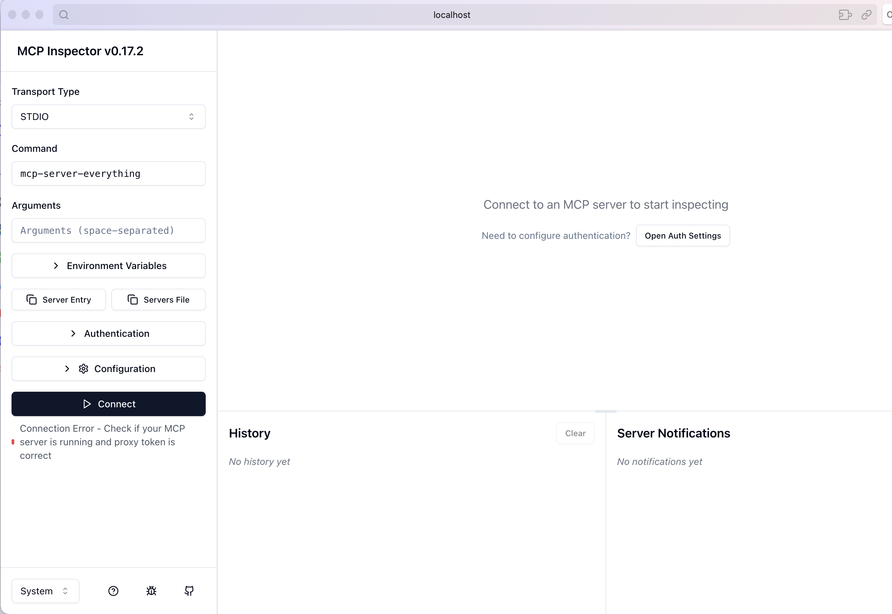

Google Agentspace

Agent builder
https://platform.openai.com/agent-builder

mcp

## 比較表格

|            | OpenAI        | Google            | Anthropic | Perplexity AI    |
| ---------- | ------------- | :---------------- | --------- | ---------------- |
| Chat       | ChatGPT       |                   |           | Perplexity       |
| POC        |               | Google AI Studio  |           |                  |
| Browser    | ChatGPT Atlas | Chrome AI 模式      |           | Perplexity Comet |
| AI 筆記與研究工具 | Notebook LM   |                   |           |                  |
| 地端IDE      |               | Antigravity       |           |                  |
| 企業AI 搜尋    |               | Google Agentspace |           |                  |
| CLI        | Codex CLI     |                   |           |                  |
|            |               |                   |           |                  |
|            |               |                   |           |                  |
## AI 歷史
2020 gpt-3
2022 chatgpt
2023 gpt-4

## self-host
- JAN vs LM studio 
- ollama vs vllm

## 使用方法

## cli
claude code cli
會產生 CLAUDE.md
codex
會產生 AGENTS.md

## Materials
https://www.deeplearning.ai/

## claude 
https://platform.claude.com/docs/zh-TW/agents-and-tools/agent-skills/overview

claude and n8n

## Tools
ChatGPT Atlas
comet

4 Next-Level ChatGPT Techniques
https://youtu.be/6hRO1q8vv60

## mcp

https://developers.openai.com/apps-sdk/build/mcp-server
| 類型 / 公司                                  | OpenAI                                                           | Google                                                          | Anthropic                                               |
| ---------------------------------------- | ---------------------------------------------------------------- | --------------------------------------------------------------- | ------------------------------------------------------- |
| Agent framework                          | Model Context Protocol (MCP) + OpenAI Agents SDK（Agent 標準 + SDK） | Agent Development Kit (ADK)、Vertex AI Agent Builder（雲端部署 Agent） | Claude Agent SDK（搭配 Claude Code / Claude 模型的 Agent SDK） |
| Web-based AI editor / IDE（不含 NotebookLM） | Codex 線上編輯 / ChatGPT Code Interpreter                            | Google AI Studio、Firebase Studio、Gemini for Web、                | Claude Code Web App（claude.ai）                          |
| Local AI editor / IDE                    | （OpenAI：目前無本地 IDE）                                               | Gemini in Zed Editor、Antigravity（本地運行）、VSCode Gemini Plugin     | Claude Code CLI（帶編輯能力）                                  |
| CLI tool                                 | OpenAI CLI、Codex CLI（直接在終端呼叫 OpenAI API / 模型）                    | Gemini CLI（開源 AI agent，帶 Gemini 到你的 terminal）                   | Claude Code CLI（終端內的 Claude coding / agent 工具）          |
| Research / Note-taking Tools             | （OpenAI：暫無專門筆記工具）                                                | NotebookLM（AI 筆記與研究工具）                                          | （Anthropic：暫無專門工具）                                      |

## Coding
无限免费Claude Code，免费模型有满血版几成功力？
claude 
claude.md
https://youtu.be/Hr24rIDDyPU?si=8KZNRJZ0NEuHuSFZ

gemini
GEMINI.md

