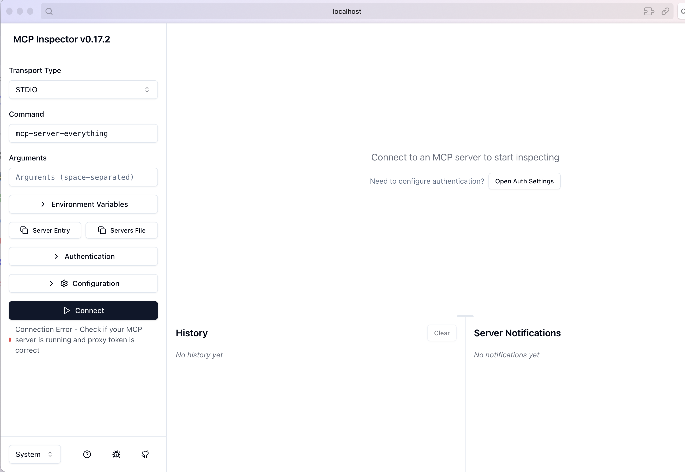

# AI 生態系整理

三大陣營（OpenAI / Google / Anthropic）在同樣的產品位置上各自都有對應品項，這頁用來對照，避免名詞混淆。

## 比較表格

|                 | OpenAI        | Google            | Anthropic | Perplexity AI    |
| --------------- | ------------- | :---------------- | --------- | ---------------- |
| Chat            | ChatGPT       |                   |           | Perplexity       |
| POC             |               | Google AI Studio  |           |                  |
| Browser         | ChatGPT Atlas | Chrome AI 模式      |           | Perplexity Comet |
| AI 筆記與研究工具      | Notebook LM   |                   |           |                  |
| 地端IDE           |               | Antigravity       |           |                  |
| 企業AI 搜尋         |               | Google Agentspace |           |                  |
| CLI             | Codex CLI     |                   |           |                  |
| Agent Framework |               | Agent builder     |           |                  |

## AI 歷史

| 年份 | 事件 | 意義 |
|---|---|---|
| 2017 | Transformer 論文（*Attention Is All You Need*） | 提出 self-attention，取代 RNN 成為所有現代 LLM 的基礎架構 |
| 2018 | BERT / GPT-1 | 「預訓練 + 微調」範式確立 |
| **2020** | **GPT-3** | 參數規模跳到 175B，展示 **few-shot / in-context learning**——不必微調，光靠 prompt 裡的範例就能執行新任務。這是「prompt engineering」概念的起點 |
| 2022 | InstructGPT / RLHF | 用人類回饋做強化學習，讓模型「聽得懂指令」而不只是接續文字。這是 ChatGPT 好用的真正原因 |
| **2022/11** | **ChatGPT** | 把 LLM 包裝成對話介面對大眾開放，兩個月破億使用者 |
| **2023** | **GPT-4** | 多模態（可讀圖）、推理能力大幅提升，開始出現「可用於正式工作」的評價 |
| 2023–2024 | 開源模型崛起（Llama 系列等） | 本地部署變得可行，催生 ollama / LM Studio 這類工具 |
| 2024–2025 | Agent / 工具使用成為主軸 | 重點從「模型會不會答」轉向「模型能不能自己動手完成多步驟任務」 |
| 2024/11 | **MCP** 發布 | 工具接入的標準化，見下方 mcp 章節 |

## Agent Framework

### Agent builder

[OpenAI Agent Builder](https://platform.openai.com/agent-builder) 是 OpenAI 平台上的**視覺化 agent 編排工具**。用拖拉節點的方式定義流程：哪一步呼叫模型、哪一步呼叫工具、什麼條件下分支、何時交給人類確認。

它解決的問題是：純用 code 寫 agent 迴圈時，「流程長什麼樣」散在程式碼各處，難以檢視與調整。視覺化編排讓流程本身變成可見的產物。

同類型的東西：
- **Google**：Agent Development Kit（ADK）、Vertex AI Agent Builder
- **Anthropic**：Claude Agent SDK
- **開源**：LangGraph、n8n、Dify

### 三家的 Agent 相關產品對照

| 類型 / 公司                                  | OpenAI                                                           | Google                                                          | Anthropic                                               |
| ---------------------------------------- | ---------------------------------------------------------------- | --------------------------------------------------------------- | ------------------------------------------------------- |
| Agent framework                          | Model Context Protocol (MCP) + OpenAI Agents SDK（Agent 標準 + SDK） | Agent Development Kit (ADK)、Vertex AI Agent Builder（雲端部署 Agent） | Claude Agent SDK（搭配 Claude Code / Claude 模型的 Agent SDK） |
| Web-based AI editor / IDE（不含 NotebookLM） | Codex 線上編輯 / ChatGPT Code Interpreter                            | Google AI Studio、Firebase Studio、Gemini for Web                  | Claude Code Web App（claude.ai）                          |
| Local AI editor / IDE                    | （OpenAI：目前無本地 IDE）                                               | Gemini in Zed Editor、Antigravity（本地運行）、VSCode Gemini Plugin     | Claude Code CLI（帶編輯能力）                                  |
| CLI tool                                 | OpenAI CLI、Codex CLI（直接在終端呼叫 OpenAI API / 模型）                    | Gemini CLI（開源 AI agent，帶 Gemini 到你的 terminal）                   | Claude Code CLI（終端內的 Claude coding / agent 工具）          |
| Research / Note-taking Tools             | （OpenAI：暫無專門筆記工具）                                                | NotebookLM（AI 筆記與研究工具）                                          | （Anthropic：暫無專門工具）                                      |



## MCP

**MCP**（Model Context Protocol）是 Anthropic 在 2024 年底提出並開源的**工具接入標準協定**，現已被 OpenAI、Google 等採用。

它要解決的問題：在 MCP 出現之前，每個 AI 應用都要為每個外部服務（GitHub、Slack、資料庫、檔案系統）各自寫一套整合。M 個應用 × N 個服務 = M×N 份重複的整合程式碼。

MCP 的做法是定義一個中間層，把它變成 **M + N**：

```
AI 應用（MCP client）          外部服務（MCP server）
Claude Code       ┐        ┌  github-mcp-server
Codex CLI         ├─ MCP ──┤  filesystem-server
你自己的 agent     ┘        └  你自己寫的 server
```

協定定義三種能力：

| 能力 | 說明 |
|---|---|
| **Tools** | 模型可以呼叫的函式（有副作用，例如建立 PR、發訊息） |
| **Resources** | 模型可以讀取的資料（檔案、資料庫查詢結果） |
| **Prompts** | 預先定義好的提示範本，讓使用者快速觸發常見流程 |

傳輸方式有 **stdio**（本機子行程，最常用）與 **HTTP/SSE**（遠端服務）兩種。

實作參考：
- [OpenAI Apps SDK — 建立 MCP server](https://developers.openai.com/apps-sdk/build/mcp-server)
- 自己寫的範例：[yt-mcp-server](https://github.com/alanhc/yt-mcp-server)（見 [mcp 筆記](./mcp.md)）

## self-host

自己跑模型的兩個層次，常被搞混：

### 桌面 App：JAN vs LM Studio

兩者都是「下載模型、開個聊天視窗就能用」的桌面應用，底層都用 llama.cpp。

| | JAN | LM Studio |
|---|---|---|
| 授權 | **開源**（AGPL） | 閉源（個人免費） |
| 介面 | 簡潔，偏向「開源版 ChatGPT」 | 功能較多，模型參數可調細節多 |
| API server | 支援 OpenAI 相容端點 | 支援 OpenAI 相容端點 |
| 適合 | 想要開源、想改的人 | 想快速試各種模型、調參數的人 |

兩者都提供 **OpenAI 相容的 API**，所以既有的程式碼把 `base_url` 換掉就能改用本地模型。相關筆記：[JAN AI](./ai_jan_ai.md)、[openclaw + JAN](./openclaw_jan_ai.md)。

### 推論引擎：ollama vs vLLM

這一層是「怎麼把模型跑起來對外提供服務」，取捨完全不同：

| | ollama | vLLM |
|---|---|---|
| 定位 | **個人 / 開發用**，一行指令跑起來 | **正式服務用**，追求吞吐量 |
| 底層 | llama.cpp | 自研 CUDA kernel |
| 量化 | 預設用量化模型（GGUF），省記憶體 | 主要跑全精度 / AWQ / GPTQ |
| 並發 | 弱，一次一個請求較順 | **強**，PagedAttention + continuous batching，多人同時用效率極高 |
| 硬體 | CPU 也能跑，Mac 上表現好 | **必須有 NVIDIA GPU** |
| 上手 | `ollama run llama3` 就結束 | 要設定較多參數 |

**判斷原則**：自己一個人用、或在筆電上跑 → ollama。要架給一個團隊用、在意每秒能服務多少請求 → vLLM。

相關筆記：[claude 接 ollama](./claude_use_ollama.md)、[ollama 對外開放](./ollama_export_in_vpn.md)、[openwebui](./openwebui.md)。

## 使用方法

幾個實際用下來有效的原則：

1. **先給脈絡再給任務**。把背景、限制、期望的輸出格式講清楚，比反覆修正省時間。
2. **要求它先列計畫**。複雜任務先讓它說明打算怎麼做，確認方向對了再讓它執行，避免做完一大堆才發現理解錯。
3. **把重複的脈絡固化成檔案**。專案的慣例、架構、禁忌寫進 `CLAUDE.md` / `AGENTS.md`（見下方 cli 章節），不要每次重講。
4. **給它能自己驗證的方法**。能跑測試、能編譯、能看 log 的任務，品質遠高於「憑空生成一段程式碼」。
5. **長對話要適時重開**。脈絡累積過多雜訊時，把結論整理成一段新的開場白重開，比繼續拖著有效。

## CLI

終端機裡的 agent 工具，共通模式是「在專案根目錄放一份說明檔，工具每次啟動時自動讀取」：

| 工具 | 設定檔 | 說明 |
|---|---|---|
| **Claude Code CLI** | `CLAUDE.md` | 專案慣例、build 指令、架構說明 |
| **Codex CLI** | `AGENTS.md` | 同上，OpenAI 的對應物 |
| **Gemini CLI** | `GEMINI.md` | 同上 |

這份檔案的內容建議放：**怎麼跑起來、怎麼測試、專案的特殊慣例、不要碰的東西**。不要放程式碼本身讀得出來的東西（目錄結構、函式列表）——那是浪費 context。

相關筆記：[Claude Code](./claude_code.md)、[Claude Skills](./claude_skills.md)、[gemini](./gemini.md)。

## Tools

- **ChatGPT Atlas** — OpenAI 的 AI 瀏覽器，把 agent 能力直接嵌進瀏覽情境，可以讓它代為操作網頁。
- **Perplexity Comet** — Perplexity 的同類產品，強項是搜尋與來源引用。
- **Chrome AI 模式** — Google 在 Chrome 內建的 AI 功能。

三者都在爭同一個位置：**把 agent 放進「使用者本來就在的地方」**，而不是要使用者切換到另一個 App。

延伸：[4 Next-Level ChatGPT Techniques](https://youtu.be/6hRO1q8vv60)

## Materials

- [DeepLearning.AI](https://www.deeplearning.ai/) — 短課程品質高，Agent / RAG / 工具使用的主題更新很快
- [Claude Agent Skills 文件](https://platform.claude.com/docs/zh-TW/agents-and-tools/agent-skills/overview)

## Coding

- 无限免费 Claude Code，免费模型有满血版几成功力？ — [影片](https://youtu.be/Hr24rIDDyPU?si=8KZNRJZ0NEuHuSFZ)
- Claude 與 n8n 串接的自動化流程，見 [automation](./automation.md)
