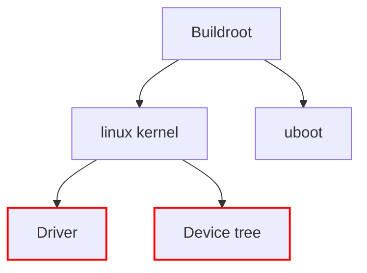
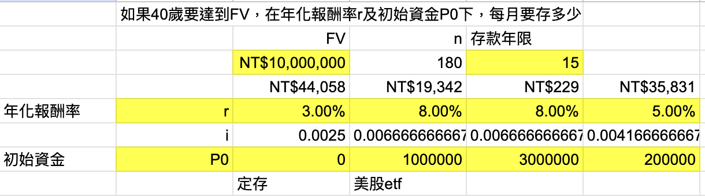
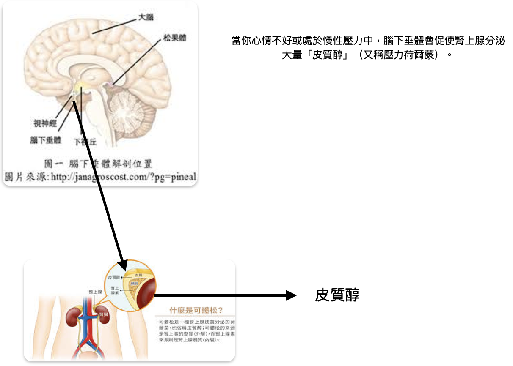
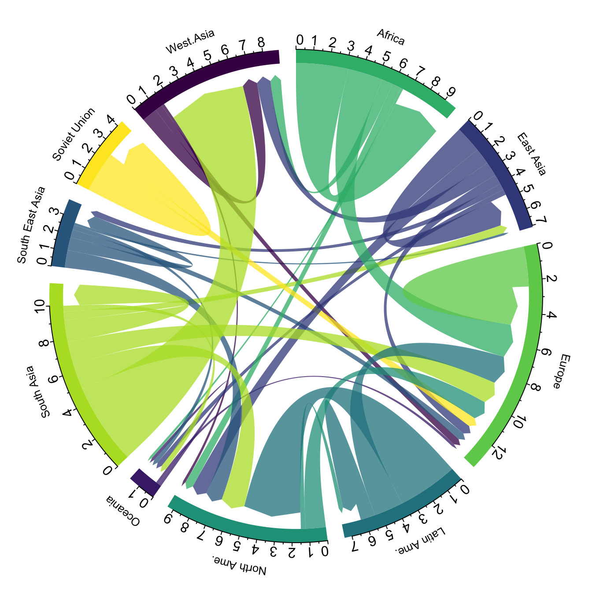
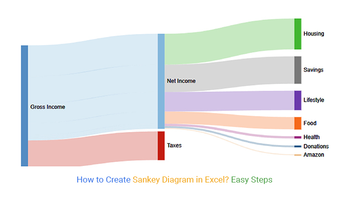
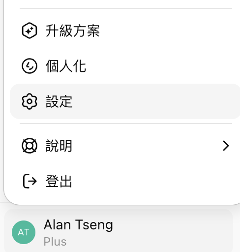

# Device Driver

Linux driver 開發最常碰到的幾個名詞，先把它們的角色講清楚：

- **probe**：driver 的進入點。當 kernel 發現「device tree 上宣告的裝置」與「driver 宣告支援的 `compatible` 字串」配對成功時，就會呼叫 driver 的 `probe()` 函式，在裡面做暫存器初始化、註冊 sysfs 介面等工作。裝置拔除或 driver 卸載時則呼叫 `remove()`。
- **Kconfig**：kernel 的組態選項描述檔。新增 driver 要在對應目錄的 `Kconfig` 加一個 `config` 項目，`make menuconfig` 才看得到這個選項、才能決定要不要編進 kernel（`y`）或編成模組（`m`）。
- **Makefile**：告訴 kernel build system「這個組態選項打開時要編哪個 `.c`」。慣用寫法是 `obj-$(CONFIG_XXX) += xxx.o`。
- **dmesg**：讀取 kernel ring buffer 的指令，driver 裡 `dev_info()` / `dev_err()` 印出的訊息都在這裡。`dmesg | grep <driver 名稱>` 是確認 probe 有沒有成功最快的方法。
- **`/sys/class/hwmon/hwmonX/current1_input`**：hwmon 子系統對 user space 曝露的 sysfs 介面。感測器 driver probe 成功後會出現一個 `hwmonX` 目錄，裡面每個檔案就是一個讀值，`cat` 它即可拿到當下數值（電流類的單位是 mA，電壓 mV，溫度 milli-°C）。

改 driver 通常會動到的是 Driver 及 Device Tree


## smbus



## pmbus

### Linear11 Floating-Point Format


$$
\text{Value Represented} = Y \times 2^N
$$


```
user space（例如：sensors） 
   ↓
PMBus core
   ↓
mpc42013_read_word_data(client, page, reg)
   ↓
底層實際透過 I2C 傳送 command code（reg） → 取得 word 資料
```

可以用 `i2cdetect` 查看是否有 driver 佔用


上圖代表在 i2c-7 有 address `0x63` 的裝置， `63` 代表 no device driver，`UU` 代表目前有 driver 佔用。

### Files
- Kconfig
   `linux/drivers/hwmon/pmbus/Kconfig`
```
config {driver}
   ...
```

:::info 參考
- https://docs.kernel.org/kbuild/kconfig-language.html
- https://www.cnblogs.com/chorm590/p/13977818.html
:::

- Driver Documentation
   - 位置: `linux/Documentation/devicetree/bindings/hwmon/{driver}.yaml`
- Makefile
   - 位置: `linux/drivers/hwmon/pmbus/Makefile`

   ```makefile
   obj-$(CONFIG_{driver}) += {driver}.o
   ```

- Driver Code
   - 位置: `linux/drivers/hwmon/pmbus/{driver}.c`
- Device Tree Alias
   - 位置: `linux/arch/arm/boot/dts/{board}-i2c-aliases.dtsi`
      ```
      alias {
         i2c99 = &{sensor}
      }
      ```
### Driver Structure

### Functions
- `probe`


```c
int pmbus_read_word_data(struct i2c_client *client, u8 page, u8 phase, u8 reg);
int pmbus_read_byte_data(struct i2c_client *client, int page, u8 reg);
int pmbus_write_word_data(struct i2c_client *client, u8 page, u8 reg, u16 word);
```
- https://www.kernel.org/doc/html/v6.12/hwmon/pmbus-core.html


### 觀察
- `ls /sys/class/hwmon/hwmon16`


## Ref
- https://en.wikipedia.org/wiki/Power_Management_Bus
- https://www.ti.com/download/trng/docs/seminar/Topic_6_Hesse.pdf
