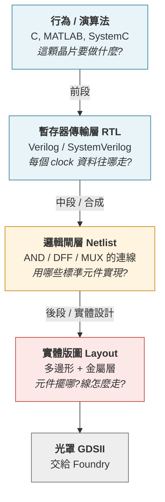
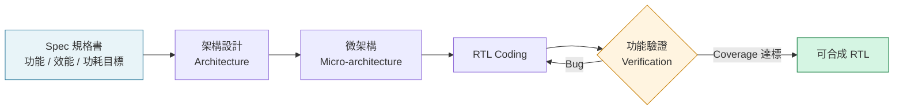
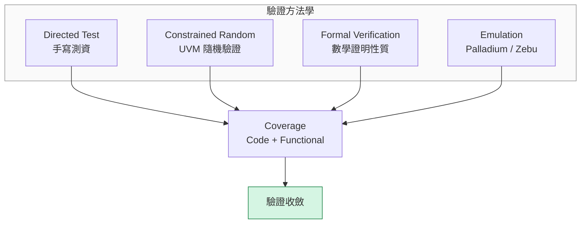
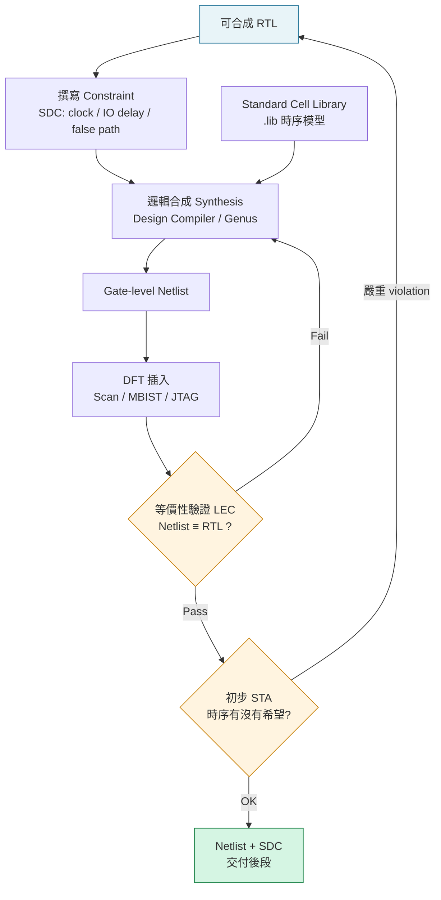
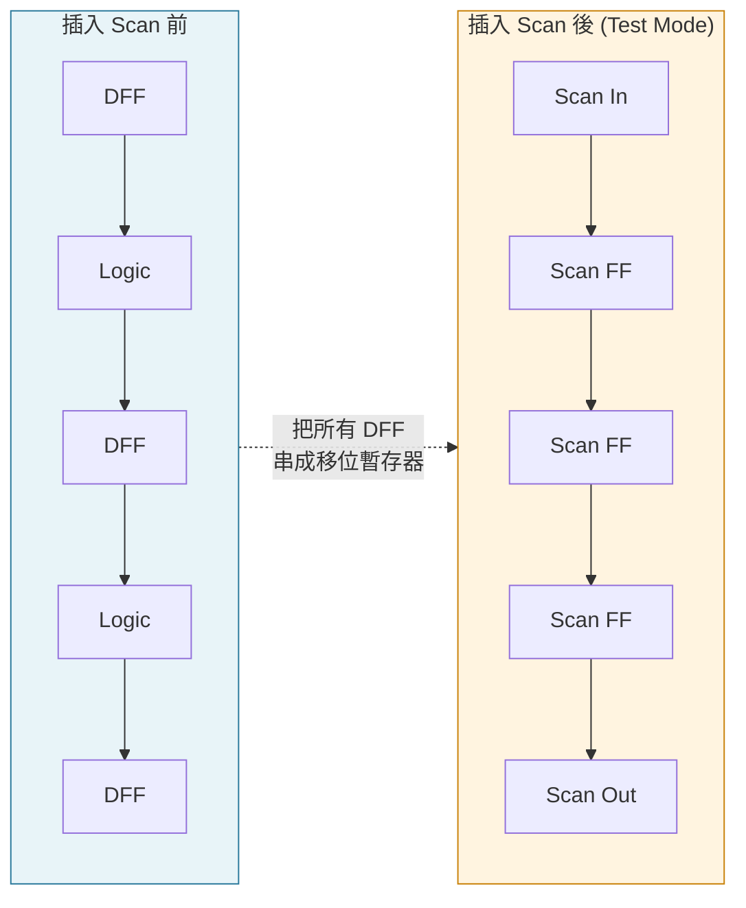
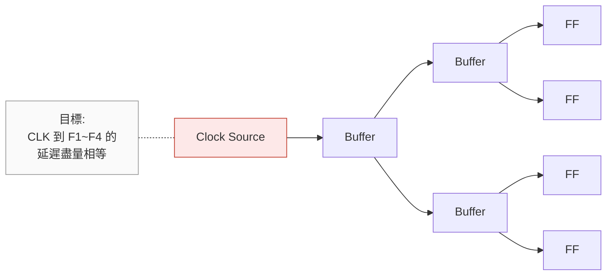
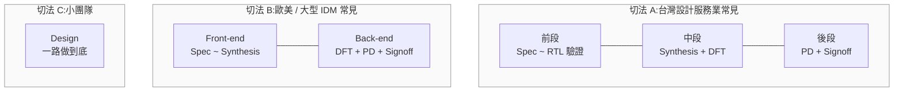
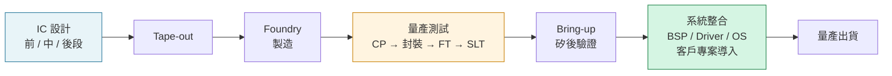

# IC 設計的前段、中段、後段:一條從規格到 GDSII 的路

跟不同背景的工程師聊天時,「前段 / 後段」這組詞的邊界常常對不起來。做驗證的人講的前段,跟做 Place & Route 的人心裡的前段,切點未必一樣;而「中段」這個詞在台灣業界很常用,到了歐美履歷上卻幾乎看不到。

這篇整理一次數位 IC 的完整流程,以及每一段實際在處理什麼問題。

---

## 一、切分的本質:抽象層次的下降

分段不是為了組織架構好畫,而是因為**設計的抽象層次在一路往下掉**。每往下一層,設計的自由度變小、物理限制變多、迭代成本變高。

一個好記的類比:

| 階段 | 軟體世界的對應 |
|---|---|
| 前段 | 寫原始碼 + 跑單元測試 |
| 中段 | 編譯成組合語言 + 插入 debug symbol |
| 後段 | 決定每條指令實際放在記憶體哪個位址、bus 怎麼繞 |

這個類比在「前段」最貼切,到「後段」就會失效 —— 因為軟體的 linker 不需要煩惱電壓降和電子遷移。

---

## 二、前段 (Front-end):把想法變成可合成的 RTL

### 工作範圍

### 實際在做的事

**架構 / 微架構設計** 是這一段最值錢、也最難被工具取代的部分:

- Pipeline 要幾級?哪裡放 buffer?
- Bus 用 AXI 還是 AHB?頻寬夠不夠?
- Cache 幾路組相聯?一致性協定怎麼設計?
- Power domain 怎麼切?哪些區塊可以 power gating?
- Clock domain 有幾個?跨域怎麼做同步(CDC)?

**RTL Coding** 是把上面的決策寫成 Verilog / SystemVerilog / VHDL。這裡的關鍵約束是「**可合成**」—— 語法對不代表工具產得出電路。常見的地雷:

- 用 `initial` 區塊描述硬體初始值(FPGA 可以,ASIC 不行)
- Latch 被意外推斷出來(`if` 沒補 `else`)
- 非阻塞 / 阻塞賦值混用造成 simulation-synthesis mismatch

**驗證 (Verification)** 通常佔掉整個前段一半以上的人力。現代 SoC 專案裡,驗證工程師人數超過設計工程師是常態。

四種方法互補,不是互斥:formal 適合證明「這個 FIFO 永遠不會 overflow」這種全稱命題;emulation 適合跑完整的 OS boot,因為軟體 simulation 跑一秒的實際時間可能要算好幾天。

### 產出

一包**可合成、驗證收斂的 RTL**,加上驗證報告與 coverage 數據。

---

## 三、中段 (Middle-end):RTL → Netlist,順便讓晶片「可被測試」

這一段是我覺得最容易被忽略、但工程含量很高的部分。歐美常把它拆進 front-end(合成)與 back-end(DFT signoff),但在台灣的 IC 設計服務公司,「中段」是一個獨立的職缺類別。

### 邏輯合成 (Synthesis)

工具讀進 RTL、標準元件庫(.lib)、以及約束檔(SDC),在**時序、面積、功耗**三者之間找一個滿足約束的解。

值得注意的是:合成工具的品質高度依賴 constraint 寫得好不好。SDC 寫錯的兩種典型後果 ——

- **約束太鬆**:工具說 timing 過了,實際 silicon 跑不到目標頻率
- **約束太緊**:工具拚命塞大 driver、複製邏輯,面積和功耗爆炸

### DFT (Design for Test)

這是「為了測試而修改設計」。晶片製造出來後,要能在自動測試機台(ATE)上判斷這顆是好是壞,而 ATE 只能從有限的接腳戳進去。

核心概念:把設計裡所有正反器串成一條(或多條)**移位暫存器鏈**。測試模式下,測試向量可以從外部一位一位推進去,設定內部任意狀態;跑一個 clock 之後,再把結果推出來比對。

相關的主要工作項:

- **Scan Chain**:上圖的鏈,解決組合邏輯的可控制性 / 可觀測性
- **MBIST**:記憶體自我測試。SRAM 沒辦法用 scan 測,要在旁邊放一個小電路自己產生 pattern 掃過去
- **ATPG**:自動產生測試向量,目標是拉高 fault coverage(業界常見門檻 99%+)
- **JTAG / Boundary Scan**:板級測試,檢查晶片腳位跟 PCB 的焊接
- **壓縮 (Compression)**:測試資料量太大會拉長 ATE 測試時間,直接反映在每顆晶片的測試成本上

> 這裡跟量產測試(CP / FT / SLT)是直接接在一起的 —— DFT 決定了 ATE 上能測到什麼、要測多久。

### 等價性驗證 (LEC / Formal Equivalence)

合成和 DFT 插入都改動了電路。LEC 用數學方法證明「改完的 netlist 在功能上等價於原本的 RTL」,而不是重跑一次幾百萬筆的 simulation。這是中段的 gatekeeper。

### 產出

**Gate-level netlist + SDC + DFT 相關檔案**,以及一份「時序上大致可行」的信心。

---

## 四、後段 (Back-end / Physical Design):把邏輯變成矽

後段處理的是物理世界的問題:元件要佔面積、金屬線有電阻電容、電流會造成壓降、訊號會互相干擾。

```mermaid
flowchart TD
    IN["Netlist + SDC + Library"] --> FP["<b>Floorplan</b><br/>晶片輪廓 / Macro 擺位<br/>Power Grid 規劃 / IO 配置"]
    FP --> PL["<b>Placement</b><br/>標準元件擺位<br/>時序驅動優化"]
    PL --> CTS["<b>CTS</b> 時脈樹合成<br/>降低 skew / 控制 insertion delay"]
    CTS --> RT["<b>Routing</b><br/>Global → Detail Route<br/>多層金屬繞線"]
    RT --> SO["<b>Signoff</b>"]

    SO --> S1["STA<br/>多 corner 時序簽核"]
    SO --> S2["IR Drop / EM<br/>電源完整性"]
    SO --> S3["DRC / LVS / ANT<br/>實體規則檢查"]
    SO --> S4["SI<br/>串音 / 訊號完整性"]

    S1 --> GDS["GDSII → Tape-out"]
    S2 --> GDS
    S3 --> GDS
    S4 --> GDS

    style IN fill:#fff4e0,stroke:#c9820a
    style GDS fill:#d5f5e3,stroke:#1e8449
    style SO fill:#fde8e8,stroke:#c0392b
```

### 各步驟在解什麼問題

**Floorplan** 是後段影響最大的決策,也是最難改的。一旦 macro(SRAM、PLL、類比 IP)位置定了,後面所有步驟都被它綁住。這一步同時要規劃電源網格(power grid)—— 太密會吃掉繞線資源,太疏會 IR drop 過大。

**Placement** 把幾百萬顆標準元件放進去。現代工具是 timing-driven 的:關鍵路徑上的元件會被拉近,非關鍵路徑則讓位給繞線空間。

**CTS (Clock Tree Synthesis)** 專門處理時脈訊號。時脈要送到每一顆正反器,而且到達時間要盡量一致。**Skew**(不同 FF 收到 clock 的時間差)過大會直接吃掉時序餘裕,嚴重時造成 hold violation —— 這種錯誤在 silicon 上是無解的。

**Routing** 用多層金屬把所有連線接起來。先做 global route 規劃大方向,再做 detail route 決定每一條線走哪一格。先進製程的金屬層數可以到十幾層以上。

**Signoff** 是一組必須全部通過的檢查:

| 檢查項目 | 在確認什麼 |
|---|---|
| STA | 所有路徑在所有 PVT corner 下時序都滿足(setup / hold) |
| IR Drop | 電源網路壓降是否在容許範圍內 |
| EM | 金屬線電流密度會不會造成電子遷移、影響壽命 |
| DRC | 版圖是否符合 Foundry 的製程規則 |
| LVS | 版圖萃取出的電路,是否等於 netlist |
| Antenna | 製程中電荷累積會不會打穿閘極氧化層 |
| SI / Crosstalk | 鄰近訊號線互相干擾造成的延遲變化與雜訊 |

### 產出

**GDSII**(或 OASIS),送交晶圓廠做光罩、下線(tape-out)。

---

## 五、幾個容易混淆的地方

### 「中段」的邊界其實是浮動的

不同公司的切法不一樣:

看職缺描述比看職稱名字準。

### 這套流程只適用於數位 IC

類比 / RF IC 沒有「合成」這個步驟 —— 電晶體尺寸要手工調,版圖要手工畫,對稱性和寄生效應直接決定電路能不能用。流程大致是:

`Spec → Schematic → 電路模擬 (SPICE) → Layout → 寄生萃取 → Post-layout 模擬`

所以類比只有「電路設計」和「佈局」兩個角色,沒有前中後段之分。

### 流程不是單向瀑布

上面所有圖為了好讀都畫成往下流,實際上迴授到處都是:後段跑到一半發現某條路徑怎麼都收不了時序,回頭要求前段改 RTL(加 pipeline stage)是家常便飯。越晚發現問題,重跑的代價越高 —— 這也是為什麼近年 physical-aware synthesis、RTL 階段就做初步 floorplan 評估的做法越來越普遍。

---

## 六、這條鏈的下游

值得補一句:前中後段做完、tape-out、晶圓回來之後,還有一整段完全不同性質的工作 ——

矽後驗證(post-silicon validation)、系統整合、BSP、驅動、客戶專案導入,這些是另一條軸線的專業。它們跟前中後段共用同一顆晶片,但關心的問題完全不同:前中後段問「這個設計對不對」,下游問「這顆晶片在真實系統裡跑不跑得起來」。

理解上游的分段方式,好處是在 debug 時知道問題可能落在哪一層 —— 是 RTL 的功能 bug、DFT 沒蓋到的製造缺陷、還是特定 corner 下的時序邊界問題。這三種問題的表現症狀可能很像,但處理方式天差地遠。

---

## 參考方向

想再往下深入的話,幾個常被推薦的起點:

- **RTL / 驗證**:《Writing Testbenches using SystemVerilog》(Bergeron)、UVM Cookbook
- **合成 / STA**:《Static Timing Analysis for Nanometer Designs》(Bhasker & Chadha)
- **DFT**:《VLSI Test Principles and Architectures》(Wang, Wu, Wen)
- **實體設計**:《Handbook of Algorithms for Physical Design Automation》
- **開源實作**:OpenROAD / OpenLane —— 可以在自己電腦上跑完整條 RTL-to-GDSII 流程,對建立全貌感覺很有幫助
