# Single Linked list

我們先實作一個簡單的 linked list，我們使用 `main.c` 來撰寫主要的測試 case ， `list.h` 來定義 linked list 的結構和函式原型， `list.c` 來實作 linked list 的函式。完整的程式可以參考 [code](https://github.com/alanhc/algorithm/tree/main/dsa/linked_list)。

本篇範例程式在 [GitHub - sigle linked list](https://github.com/alanhc/algorithm/tree/main/dsa/linked_list)

## 實作 linked list 的新增、刪除

先建立以下檔案：

```bash
.
├── list.c
├── list.h
└── main.c
```

### `main.c`：主要的程式入口
在 `main.c` 中，我們會先撰寫整個程式的主要邏輯跟所需要的函式。這裡我們使用 `dummy head node` 來簡化 linked list 的操作，這樣可以避免處理空 linked list 的情況。

:::info
由以下圖可知，如果沒有 dummy head node，當 linked list 為空時，head 會指向 NULL，這樣在插入或刪除節點時需要特別處理空 linked list 的情況。而有了 dummy head node 後，head 永遠不會是 NULL，這樣就可以簡化程式碼。
```
A. 沒有 dummy                                B. 有 dummy
┌────┐    ┌────┐    ┌────┐                ┌────┐    ┌────┐    ┌────┐
│ 1  │──▶ │ 2  │──▶ │ 3  │                │ D  │──▶ │ 1  │──▶ │ 2  │──▶ │ 3  │
└────┘    └────┘    └────┘                └────┘    └────┘    └────┘
 head                                       head(固定指向 D)
```
:::

```c
int main()
{
    Node *head = create_node(-1); // create a dummy head node
    // create a linked list with 5 nodes
    // insert 5 nodes at the tail
    for (int i=0; i<5; i++)
    {
        insert_tail(head, i);
    }
    print_list(head);
    // insert 5 nodes at the head
    for (int i=5; i<10; i++)
    {
        insert_head(head, i);
    }
    print_list(head);
    
    // delete the specific node with value 3
    delete_node(head, 3);
    print_list(head);
    
    // delete the middle node
    delete_mid(head);

    print_list(head);
    free_list(head);

    // delete the duplicate nodes
    head = create_node(-1);
    for (int i=0; i<5; i++)
    {
        for (int j=0; j<2; j++) {
            insert_tail(head, i);
        }
    }
    print_list(head);
    delete_dup(head);
    print_list(head);
    return 0;
}
```

### 在 `list.h` 定義的結構和函式原型：

```c
typedef struct Node
{
    int data;
    struct Node *next;
} Node;

Node* create_node(int n);
void free_list(Node *node);
void print_list(Node *node);
void insert_tail(Node *node, int n);
void insert_head(Node *node, int n);
void delete_node(Node *node, int n);
void delete_head(Node *node);
void delete_tail(Node *node);
void delete_mid(Node *node);
void delete_dup(Node *node);
```

### `list.c` 基本的建立節點及結構
宣告 `Node` 結構，在 `list.h` 中定義 linked list 的節點結構，包含 `data` 和 `next` 指標。
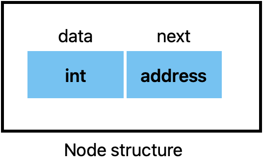
```c
typedef struct Node
{
    int data;
    struct Node *next;
} Node;
```
建立節點
```c
Node* create_node(int n)
{
    Node* node = (Node*)malloc(sizeof(Node));
    node->data = n;
    node->next = NULL;
    return node;
}
```

### 在 `list.c` 實作新增到尾
先找到 linked list 的尾端，然後將新的節點插入到尾端。
```c
void insert_tail(Node* node, int n)
{
    // 找到 linked list 的尾端
    while (node->next != NULL)
    {
        node = node->next;
    }
    // 在尾端插入新的節點
    node->next = create_node(n);
}
```
### 在 `list.c` 實作新增到頭
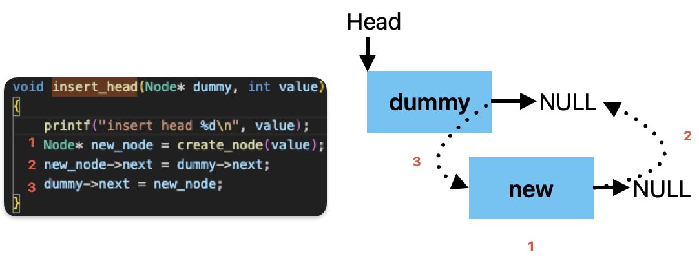
```c
void insert_head(Node* dummy, int value)
{
    printf("insert head %d\n", value);
    Node* new_node = create_node(value);       // 建立新節點
    new_node->next = dummy->next;              // 指向原本第一個節點
    dummy->next = new_node;                    // dummy 指向新的第一個節點
}
```
### 實作刪除特定節點
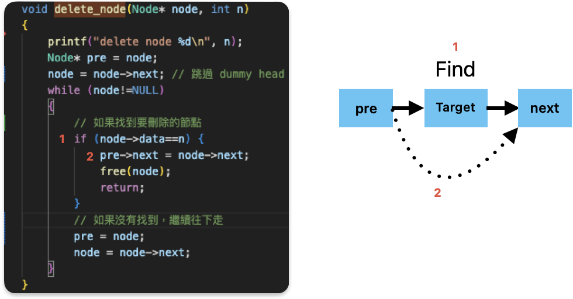
```c
void delete_node(Node* node, int n)
{
    printf("delete node %d\n", n);
    Node* pre = node;
    node = node->next; // 跳過 dummy head
    while (node!=NULL)
    {
        // 如果找到要刪除的節點
        if (node->data==n) {
            pre->next = node->next;
            free(node);
            return;
        }
        // 如果沒有找到，繼續往下走
        pre = node; 
        node = node->next;
    }
}
```
### 實作刪除中間節點
刪除中間節點，我們可以使用 fast-slow pointer 的方法來找到中間節點。
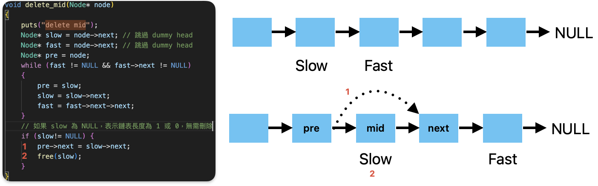
```c
void delete_mid(Node* node)
{
    puts("delete mid");
    Node* slow = node->next; // 跳過 dummy head
    Node* fast = node->next; // 跳過 dummy head
    Node* pre = node;
    while (fast != NULL && fast->next != NULL)
    {
        pre = slow;
        slow = slow->next;
        fast = fast->next->next;
    }
    // 如果 slow 為 NULL，表示鏈表長度為 1 或 0，無需刪除
    if (slow!= NULL) {
        pre->next = slow->next;
        free(slow);
    }   
}
```
### 實作刪除重複節點
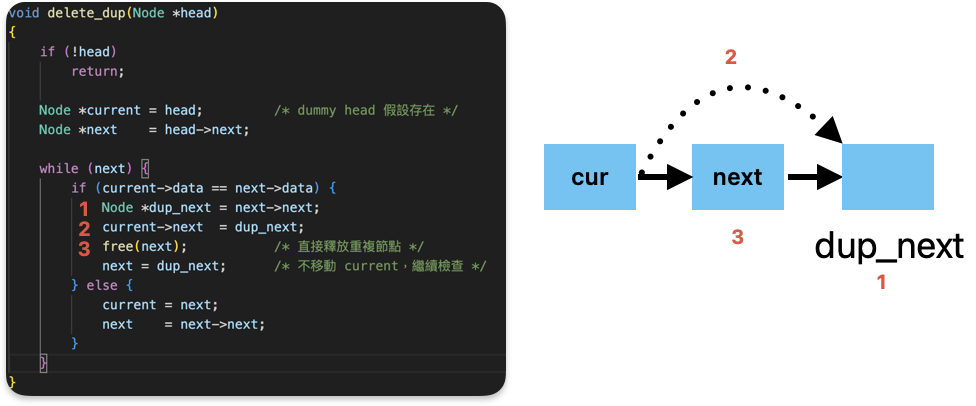
```c
void delete_dup(Node *head)
{
    if (!head)
        return;

    Node *current = head;         /* dummy head 假設存在 */
    Node *next    = head->next;

    while (next) {
        if (current->data == next->data) {
            Node *dup_next = next->next;
            current->next  = dup_next;
            free(next);           /* 直接釋放重複節點 */
            next = dup_next;      /* 不移動 current，繼續檢查 */
        } else {
            current = next;
            next    = next->next;
        }
    }
}
```
### 實作交換 a、b 節點
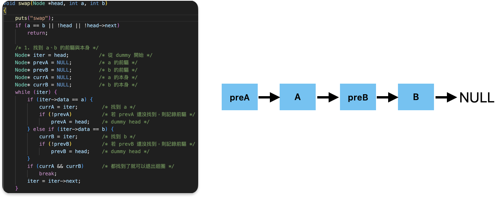
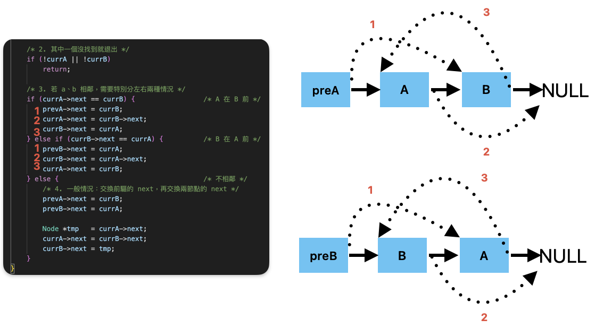
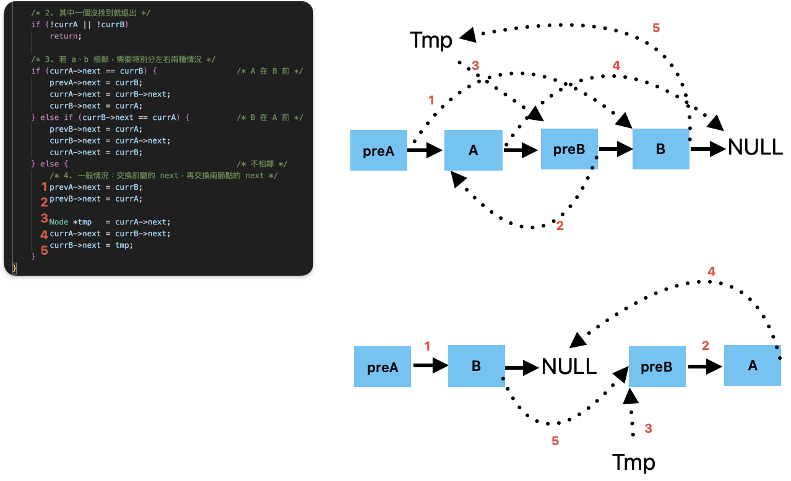
```c
void swap(Node *head, int a, int b)
{
    puts("swap");
    if (a == b || !head || !head->next)
        return;

    /* 1. 找到 a、b 的前驅與本身 */
    Node* iter = head;          /* 從 dummy 開始 */
    Node* prevA = NULL;         /* a 的前驅 */
    Node* prevB = NULL;         /* b 的前驅 */
    Node* currA = NULL;         /* a 的本身 */
    Node* currB = NULL;         /* b 的本身 */
    while (iter) {
        if (iter->data == a) {
            currA = iter;        /* 找到 a */
            if (!prevA)          /* 若 prevA 還沒找到，則記錄前驅 */
                prevA = head;    /* dummy head */
        } else if (iter->data == b) {
            currB = iter;        /* 找到 b */
            if (!prevB)          /* 若 prevB 還沒找到，則記錄前驅 */
                prevB = head;    /* dummy head */
        }
        if (currA && currB)      /* 都找到了就可以退出迴圈 */
            break;
        iter = iter->next;
    }

    /* 2. 其中一個沒找到就退出 */
    if (!currA || !currB)
        return;

    /* 3. 若 a、b 相鄰，需要特別分左右兩種情況 */
    if (currA->next == currB) {                 /* A 在 B 前 */
        prevA->next = currB;
        currA->next = currB->next;
        currB->next = currA;
    } else if (currB->next == currA) {          /* B 在 A 前 */
        prevB->next = currA;
        currB->next = currA->next;
        currA->next = currB;
    } else {                                    /* 不相鄰 */
        /* 4. 一般情況：交換前驅的 next，再交換兩節點的 next */
        prevA->next = currB;
        prevB->next = currA;

        Node *tmp   = currA->next;
        currA->next = currB->next;
        currB->next = tmp;
    }
}
```
### 實作反轉 linked list
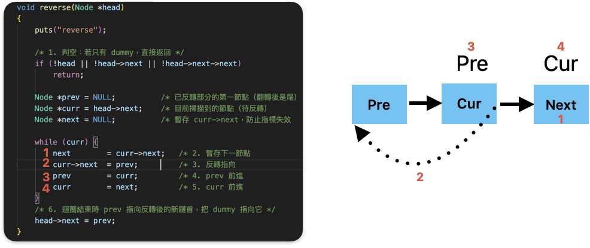
```c
void reverse(Node *head)
{
    puts("reverse");

    /* 1. 判空：若只有 dummy，直接返回 */
    if (!head || !head->next || !head->next->next)
        return;

    Node *prev = NULL;          /* 已反轉部分的第一節點（翻轉後是尾）   */
    Node *curr = head->next;    /* 目前掃描到的節點（待反轉）           */
    Node *next = NULL;          /* 暫存 curr->next，防止指標失效        */

    while (curr) {
        next        = curr->next;   /* 2. 暫存下一節點                    */
        curr->next  = prev;         /* 3. 反轉指向                       */
        prev        = curr;         /* 4. prev 前進                      */
        curr        = next;         /* 5. curr 前進                      */
    }
    /* 6. 迴圈結束時 prev 指向反轉後的新鏈首，把 dummy 指向它 */
    head->next = prev;
}
```

### 實作反轉 K 個節點
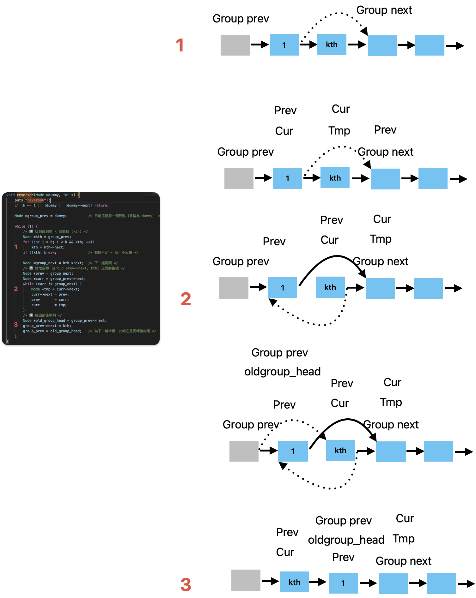
```c
/* 以 dummy 為鏈首，將串列每 k 個節點反轉 */
void reverseK(Node *dummy, int k) {
    puts("reverseK");
    if (k <= 1 || !dummy || !dummy->next) return;

    Node *group_prev = dummy;          /* 目前這組前一個節點（首輪為 dummy） */

    while (1) {
        /* 1️⃣ 找到這組第 k 個節點 (kth) */
        Node *kth = group_prev;
        for (int i = 0; i < k && kth; ++i)
            kth = kth->next;
        if (!kth) break;               /* 剩餘不足 k 個，不反轉 */

        Node *group_next = kth->next;  /* 下一組開頭 */
        /* 2️⃣ 就地反轉 [group_prev->next, kth] 之間的指標 */
        Node *prev = group_next;
        Node *curr = group_prev->next;
        while (curr != group_next) {
            Node *tmp = curr->next;
            curr->next = prev;
            prev       = curr;
            curr       = tmp;
        }
        /* 3️⃣ 接回前後串列 */
        Node *old_group_head = group_prev->next;
        group_prev->next = kth;
        group_prev = old_group_head;   /* 為下一輪準備：此時它是反轉後的尾 */
    }
}
```
### 實作 merge sort linked list
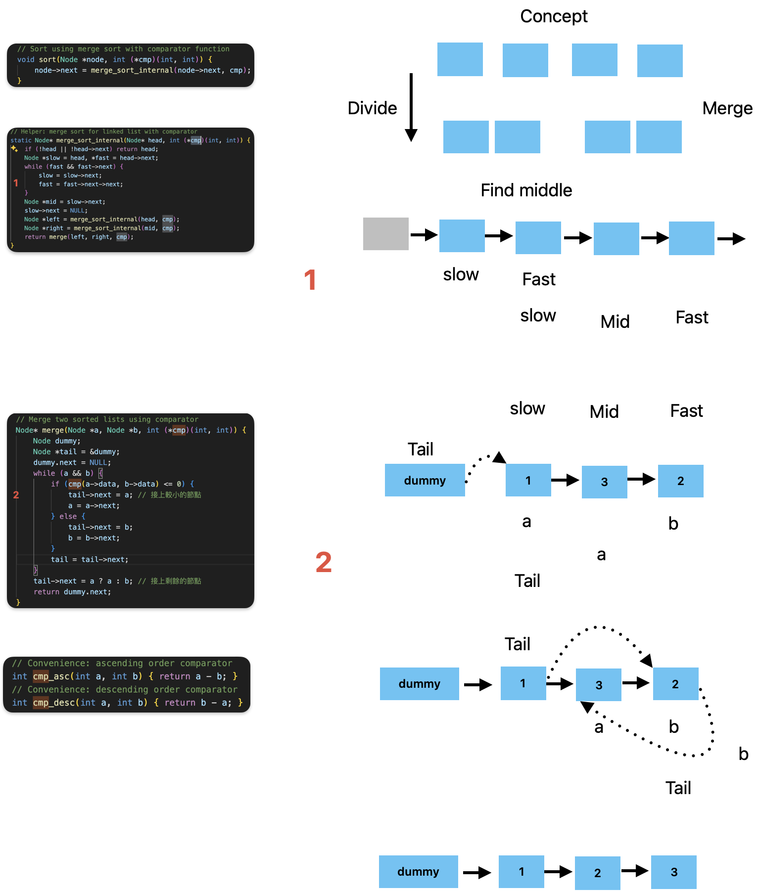
```c
// Merge two sorted lists using comparator
Node* merge(Node *a, Node *b, int (*cmp)(int, int)) {
    Node dummy;
    Node *tail = &dummy;
    dummy.next = NULL;
    while (a && b) {
        if (cmp(a->data, b->data) <= 0) {
            tail->next = a; // 接上較小的節點
            a = a->next;
        } else {
            tail->next = b;
            b = b->next;
        }
        tail = tail->next;
    }
    tail->next = a ? a : b; // 接上剩餘的節點
    return dummy.next;
}

// Helper: merge sort for linked list with comparator
static Node* merge_sort_internal(Node* head, int (*cmp)(int, int)) {
    if (!head || !head->next) return head;
    Node *slow = head, *fast = head->next;
    while (fast && fast->next) {
        slow = slow->next;
        fast = fast->next->next;
    }
    Node *mid = slow->next;
    slow->next = NULL;
    Node *left = merge_sort_internal(head, cmp);
    Node *right = merge_sort_internal(mid, cmp);
    return merge(left, right, cmp);
}

// Sort using merge sort with comparator function
void sort(Node *node, int (*cmp)(int, int)) {
    node->next = merge_sort_internal(node->next, cmp);
}
// Convenience: ascending order comparator
int cmp_asc(int a, int b) { return a - b; }
// Convenience: descending order comparator
int cmp_desc(int a, int b) { return b - a; }
```


## 編譯
```
gcc -Wall -o linked_list.out main.c list.c 
```
- `-Wall` 參數會開啟所有警告訊息，這樣可以幫助我們在編譯時發現潛在的問題。
- `-o linked_list.out` 參數指定輸出的可執行檔名稱為 `linked_list.out`。
- `gcc` 是 GNU C Compiler 的縮寫，是一個開源的 C 語言編譯器。
會產生 `linked_list.out` 可執行檔。

## 執行
```
$ ./linked_list.out 
-1 0 1 2 3 4 
```

TODO
remove_head
remove_tail
delete_mid
delete_dup
swap
reverse
reverseK
sort
ascend
descend
merge