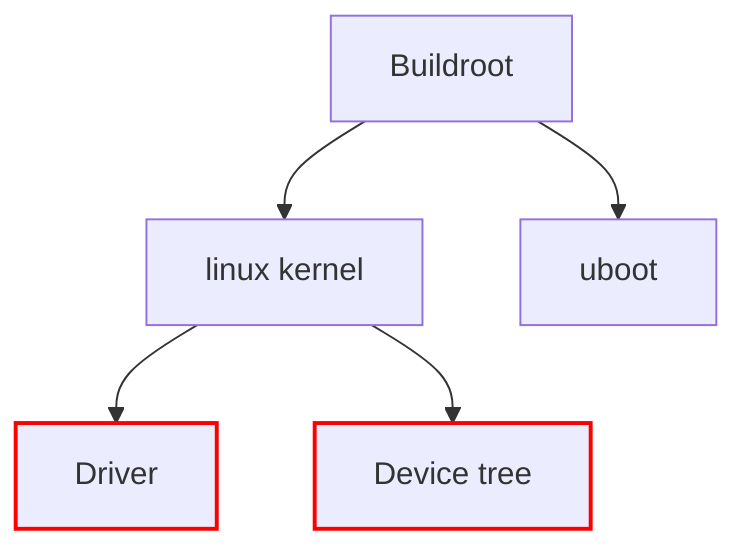

## config

`make menuconfig`

`make uboot-menuconfig`

```mermaid
graph TD
    A[Buildroot]
    B[linux kernel]
    C[uboot]
    D[Driver]
    E[Device tree]

    A --> B
    A --> C
    B --> D
    B --> E

    style D stroke:red,stroke-width:2px
    style E stroke:red,stroke-width:2px
```