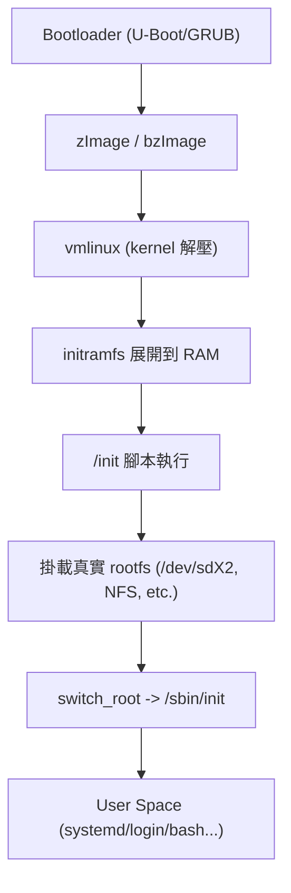
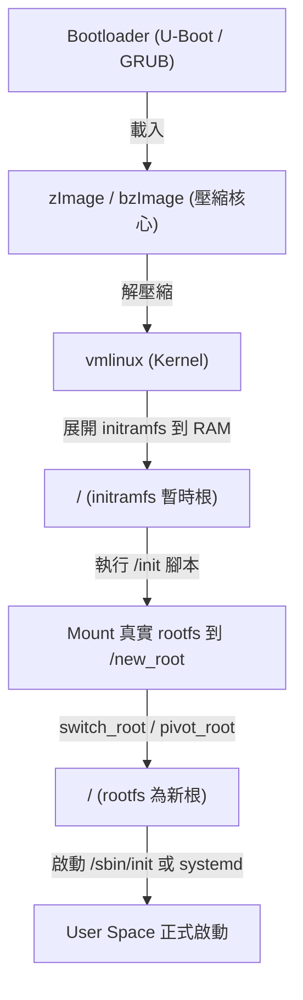
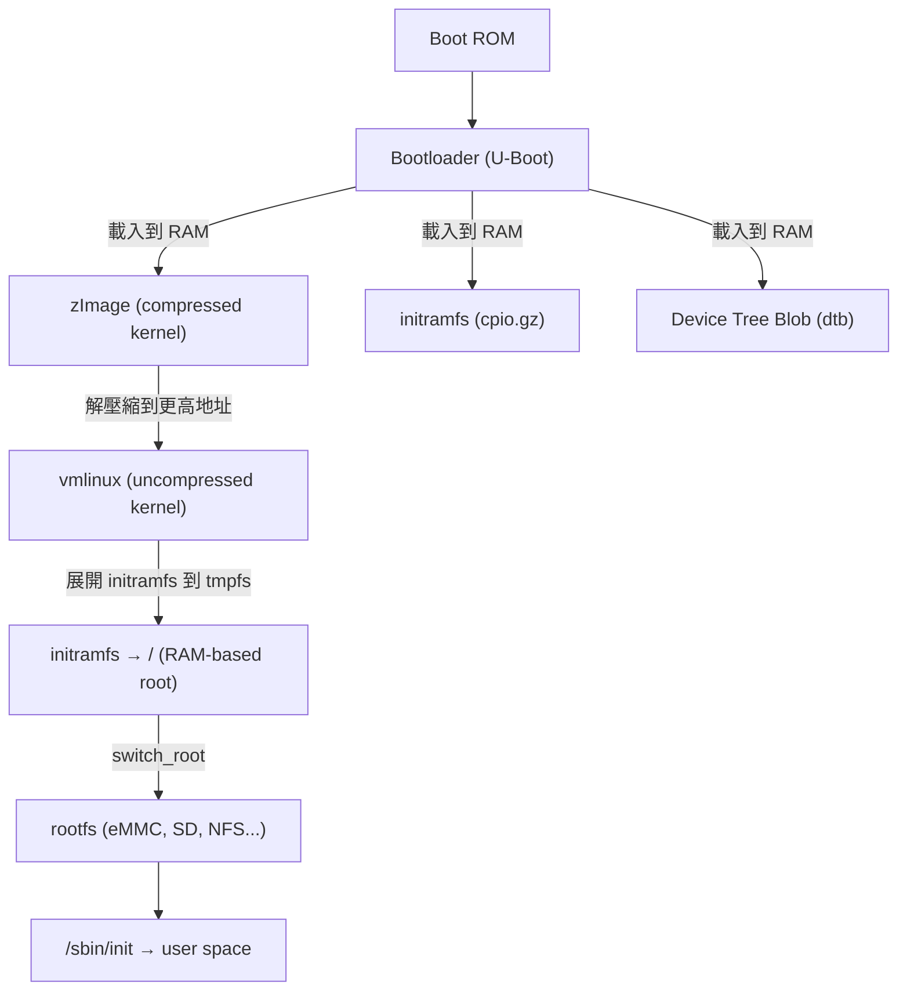

- vmlinux
    - 型態：ELF 可執行檔
    - 產生來源：由 kernel 原始碼經過編譯（make）產生的完整未壓縮核心映像。
    - 內容：包含 kernel 的 .text、.data、.bss 等區段，通常還有符號資訊（可供除錯）。
    - 位置：`arch/<arch>/boot/compressed/` 或 `arch/<arch>/boot/` 下會衍生壓縮版本。
    - 用途：
    - 不直接由 bootloader 載入（太大），而是壓縮成 zImage / bzImage。
    - 在核心開發或除錯（例如 addr2line、gdb vmlinux）時使用。
    - 在 boot flow 中的角色：
    - 是 Linux kernel 的「原始體」，壓縮後才變成可由 bootloader 載入的形式。
- initramdisk
    - 舊稱（initrd = initial RAM disk）
    - 型態：過去是一個完整的「磁碟映像」（block image），不是 cpio。
    - 差異：
    - initramdisk/initrd：是映像檔，需 kernel 當作虛擬磁碟載入，再由檔案系統（如 ext2）掛載。
    - initramfs：是檔案系統內容本身，直接展開到 RAM，不需 mount block device。
    - 現代 Linux（2.6 以後） 幾乎全部改用 initramfs。
    - → 「initramdisk」一詞常只是舊稱或泛指。
- initramfs
    - 型態：一個 cpio 壓縮檔（通常是 gzip 格式）
    - 用途：
    - 在 kernel 啟動早期掛載的暫時性檔案系統。
    - 提供最小可執行環境（init、shell、udev、模組、腳本）。
    - 在 boot flow 中的角色：
    - Kernel 解壓後會自動展開 initramfs 到 RAM，掛載為 /。
    - 內含的 /init 腳本會被 kernel 呼叫為第一個使用者空間程式。
    - 它的任務是：
    - 掛載真實 root filesystem（rootfs）。
    - 切換根目錄（switch_root 或 pivot_root）。
    ```
    /init
    /bin/busybox
    /sbin/modprobe
    /lib/modules/...
    /etc/init.d/...
    ```
    - 製作方式：
    - 可由 initramfs-tools、dracut、mkinitramfs 或 gen_init_cpio 建立。
- rootfs
    - 定義：系統的最終根檔案系統 /，包含完整的 Linux 使用者空間。
    - 載體：可以是磁碟分割（如 /dev/sda2）、NFS、MMC、或透過 initramfs 解壓出來。
    - 在 boot flow 中的角色：
    - 最終目標是讓 kernel 掛載真正的 rootfs。
    - 如果使用 initramfs，initramfs 的 /init 腳本最後會：
        ```
        mount /dev/sda2 /new_root
        switch_root /new_root /sbin/init
        ```
    - 然後才進入使用者空間的 init（systemd、busybox init 等）。
- zimage
    - 型態：壓縮後的 kernel binary（通常用 gzip）
    - 內容：
    - 一個小的解壓縮 stub（在啟動初期執行）
    - 以及被壓縮的 vmlinux 主體
    - 用途：
    - 由 bootloader（如 U-Boot、GRUB）載入，展開成完整的核心。
    - 在 boot flow 中的角色：
    - Bootloader → 載入 zImage → 跳到解壓縮程式 → 解壓成 vmlinux → kernel entry point 開始執行。








| 名稱                       | 類型          | 位置/載入者        | 是否壓縮 | 功能/角色              | 是否常駐   |
| ------------------------ | ----------- | ------------- | ---- | ------------------ | ------ |
| **vmlinux**              | ELF 可執行檔    | 編譯產物          | 否    | 完整核心映像 (除錯/分析用)    | 否      |
| **zImage**               | 壓縮 kernel   | Bootloader 載入 | 是    | 可開機的 kernel binary | 否      |
| **initramfs**            | cpio 檔案系統   | 由 kernel 解壓   | 是    | 暫時 rootfs，負責轉移控制權  | 只在記憶體中 |
| **initramdisk (initrd)** | block image | kernel 掛載     | 是/否  | 舊式 RAM disk，現已被取代  | 只在記憶體中 |
| **rootfs**               | 真實檔案系統      | kernel 最終掛載   | 視情況  | 最終系統環境             | 是      |
