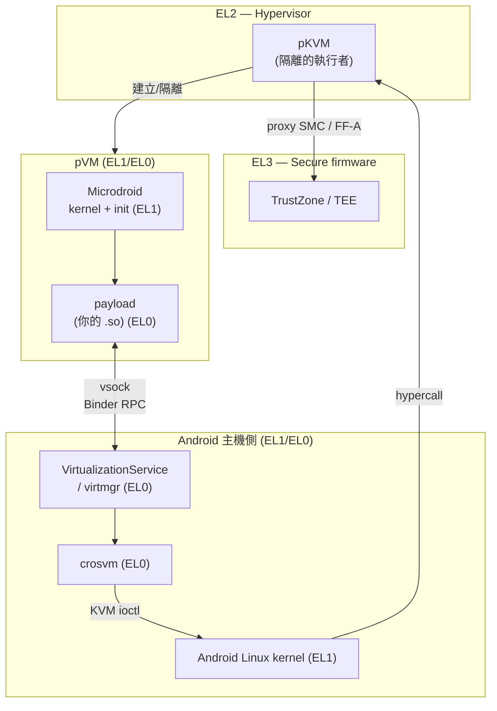
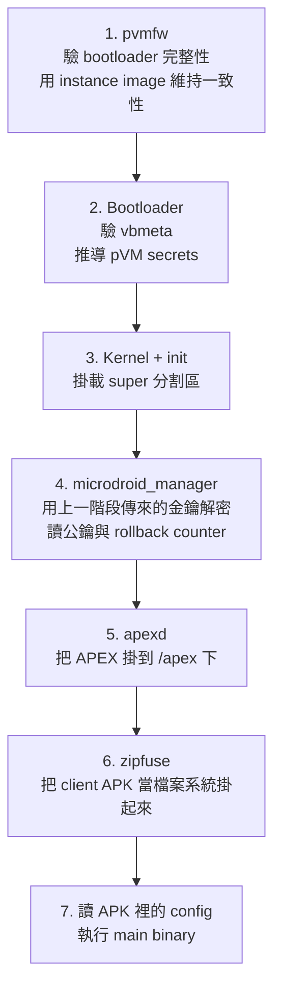
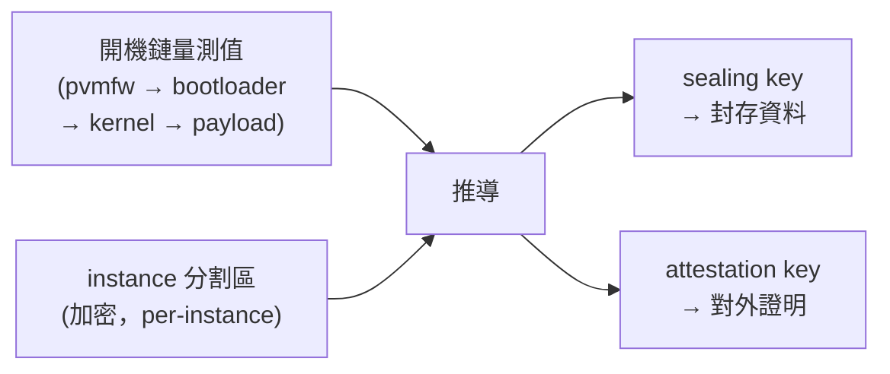

# Microdroid：Android 為什麼要在手機裡再開一台 Android

> 讀者定位：知道 Android 開機流程、SELinux、AVB 大概在做什麼，但沒碰過 AVF / pKVM。本文從「為什麼需要」講到「開機鏈每一步在驗什麼」，最後收在實務邊界。
>
> 姊妹篇：[AVB 深入解析](Android-Verified-Boot-AVB.md) 講的是「整台裝置的 Verified Boot」；本文講的是「一台 VM 內部自己的 Verified Boot」——會發現兩者是同一套機制在不同尺度上重演。

---

## 一、問題的起點：Android 的隔離已經不夠用了

Android 原本的隔離模型是 **UID sandbox + SELinux**：每個 App 一個 UID，policy 規定誰能碰什麼。這套東西擋得住 App 之間互相偷看，但有一個前提假設：

> **Linux kernel 是可信的。**

因為所有隔離都是 kernel 執行的。kernel 一被打下來，所有 sandbox 同時失效——UID 檢查、SELinux hook、權限模型全都是 kernel 裡的一段 `if`。

這在 2010 年代還算可以接受，因為當時「機密資料」大多是 App 自己的資料，且真正高價值的東西（金鑰、指紋樣板）已經被丟進 TrustZone 了。但接下來兩件事同時發生：

1. **需要保護的計算變重了。** 早期 TrustZone 只要存金鑰、做簽章；現在要跑的是 on-device 機器學習推論、DRM 影像解碼、ART 的 AOT 編譯。這些東西動輒上百 MB 記憶體、要跑幾十秒，把它們塞進 TEE 是災難——TEE 的 TCB 本來要「小到可以審計」，塞進一個 ML runtime 就沒有這個性質了。
2. **kernel 攻擊面持續擴大。** vendor driver、DSP/NPU driver、各種 SoC 專屬 IP 的 kernel 介面愈來愈多。[Pixel 8 GXP DSP 那個案例](pixel8-gxp-dsp.md) 就是很典型的展示：主流防護（MTE、KASLR、SELinux）全開，攻擊者換走一顆沒人看過的 DSP driver 就整條打穿到 root。

於是需求變成：**我要一個「比 App sandbox 強、但比 TEE 便宜」的隔離層級，而且它的安全性不能建立在「Linux kernel 沒有洞」這個假設上。**

這就是 AVF（Android Virtualization Framework）與 Microdroid 存在的理由。

---

## 二、先把這疊東西的名字分清楚

初學這塊最大的障礙是名詞太多且層次混亂。一次講清楚：

| 名稱 | 它是什麼 | 跑在哪 |
|---|---|---|
| **AVF** | Android Virtualization Framework，整套框架的統稱（不是某個程式） | — |
| **pKVM** | protected KVM，做隔離的 hypervisor 本體 | EL2 |
| **crosvm** | VMM（Virtual Machine Monitor），用 Rust 寫的，負責模擬 virtio 裝置、組裝磁碟映像 | Android host 的 userspace |
| **VirtualizationService** / **virtmgr** | Android 這側的管理服務，開關 VM、配 CID、生成磁碟 | Android host 的 userspace |
| **pVM** | protected VM，被 pKVM 保護起來的那個 guest（一個容器概念，裡面裝什麼都行） | guest |
| **Microdroid** | 一個**極簡的 Android based guest OS**，是 pVM 裡最常裝的東西 | guest |

一句話理清關係：

> **pKVM 提供隔離，crosvm 提供虛擬硬體，Microdroid 是裝進去的作業系統，AVF 是這一整套的名字。**

Microdroid 官方定義就是「a mini-Android OS that runs in a pVM」。它跟 pVM 不是同一件事——你可以在 pVM 裡跑別的東西（Android 15+ 的 Linux Terminal 就是在 AVF 上跑 Debian，那不是 Microdroid）。



---

## 三、關鍵設計：host kernel 被「降權」了

這是整套機制最重要的一件事，也是最容易被輕描淡寫帶過的一件事。

ARM 定義四個 exception level：

| EL | 誰住在這 |
|---|---|
| EL0 | userspace |
| EL1 | Linux kernel |
| **EL2** | **pKVM hypervisor** |
| EL3 | secure firmware（TrustZone） |

一般的 KVM，hypervisor 是 kernel 的一部分，所以「host kernel」和「hypervisor」是同一個信任等級。**pKVM 把它們拆開**：hypervisor 那一小塊留在 EL2，Android 的 Linux kernel 被留在 EL1。

結果是：**Android kernel 從此不是 guest 的 TCB 的一部分。** 它還是能開關 VM、還是能調度 CPU，但它**讀不到 guest 的記憶體**。

實現手法是記憶體所有權轉移。文件的說法是：guest 的記憶體一開始屬於 host，建立 pVM 時「host donates memory pages」，然後「hypervisor transitions the ownership of those pages from the host to the pVM」。技術上是透過 **stage 2 page table**——pKVM 為 host 也開了一份 stage 2 轉譯，把捐出去的頁面從 host 的 stage 2 拿掉。host kernel 拿著實體位址也解不開，因為它的 stage 2 沒有那個 mapping。

要通訊怎麼辦？**guest 必須主動用 hypercall 把特定頁面分享回去**。所以 virtio 的資料 buffer 是走一個明確的共享視窗（doc: 「data buffers bounced through shared memory windows」），而不是 host 想讀哪就讀哪。

幾個配套機制也值得記下來：

- **MMIO guard**：guest 對 MMIO 的存取會被攔下來 trap 給 hypervisor，而不是任意穿透。
- **DMA 保護必須靠 IOMMU**。文件明白要求所有具備 DMA 能力的裝置都要有 IOMMU（推薦 Arm SMMU）。理由很直接：**如果某顆周邊可以繞過 MMU 直接寫實體記憶體，pKVM 的 stage 2 保護就形同虛設**——這正是 [GXP 那個漏洞](pixel8-gxp-dsp.md) 的攻擊路徑，只是換了個尺度重演。
- **SMC 走 pKVM proxy，並實作 FF-A**（Firmware Framework for Arm）。這是為了防 confused deputy：host 不能叫 TrustZone 去讀一塊它自己讀不到的 buffer。

> **一句話**：pKVM 的價值不在「能開 VM」，而在**它讓「Android kernel 被打下來」不再等於「機密資料洩漏」**。這是威脅模型的改變，不是效能或功能的改變。

目前 protected VM 只支援 **ARM64**；x86_64 只能跑 non-protected VM（給開發測試用）。

---

## 四、Microdroid 有什麼、沒有什麼

理解 Microdroid 的最快方式是看它砍掉了什麼。官方列的**不支援**清單：

- ❌ `android.*` 的 Java API
- ❌ SystemServer 與 Zygote
- ❌ 圖形 / UI
- ❌ HAL

**支援**的：

- ✅ NDK API 的子集（Android 的 libc / Bionic 的 API 全部提供）
- ✅ Verified Boot 與 SELinux
- ✅ 從 APK 裡載入並執行一個 binary + 它的 shared library
- ✅ Binder RPC over vsock，以及帶隱含完整性檢查的檔案交換
- ✅ 載入 APEX
- ✅ 除錯功能：adb、logcat、tombstone、gdb

從這張清單可以直接推出 Microdroid 的定位：

> **它不是「一台小 Android」，而是「一個帶 Bionic 和 Verified Boot 的原生執行環境」。**

沒有 Zygote 和 SystemServer，意思是**不要想在裡面跑 Activity、拿 Context、用 Java framework**。你的 payload 是一顆 native `.so`。`java.*` 的核心 API 在載入 ART APEX 之後可以用，但 `android.*` 那一整套不存在。

沒有 HAL，意思是**碰不到硬體**。這不是還沒做，是設計意圖——一個 pVM 的價值就在於它的攻擊面小，把 HAL 接進去就把攻擊面接回來了。

有 SELinux 這點滿有趣：VM 內部**又跑了一次**完整的 Verified Boot + SELinux。這是縱深防禦——就算 payload 本身被打下來，它在 VM 裡還是被關著。

---

## 五、磁碟映像：一台 VM 的分割表

crosvm 會組出一個 composite disk image。分割區組成（官方明述）：

| 分割區 | 內容 |
|---|---|
| `bootloader` | 驗證並啟動 kernel |
| `boot.img` | kernel 與 init ramdisk |
| `vendor_boot.img` | VM 專屬的 kernel module，例如 virtio |
| `super.img` | system 與 vendor 兩個 logical partition |
| `vbmeta.img` | verified boot metadata |

加上 VirtualizationService 額外生成的兩塊：

| 分割區 | 內容 |
|---|---|
| `payload` | 由 Android 的 APEX 與 APK 撐起來的一組分割區 |
| `instance` | **加密**分割區，持久保存 per-instance 的 verified boot 資料 |

看到這張表應該會有既視感：`boot` / `vendor_boot` / `super` / `vbmeta`——**這就是一台 Android 手機的分割表**。Microdroid 完整複製了 Android 的 Verified Boot 結構，只是尺度縮到一台 VM 裡面。

`instance` 那塊是整套安全模型的樞紐，第七節再談。

---

## 六、開機鏈：每一步在驗什麼

這是本文的核心。Microdroid 的開機鏈（官方順序）：



逐步看重點：

### 6.1 pvmfw：VM 自己的 Boot ROM

`pvmfw`（protected VM firmware）是 guest 記憶體裡執行的第一段程式，扮演的角色**等同於實體裝置上燒死在晶片裡的 Boot ROM**——信任鏈的起點。

它做兩件事：驗證下一階段（bootloader）的完整性，以及**透過 instance image 維持「這台 VM 的身分一致性」**。後者是精髓：pvmfw 要能回答「這次開機的這台 VM，跟上次那台是不是同一台、跑的是不是同一份程式」。

### 6.2 Bootloader：驗 vbmeta，推導 secrets

這一步和實體手機的 ABL 做的事高度平行（可對照 [ABL / AVB 逆向那篇](abl-avb-reversing.md)）：驗 `vbmeta` 的簽章、走 descriptor、決定要不要放行。

差別在多了一件事：**推導 pVM secrets**。金鑰不是「存」在某處給 VM 讀，而是**從開機鏈的量測值一路推導出來的**。這代表：

> **程式碼改了 → 量測值變了 → 推導出來的金鑰就變了 → 舊資料解不開。**

這是 DICE 家族的核心手法。它的實務意義是：攻擊者換掉 payload 之後，那台 VM 的 sealing key 自然就不一樣了，**根本讀不到原本封存的資料**——不需要任何額外的「檢查有沒有被改」的邏輯，改了就自動解不開。

### 6.3 microdroid_manager：VM 內的 init 之後那一棒

`init.rc` 官方說是「similar to that of full Android but tailored to the needs of Microdroid」——結構一樣，內容砍掉大半。

`microdroid_manager` 是這裡最關鍵的 service，它負責：

- 用**上一階段傳來的金鑰**解密（instance 映像）
- 讀出**公鑰與 rollback counter**
- 透過 **Binder RPC** 與 Android 側的 VirtualizationService 通訊
- 從 APK 的 config 讀出 main binary 位置，然後執行它

它是「VM 內部的驗證決策者」——公鑰比對和 rollback 檢查都在這裡收斂。

### 6.4 zipfuse：不解壓縮就掛載 APK

`zipfuse` 是 Microdroid 自己的 FUSE 檔案系統，作用是把 client 的 APK（本質上就是個 Zip）**直接當成檔案系統掛起來**。

為什麼不解壓縮？兩個理由：

1. **省時間省空間**。APK 可能幾十上百 MB，開機時解壓縮是純浪費。
2. **保留驗證能力**。APK 有自己的簽章與 Merkle 樹（APK Signature Scheme v4 的 idsig），按需讀取時可以逐塊驗；解壓縮到某個可寫目錄之後，這個保證就斷了。

這個設計和 `adb remount` 用 overlayfs、Android 用 EROFS 的思路一致：**能不搬資料就不搬，驗證要能跟著資料一路帶到讀取那一刻。**

---

## 七、身分、金鑰與防回滾

pVM 拿到兩把不同用途的金鑰（官方明述）：

| 金鑰 | 用途 |
|---|---|
| **sealing key** | 穩定的封存金鑰，用來加密持久化資料 |
| **attestation key** | 簽章用，向外證明「我是誰、我跑的是什麼」 |

「穩定」（stable）這個詞是關鍵：**同一台 VM 實例、跑同一份程式，每次開機推導出來的 sealing key 都一樣**，所以資料能跨開機存活。反之，任何一項改變都會讓它變成另一把金鑰。

`instance` 分割區就是撐起這個「同一台」概念的東西。它是加密的，裡面存 per-instance 的 verified boot 資料——公鑰、rollback counter 等。開機流程裡 pvmfw 用它「maintain consistency」、`microdroid_manager` 從裡面讀 rollback counter，指的都是這塊。

**rollback counter 的作用和實體裝置上的 rollback index 完全一樣**：擋住「刷回一份過去合法簽署、但含已知漏洞的舊 payload」。差別只在儲存位置——實體裝置用 RPMB，Microdroid 用這塊加密分割區。



實務上的推論：**這也意味著「合法更新 payload」需要被當成一件事來設計。** 你的 payload 升版了，量測值就變了，sealing key 就變了，上一版封存的資料原地失效。任何要跨版本保留狀態的設計都得先想清楚遷移路徑（此段為作者依機制推論，非文件明述）。

---

## 八、通訊：vsock、Binder RPC、AuthFS

pVM 沒有網路概念，只有 **vsock**。

vsock 用 32-bit 的 **CID**（context identifier）定位，官方的類比是「analogous to IP addresses」，由 `VirtualizationServiceInternal` 分配，再由 `virtmgr` 裡的 VirtualizationService 帶著這個 CID 去啟動 crosvm 子行程。

在 vsock 之上跑的是 **Binder RPC**。這點很值得注意：Android 把 Binder 從「kernel driver 上的 IPC」擴展成「socket 上的 RPC」，於是**同一套 AIDL 介面可以跨 VM 邊界**。Client 端用 `RpcSession` 連，Server 端用 `RpcServer` 提供服務。對開發者的意義是：你不用自己設計序列化協定，寫 AIDL 就好。

VM 生命週期是**引用計數**的：只要 client 還持有 `IVirtualMachine` 物件，VM 就繼續跑；所有引用消失時服務會自動關掉 VM。這個設計是為了防止「client 行程被殺掉之後留下孤兒 VM 吃資源」。

檔案交換用 **AuthFS**。它解決的問題是：兩端**互不信任**，但要交換檔案。做法是在**每一次存取操作**上做透明的完整性檢查（官方類比是 `fs-verity`）。

重點在「每一次存取」而不是「開檔時驗一次」。開檔時驗一次的模型在跨信任邊界時是無效的——對方可以在你驗完之後才改內容（TOCTOU）。逐次存取驗證才擋得住。

---

## 九、實務：怎麼跑、怎麼看

AVF 相關的執行檔都在 `com.android.virt` 這個 APEX 裡，`vm` 是主要的除錯 CLI：

```bash
# 大致長相；子命令與旗標依 Android 版本有差，先跑 --help 為準
adb shell /apex/com.android.virt/bin/vm --help
adb shell /apex/com.android.virt/bin/vm list
```

`vm` 能做的事官方描述是：從 shell 啟動 VM、看 log、關掉 VM。

**Debug level 是最需要記住的一個概念。** VM 可以用 **debuggable（FULL）** 或 **non-debuggable（NONE）** 啟動：

| Debug level | 能做什麼 | 用在哪 |
|---|---|---|
| FULL | adb、logcat、tombstone、gdb 都能用 | 開發 |
| NONE | 上述全部關閉 | 出貨 |

**這兩者的差別不是「方便程度」，是安全等級。** 一台 debuggable 的 pVM 等於把 guest 內部攤開給 host 看——那正好是 pKVM 存在的目的所要防止的事。文件明確說 production deployment 應該用 non-debuggable。

由此推出一條實務原則（作者觀點）：

> **任何在 debuggable VM 上做出的機密性驗證結果都不算數。** 要驗機密性，必須跑在 NONE 上；而 NONE 上你看不到 log——所以除錯策略必須從一開始就設計，不能等到出問題才想。

Client App 這側，官方說法是「透過 AIDL API 存取 VirtualizationService，方式是直接執行 `virtmgr`，或引入 javalib / rustlib」。實際的 framework 類別名稱、需要的權限、`vm_config.json` 的完整欄位，官方這幾頁沒有列出來，**請以你所用 Android 版本的 `packages/modules/Virtualization/` 原始碼與 SDK 文件為準**。

---

## 十、邊界與常見誤解

### 10.1 「Microdroid 是輕量 Android，所以我的 App 邏輯搬進去就能跑」

不能。沒有 Zygote、沒有 SystemServer、沒有 `android.*`。你要準備的是一顆 native library，不是一個 Activity。這是移植成本的主要來源，而且是架構性的，沒有 workaround。

### 10.2 「開了 pVM 就安全了」

pKVM 保護的是**記憶體隔離**。它不保護：

- payload 自己的邏輯漏洞（VM 裡照樣有 SELinux 關著它，就是因為預期它可能被打下來）
- 沒有 IOMMU 的 DMA 路徑（這是硬體前提，不是軟體能補的）
- 你自己選擇分享出去的頁面
- host 對 VM 的**可用性**攻擊——host 還是能把 VM 關掉。pKVM 提供的是機密性與完整性，**不是可用性**

### 10.3 「pVM 可以取代 TEE」

不能，也不是設計目的。TEE（EL3/TrustZone）在信任等級上仍然比 pVM 高，而且有硬體綁定的 root of trust。pVM 是**中間層**：比 App sandbox 強、比 TEE 便宜、可以承載大型計算。這三者是階梯而不是替代關係。

### 10.4 「debuggable 跟 non-debuggable 只差在能不能看 log」

見第九節。差在攻擊者能不能看你的 guest。

### 10.5 硬體支援不是普遍的

protected VM 目前只有 ARM64，且需要平台的 pKVM 支援與 IOMMU。**在寫任何依賴 pVM 的功能之前，先確認目標裝置上真的支援**，並且設計好不支援時的退路。具體的偵測 property 名稱依版本而異，請查你手上那版的原始碼。

---

## 十一、一句話的心智模型

> **Microdroid 把「一台 Android 裝置的 Verified Boot 信任鏈」整套縮小，塞進一個 Android kernel 讀不到的記憶體區域裡。**

抓住這個模型，前面所有細節都變成推論：

- 因為是**完整的信任鏈** → 才會有 `bootloader` / `vbmeta` / `super` 這組分割區、才會有 pvmfw 當 Boot ROM、才會有 rollback counter。
- 因為 **Android kernel 讀不到** → 才需要記憶體捐贈與 stage 2、才需要 vsock 而非共享記憶體亂讀、才需要 IOMMU 補上 DMA 這個漏洞。
- 因為**金鑰從量測值推導** → 改了程式碼就自動解不開舊資料，不需要額外的防竄改檢查。
- 因為要**縮小** → 砍掉 Zygote、UI、HAL；payload 只能是 native `.so`。

反過來說，這個模型也直接標出它的極限：**它保護的是「跑什麼」和「資料被誰看見」，不保護「跑不跑得起來」。**

---

## 驗證說明

本文以下內容取自 AOSP 官方文件（2026-07-30 抓取）：

- Microdroid 的支援 / 不支援清單、磁碟分割區組成、開機鏈七個階段與各階段職責、`zipfuse` 與 AuthFS 的定義、sealing key / attestation key 兩把金鑰 —— [source.android.com/docs/core/virtualization/microdroid](https://source.android.com/docs/core/virtualization/microdroid)
- Exception level 配置、pKVM 的記憶體捐贈與 stage 2、MMIO guard、IOMMU / SMMU 要求、FF-A 與 SMC proxy、crosvm 為 Rust 實作的 VMM、ARM64-only 的限制 —— [source.android.com/docs/core/virtualization/architecture](https://source.android.com/docs/core/virtualization/architecture)
- `virtmgr` 的行程模型、CID 的分配、VM 生命週期引用計數、`vm` CLI 的用途、debuggable（FULL）/ non-debuggable（NONE）與 production 建議 —— [source.android.com/docs/core/virtualization/virtualization-service](https://source.android.com/docs/core/virtualization/virtualization-service)

以下為**作者依機制所作的推論或觀點，非文件明述**，引用前請自行驗證：

- 「金鑰從量測值推導 → 改程式碼就解不開舊資料」是依 sealing key 的 stable 語意與 DICE 的一般設計推得；本文引用的三頁文件未展開 DICE / CDI 的推導細節。
- payload 升版導致封存資料失效、因此需要設計遷移路徑（第七節末）。
- 「debuggable VM 上的機密性驗證不算數」這條實務原則。
- 第一節把 GXP 案例、TEE 成本、kernel 攻擊面串成 AVF 的動機，是作者的敘事框架。
- `zipfuse` 不解壓縮的兩個理由（省資源、保留逐塊驗證能力）中，第二點關於 APK Signature Scheme v4 idsig 的部分是依機制推論。

**本文未涵蓋**（想深入的話這幾塊都要另外查你所用版本的原始碼）：

- DICE / BCC 憑證鏈的實際結構與 CDI 推導步驟
- `vm_config.json` 的完整欄位、payload 的 C API 名稱、framework 類別與所需權限
- Gunyah（部分平台使用的另一套 hypervisor）與 pKVM 的差異
- 偵測 pVM 支援度的 property 名稱
- 效能數據與開機時間

---

## 參考資料

- [Microdroid | Android Open Source Project](https://source.android.com/docs/core/virtualization/microdroid)
- [AVF architecture | Android Open Source Project](https://source.android.com/docs/core/virtualization/architecture)
- [VirtualizationService | Android Open Source Project](https://source.android.com/docs/core/virtualization/virtualization-service)
- 原始碼：`packages/modules/Virtualization/`（AOSP）
- 相關筆記：[AVB 深入解析](Android-Verified-Boot-AVB.md)、[ABL / AVB 真機逆向](abl-avb-reversing.md)、[Pixel 8 GXP DSP 漏洞](pixel8-gxp-dsp.md)
