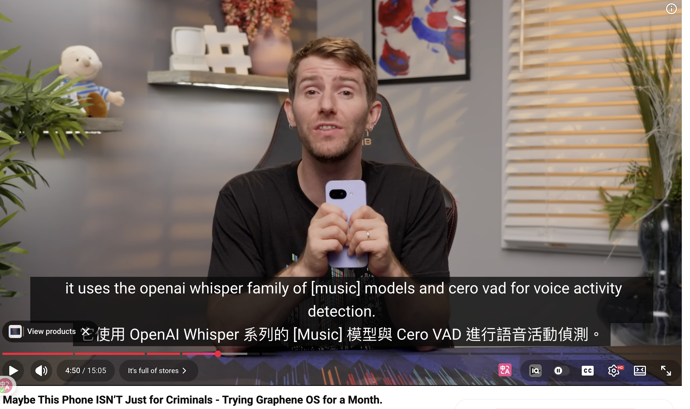
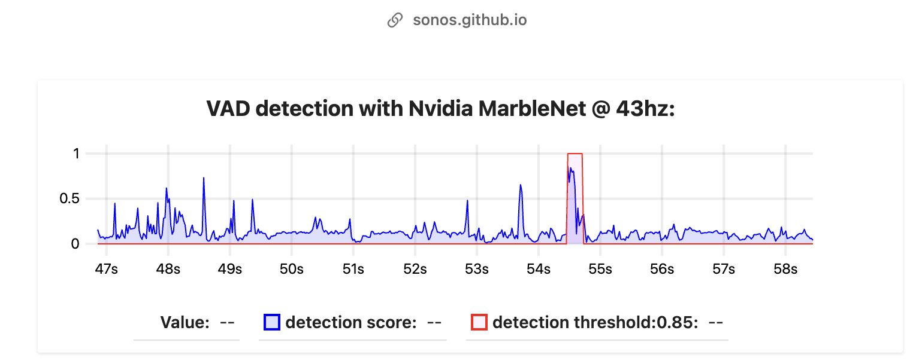
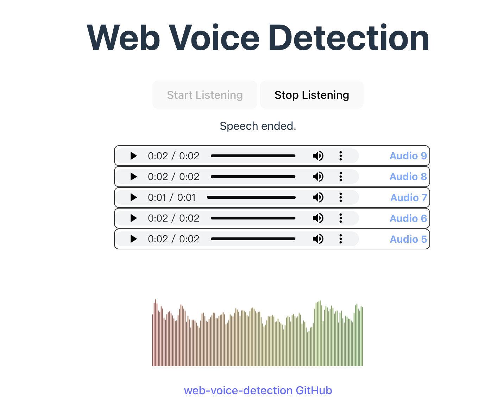
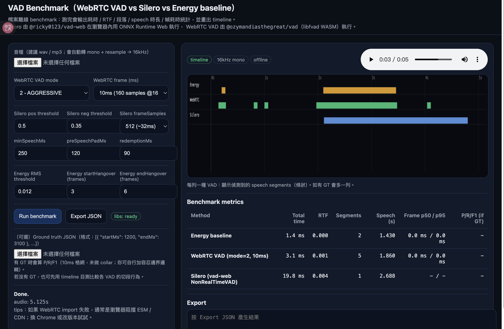

 浏览器语音活动检测实战指南：3种方法快速集成VAD功能https://blog.csdn.net/gitblog_00517/article/details/156661924

https://sonos.github.io/torch-to-nnef/latest/html/demo_vad.html

- **Sonos torch-to-nnef VAD demo**：網頁 demo，可直接體驗 VAD。
https://thecodetherapy.github.io/test-voice-detection/

**效能（Performance）**

- **Real-time factor（RTF）**：跑完一段音檔花多久（處理時間 / 音檔長度），RTF < 1 才能即時。
    
- **平均每秒處理量**：每秒能處理多少音訊 frame（可用 `onFrameProcessed` 估算）。
    
- **CPU 壓力下穩定性**：DevTools Performance + 開其他負載，看是否掉 frame / 延遲飄。
    

**準確度（Quality）**

- **False positive / false negative**：把「靜音/噪聲」誤判成說話、或漏判。
    
- **起始/結束延遲**（onset/offset lag）：開始講話多久才亮、停講多久才熄（跟你的 UX 直接相關）。
https://alanhc.github.io/vad-bench/

