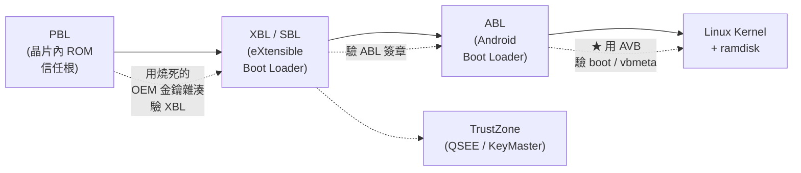
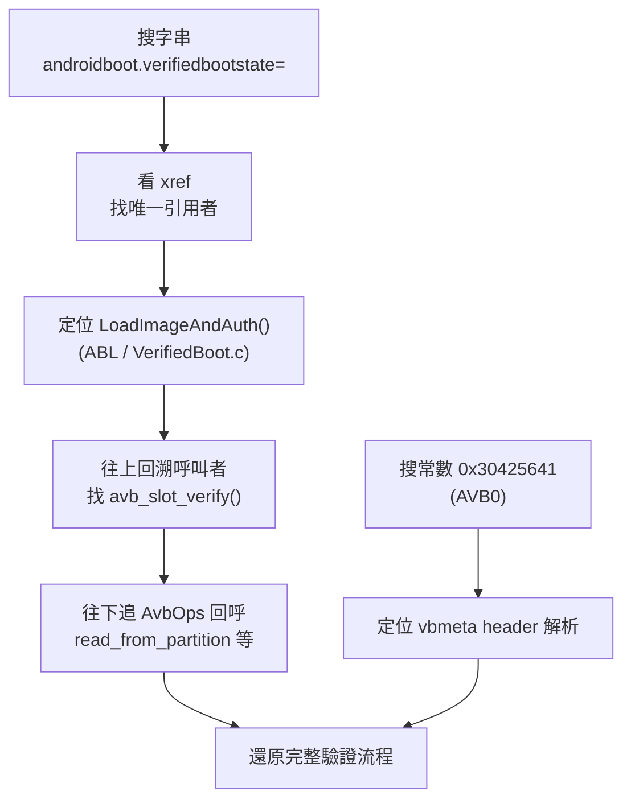
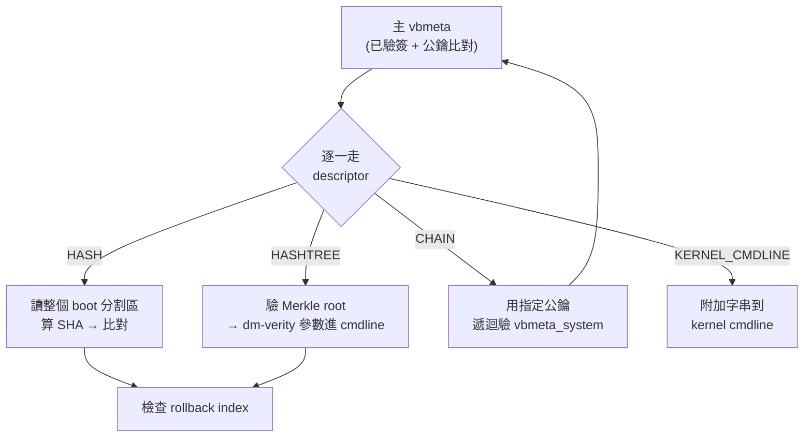
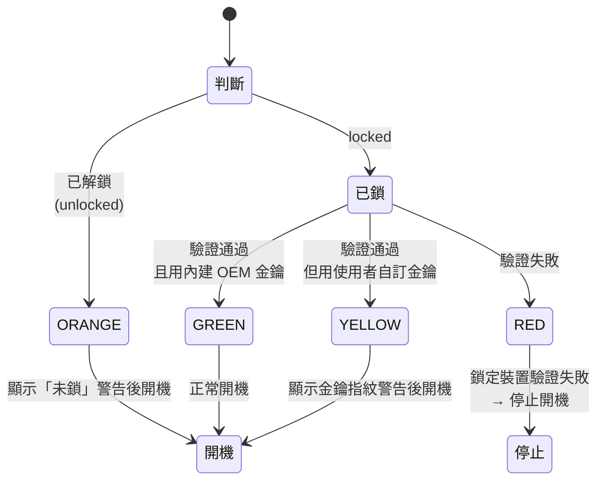

# 把 ABL 拆開看:AVB 驗證在真機上到底怎麼跑

> 這是 [vboot vs AVB] 那篇的續集。上一篇談的是「規格上兩套 Verified Boot 的設計差異」——那是紙上的 AVB。這篇要做的是把 Qualcomm 手機的 **ABL(Android Boot Loader)** 反組譯出來,對照 AOSP 的 `libavb` 原始碼,看 AVB 2.0 在真機上**實際跑了哪幾步**。規格寫得再漂亮,廠商怎麼接、哪些檢查真的有做、device state 怎麼決定,只有把 binary 拆開才看得到。
>
> 讀者定位:即使你只知道「手機開機會驗證系統有沒有被改過」也能跟得上。前半段補背景 + 講怎麼逆向,後半段深入實作。

---

## 0. 先建立地圖:ABL 在開機鏈的哪裡?

Verified Boot 的核心概念是 **信任鏈(chain of trust)**:每一階段的程式,在執行下一階段之前,先驗證下一階段沒被竄改。鏈的起點是一段燒死在晶片裡、無法竄改的程式碼(hardware root of trust)。

Qualcomm 平台的開機鏈大致長這樣:



重點:**ABL 是信任鏈裡「第一個用 AVB 來驗證 Android 分割區」的階段**。前面 PBL→XBL→ABL 用的是 Qualcomm 自己的 ELF 簽章格式(不是 AVB);到了 ABL 要載入 `boot.img` / `init_boot` / `vendor_boot` / `dtbo` 時,才切換成 Google 的 AVB。所以想看 AVB 的實作,ABL 就是那把鑰匙。

> ABL 本身是一個 **UEFI application**,建構在 edk2 之上,Qualcomm 的相關程式碼在 `QcomModulePkg`(過去在 CodeAurora / 現在 CodeLinaro 上有部分開源)。它把 Google 的 `libavb` 直接編進去,再自己實作 `libavb` 需要的 I/O 回呼(`AvbOps`)。這點很關鍵:**驗證邏輯是 Google 的、通用的;I/O 與金鑰/rollback 儲存是廠商的、平台相關的。** 逆向時要分清楚你正在看哪一半。

---

## 第一部分:方法論 —— 怎麼把 ABL 拆開並定位 AVB

### 1.1 取得 ABL binary

ABL 藏在廠商的韌體包裡,常見來源:

- **原廠 factory image / OTA**:解開後會有 `abl.img`、`abl_a.img`(A/B slot)或包在 `payload.bin` 裡(用 `payload-dumper-go` 解出 `abl` 分割區)。
- **從裝置直接抓**:`fastboot fetch abl_a` 或 dump `/dev/block/by-name/abl_a`(需要權限)。

拿到的 `abl.img` 通常是一個 **ELF 外殼**:多個 program header,外層包著 Qualcomm 的簽章(hash segment),真正的程式是裡面的 **PE32+/TE 影像(UEFI application)**。

### 1.2 剝殼:從 ELF 到可反組譯的 PE

```bash
# 看 ELF 結構,確認它是 AArch64、有幾個 segment
readelf -l abl.img

# 用 binwalk / uefi-firmware-parser 把內層的 UEFI FV / PE 抽出來
binwalk -e abl.img
# 或
python3 -m uefi_firmware parse abl.img -O

# 內層是 UEFI 韌體卷(FV),用 UEFITool 打開可以看到各個 module,
# 找到 LinuxLoader / BootLib 相關的 PE32 module
```

剝出來之後,你會拿到一個 **AArch64 的 PE32+ 影像**。丟進 Ghidra 或 IDA:

- Language 選 `AARCH64:LE:64:v8A`
- Format 讓它認 PE(TE 影像有時要手動指定 base、指定 entry)

### 1.3 定位 AVB:字串是你最好的朋友

`libavb` 是純 C、幾乎沒被混淆,而且**到處是描述性字串**——這是逆向的黃金錨點。開 Ghidra 的 Defined Strings 視窗,搜以下幾類:

| 錨點類型 | 範例字串 / 常數 | 為什麼有用 |
|---|---|---|
| 原始碼檔名 | `avb_slot_verify.c`、`avb_vbmeta_image.c` | libavb 的 `avb_assert` / error log 會帶檔名,直接標出函式歸屬 |
| Magic 常數 | `"AVB0"` = `0x30425641`(小端讀成 immediate) | vbmeta header 開頭 4 bytes,認出 header 解析點 |
| cmdline 鍵 | `androidboot.verifiedbootstate=`、`androidboot.vbmeta.digest=`、`androidboot.vbmeta.size=` | 直接落在「把驗證結果組成 kernel cmdline」的程式碼 |
| 狀態顏色 | `orange`、`yellow`、`red`、`green` / 警告畫面文字 | 落在 device state → 顯示/放行的決策點 |
| 分割區名 | `vbmeta`、`boot`、`vendor_boot`、`dtbo`、`init_boot` | 落在「要驗哪些分割區」的 requested_partitions 清單 |
| 錯誤字串 | `ERROR_VERIFICATION`、`Public key ... rejected`、`Hash of ... does not match` | 標出各個失敗分支 |

實務上最快的一條路:搜 **`androidboot.verifiedbootstate=`** → 交叉參考(xref)找到唯一引用它的函式 → 那幾乎一定是 ABL 的 `LoadImageAndAuth()` 尾段,往上回溯就能看到整個 `avb_slot_verify()` 的呼叫與結果處理。



---

## 第二部分:實作 —— AVB 驗證真正跑的每一步

以下把反組譯還原出的控制流,對照 `libavb` 原始碼一步步走。程式碼片段是**還原後的示意 C**(不是逐行反編譯輸出),常數與結構名稱都取自公開的 `libavb`,可對照查證。

### 2.1 入口:`avb_slot_verify()`

ABL 準備好一份 `AvbOps`(把「怎麼讀分割區、怎麼讀 rollback、裝置有沒有解鎖」這些平台細節塞進去的回呼表),然後呼叫 libavb 的總入口:

```c
// libavb 的公開簽名(還原時看到的參數順序就是這個)
AvbSlotVerifyResult avb_slot_verify(
    AvbOps* ops,
    const char* const* requested_partitions,   // {"boot","init_boot","vendor_boot","dtbo",NULL}
    const char* ab_suffix,                      // "_a" 或 "_b"
    AvbSlotVerifyFlags flags,
    AvbHashtreeErrorMode hashtree_error_mode,
    AvbSlotVerifyData** out_data);
```

`AvbOps` 就是「Google 邏輯 vs 廠商實作」的分界線。反組譯時你會看到一張函式指標表,對應這些回呼:

```c
struct AvbOps {
    void* user_data;
    AvbIOResult (*read_from_partition)(...);          // ← ABL 用 UEFI BlockIo 實作
    AvbIOResult (*get_preloaded_partition)(...);
    AvbIOResult (*write_to_partition)(...);
    AvbIOResult (*validate_vbmeta_public_key)(...);    // ← ★ 比對 OEM 公鑰(信任根)
    AvbIOResult (*read_rollback_index)(...);           // ← 讀防回滾計數(常存在 RPMB)
    AvbIOResult (*write_rollback_index)(...);
    AvbIOResult (*read_is_device_unlocked)(...);       // ← 讀 bootloader lock 狀態
    AvbIOResult (*get_unique_guid_for_partition)(...);
    AvbIOResult (*get_size_of_partition)(...);
    AvbIOResult (*read_persistent_value)(...);
    AvbIOResult (*write_persistent_value)(...);
    AvbIOResult (*validate_public_key_for_partition)(...);
};
```

**逆向重點**:上面標星號的兩個回呼,是「信任」真正落地的地方。`validate_vbmeta_public_key` 決定「這把簽 vbmeta 的公鑰是不是我認可的 OEM 金鑰」;`read_is_device_unlocked` 決定「驗失敗要不要擋開機」。把這兩個函式的實作看懂,就看懂了這支手機的安全模型。

### 2.2 讀 vbmeta 並解析 header

`avb_slot_verify` 內部先處理主 `vbmeta` 分割區(頂層),讀進來後交給 `avb_vbmeta_image_verify()`。第一件事是驗證 header 的 magic 與版本:

```c
// AvbVBMetaImageHeader:256 bytes,所有欄位都是 big-endian
// 開頭 magic 一定是 "AVB0"
if (avb_memcmp(header.magic, "AVB0", 4) != 0)          // 0x41 0x56 0x42 0x30
    return AVB_VBMETA_VERIFY_RESULT_INVALID_VBMETA_HEADER;

if (header.required_libavb_version_major > AVB_VERSION_MAJOR /* =1 */)
    return AVB_VBMETA_VERIFY_RESULT_UNSUPPORTED_VERSION;
```

header 裡幾個關鍵欄位(反組譯時看到的都是對這個 struct 的固定 offset 存取,byteswap 後使用):

| 欄位 | 意義 |
|---|---|
| `authentication_data_block_size` | 認證區(hash + signature)大小 |
| `auxiliary_data_block_size` | 輔助區(public key + descriptors)大小 |
| `algorithm_type` | 簽章演算法(見下表) |
| `hash_offset` / `hash_size` | 對 header+aux 算出的雜湊,擺在哪 |
| `signature_offset` / `signature_size` | RSA 簽章,擺在哪 |
| `public_key_offset` / `public_key_size` | 內嵌公鑰,擺在哪 |
| `descriptors_offset` / `descriptors_size` | descriptor 陣列 |
| `rollback_index` | 這份映像的防回滾版本號 |
| `rollback_index_location` | 這個版本號要對照哪一格 rollback 槽 |
| `flags` | 是否停用 hashtree / 停用驗證 |

`algorithm_type` 對照(`AvbAlgorithmType`):

| 值 | 演算法 | 雜湊 | RSA 金鑰長度 |
|---|---|---|---|
| 0 | NONE | — | 不簽章 |
| 1 | SHA256_RSA2048 | SHA-256 | 2048 |
| 2 | SHA256_RSA4096 | SHA-256 | 4096 |
| 3 | SHA256_RSA8192 | SHA-256 | 8192 |
| 4 | SHA512_RSA2048 | SHA-512 | 2048 |
| 5 | SHA512_RSA4096 | SHA-512 | 4096 |
| 6 | SHA512_RSA8192 | SHA-512 | 8192 |

### 2.3 驗簽章:雜湊 + RSA

這是密碼學的核心步驟。`avb_vbmeta_image_verify()` 做兩件事:

1. **算雜湊**:對 `header(把 hash/signature 欄位清零的版本)+ auxiliary block` 跑 SHA-256/512,和 `hash_offset` 那份存的比對。這一步防止內容被改。
2. **驗 RSA 簽章**:用 vbmeta 內嵌的公鑰,對上面算出的雜湊做 RSA 驗章(`avb_rsa_verify`)。這一步證明「這份雜湊確實是私鑰持有者簽的」。

```c
// 概念流程(還原示意)
avb_sha256_init(&ctx);
avb_sha256_update(&ctx, header_with_zeroed_hash_sig, sizeof(header));
avb_sha256_update(&ctx, aux_block, aux_size);
digest = avb_sha256_final(&ctx);

if (avb_safe_memcmp(digest, header + hash_offset, hash_size) != 0)
    return AVB_VBMETA_VERIFY_RESULT_HASH_MISMATCH;

if (!avb_rsa_verify(pubkey, pubkey_len,
                    signature, sig_len,
                    digest, digest_len, ...))
    return AVB_VBMETA_VERIFY_RESULT_SIGNATURE_MISMATCH;
```

> **但這裡只證明了「vbmeta 是被某把私鑰簽的、內容完整」——還沒證明那把私鑰是不是「你的 OEM 金鑰」。** 這一刀由 ABL 的 `validate_vbmeta_public_key` 回呼補上:libavb 把「內嵌公鑰」丟回給廠商,廠商拿它和燒在裝置上的 OEM 公鑰(或其雜湊)比對。少了這一步,任何人自簽的 vbmeta 都會過關——這也是逆向時一定要確認廠商真的有實作、且真的有比對的地方。

### 2.4 走 descriptors:hash / hashtree / chain / cmdline

vbmeta 驗過之後,libavb 用 `avb_descriptor_foreach()` 逐一走訪 descriptor 陣列。每個 descriptor 有個 tag(`AvbDescriptorTag`):

| Tag 值 | 名稱 | 作用 |
|---|---|---|
| 0 | PROPERTY | 帶自訂 key/value(如 `com.android.build...`) |
| 1 | HASHTREE | 大分割區(system/vendor/product)用 dm-verity 的 Merkle tree 根 |
| 2 | HASH | 小分割區(boot/init_boot/dtbo)整塊算雜湊 |
| 3 | KERNEL_CMDLINE | 要附加到 kernel cmdline 的字串(dm-verity 參數常在這) |
| 4 | CHAIN_PARTITION | 把某分割區的驗證「轉交」給它自己的 vbmeta + 指定公鑰 |

兩種驗證策略,對應兩種 descriptor:

- **HASH descriptor(給小分割區,如 `boot`)**:開機時把整個分割區讀進來,算一次 SHA,和 descriptor 裡存的比對。全有或全無。
- **HASHTREE descriptor(給大分割區,如 `system`)**:開機時**不**整塊算(太大),只驗 Merkle tree 的 root hash;真正的逐塊驗證交給 Linux 的 **dm-verity**,在讀取時 on-demand 進行。descriptor 裡的 root digest + salt 會被組成 dm-verity 的 cmdline 傳給 kernel。

**CHAIN_PARTITION** 是很容易被忽略但很重要的一環:它讓 `vbmeta` 不必自己簽所有東西,而是說「`vbmeta_system` 這個分割區有它自己的簽章,請用**這把指定的公鑰**去驗它」。這就是為什麼一支手機上會有 `vbmeta`、`vbmeta_system` 等多份——逆向時看到 chain descriptor,要順著它的 `rollback_index_location` 和內嵌公鑰追下去,才不會漏掉半條驗證鏈。



### 2.5 防回滾:rollback index

每份 vbmeta 帶一個 `rollback_index`(可理解為「安全版本號」)。裝置在受保護儲存(Qualcomm 常用 **RPMB**,Replay Protected Memory Block)裡,依 `rollback_index_location` 存了「目前為止見過的最大值」。

```c
// 概念:讀裝置存的值,和映像宣告的值比
ops->read_rollback_index(ops, location, &stored_rollback);
if (image_rollback_index < stored_rollback)
    return AVB_SLOT_VERIFY_RESULT_ERROR_ROLLBACK_INDEX;   // 擋:這是舊版,不准降級
// 驗證全部通過、且是 GREEN 狀態時,才會把 stored 更新成新的較大值
```

作用:即使攻擊者手上有一份**過去合法簽署過、但含已知漏洞**的舊映像,也無法刷回去繞過修補。逆向時要確認 `read_rollback_index` / `write_rollback_index` 真的接到 RPMB(而不是被廠商 stub 成永遠回 0)——這是常見的安全弱化點。

### 2.6 決定 device state:綠 / 黃 / 橙 / 紅

所有驗證結果,最後收斂成一個 **verified boot state 顏色**。決策同時看兩件事:**bootloader 有沒有鎖(`read_is_device_unlocked`)** 與 **驗證有沒有過 / 用的是誰的金鑰**。



| 顏色 | 條件 | 行為 |
|---|---|---|
| **GREEN** | locked + 用內建 OEM 金鑰驗過 | 直接開機,無警告 |
| **YELLOW** | locked + 用使用者燒入的自訂金鑰驗過 | 顯示公鑰指紋警告數秒後開機 |
| **ORANGE** | unlocked | 顯示「裝置未鎖、無法驗證」警告後開機 |
| **RED** | locked 但驗證失敗 / dm-verity 損毀 | **停止開機**(或進 recovery) |

這顏色不只影響畫面,還會寫進 `androidboot.verifiedbootstate=green|yellow|orange|red` 傳給 kernel,Android framework(以及後續的 KeyMaster attestation)會據此決定信任等級。**這就是為什麼 2.1.3 節搜 `androidboot.verifiedbootstate=` 能一箭穿心地定位到整段流程的收尾。**

### 2.7 收尾:把結果組成 cmdline 交棒給 kernel

ABL 在 `LoadImageAndAuth()` 尾段,把 libavb 回傳的 `AvbSlotVerifyData`(裡面有算好的 cmdline 片段、vbmeta digest、各分割區資料)組裝成最終的 kernel command line:

```
... androidboot.verifiedbootstate=green
    androidboot.vbmeta.device_state=locked
    androidboot.vbmeta.hash_alg=sha256
    androidboot.vbmeta.size=5824
    androidboot.vbmeta.digest=<hex>
    dm="1 vroot none ro 1,0 ... verity ..."   ← 來自 hashtree/cmdline descriptor
```

然後才 `BootLinux()` 跳進 kernel。到這裡,信任鏈從燒死的晶片 ROM 一路延伸到了作業系統。

---

## 第三部分:理論 vs 實作對照

| vboot / AVB 規格說的 | ABL 反組譯裡實際看到的 |
|---|---|
| 「有一個信任根」 | PBL 用 QFPROM 燒死的 OEM 金鑰雜湊驗 XBL,XBL 驗 ABL——AVB 只從 ABL 這一段接手 |
| 「vbmeta 被簽章保護」 | `avb_vbmeta_image_verify()`:先 SHA 比對再 `avb_rsa_verify`,兩關都過才算數 |
| 「只信任 OEM 金鑰」 | **不是 libavb 保證的**,是廠商 `validate_vbmeta_public_key` 回呼比對燒入公鑰——弱化常發生在這 |
| 「大分割區用 hashtree」 | descriptor 只驗 Merkle root,實際逐塊驗證推給 kernel 的 dm-verity |
| 「防止降級到舊漏洞版本」 | `read/write_rollback_index` 接 RPMB;若被 stub 成回 0 則防回滾形同虛設 |
| 「裝置狀態影響信任」 | 綠/黃/橙/紅收斂進 `androidboot.verifiedbootstate=`,再影響 KeyMaster attestation |
| 「解鎖 bootloader 就不驗」 | `read_is_device_unlocked` 回 true → ORANGE → 帶 `ALLOW_VERIFICATION_ERROR` 旗標,驗證失敗也放行 |

**一句話總結**:libavb 提供的是**通用、可驗證的密碼學骨架**;真正決定一支手機安不安全的,是廠商在 `AvbOps` 那幾個回呼裡「金鑰比對做得對不對、rollback 有沒有真的接、鎖狀態有沒有真的擋」。逆向的價值,就在於驗證這後半段有沒有偷工。

---

## 第四部分:逆向時常踩的坑

- **ABL 不是純 libavb**:別把廠商包裝層(`QcomModulePkg` 的 `VerifiedBoot.c`、`BootLinux.c`)當成 libavb 本體。函式名帶 `Vb*`、`AppendVBCommonCmdLine`、`LoadImageAndAuth` 的是廠商層;`avb_*` 開頭的才是 Google 的。
- **big-endian 陷阱**:vbmeta 所有多位元組欄位都是 big-endian。反組譯看到一堆 `rev`/`byteswap` 別以為是雜訊,那是在轉 header 欄位。
- **A/B slot suffix**:`ab_suffix`(`_a`/`_b`)會被拼進分割區名。追 `read_from_partition` 時記得它讀的是 `boot_a` 不是 `boot`。
- **`AVB_SLOT_VERIFY_FLAGS_ALLOW_VERIFICATION_ERROR`**:解鎖裝置會帶這個旗標,讓「驗證失敗」不等於「停止開機」。看漏它會誤以為某台機器根本沒在驗。
- **stub 出來的回呼**:最值得盯的弱化——`read_rollback_index` 永遠回 0、`validate_vbmeta_public_key` 永遠回 OK。這些不會讓開機失敗,但讓整套 AVB 名存實亡。
- **持久值(persistent value)**:自訂金鑰(YELLOW 路徑)、hashtree error mode 等狀態可能存在 `read_persistent_value` 背後,別漏追。

---

## 結語

規格文件告訴你 AVB「應該」怎麼保護開機;反組譯 ABL 告訴你這支手機「實際」保護到什麼程度。兩者之間的落差,全藏在廠商實作的那幾個 `AvbOps` 回呼裡。把 `avb_slot_verify` 這條主幹、加上 `validate_vbmeta_public_key` / `read_rollback_index` / `read_is_device_unlocked` 這三個決定性回呼看懂,你就從「知道 AVB 的設計」升級到「知道這台裝置的信任邊界真正劃在哪」。

下一篇可以往兩個方向延伸:一是把 `validate_vbmeta_public_key` 追到底,看 OEM 公鑰到底存在 QFPROM 還是某個唯讀分割區、怎麼比對;二是實測「解鎖 → 自簽 vbmeta → 燒自訂金鑰」的 YELLOW 路徑,對照 ABL 怎麼顯示指紋警告。

---

### 附:名詞速查

- **ABL**:Android Boot Loader,Qualcomm 開機鏈裡負責用 AVB 驗證並載入 Android 的 UEFI application。
- **AVB**:Android Verified Boot(2.0),Google 的開機驗證機制,核心實作是 `libavb`。
- **vbmeta**:AVB 的中央 metadata 分割區,含簽章、公鑰、與各分割區的 descriptor。
- **descriptor**:vbmeta 內描述「某分割區怎麼驗」的紀錄(hash / hashtree / chain / cmdline / property)。
- **dm-verity**:Linux kernel 的區塊裝置完整性驗證,大分割區的逐塊驗證由它在讀取時完成。
- **RPMB**:Replay Protected Memory Block,防重放的儲存區,常用來存 rollback index。
- **rollback index**:防回滾版本號,擋住刷回舊的、含已知漏洞的合法簽署映像。
- **verified boot state**:綠/黃/橙/紅四色,收斂裝置鎖定狀態與驗證結果,透過 cmdline 傳給 Android。
