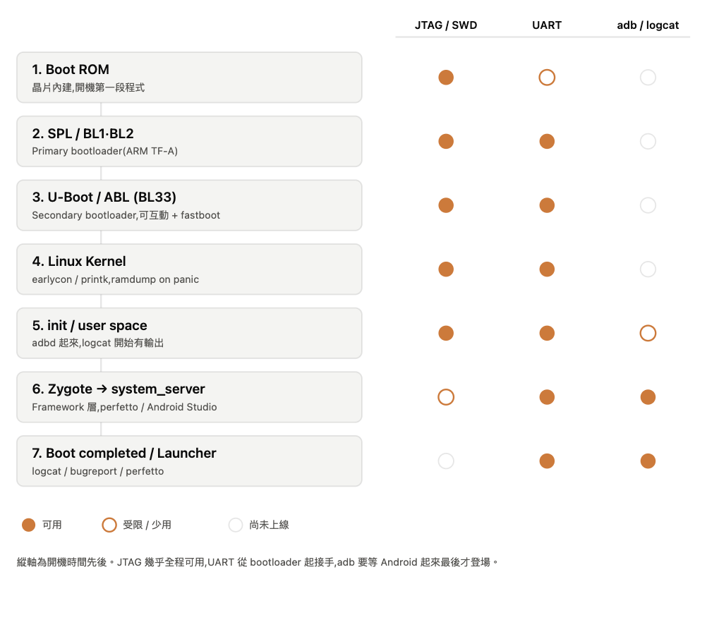

# adb logcat 與 UART:Android 除錯的兩把刀

做 Android 開發或板級(BSP)工作時,幾乎一定會碰到兩個抓 log 的手段:`adb logcat` 和 UART 序列埠。新手常有個疑問——「我都能接 UART 了,為什麼還要 logcat?」這篇把兩者的定位、用法與互補關係一次講清楚。

## adb logcat 是什麼

`adb logcat` 是 Android Debug Bridge(adb)提供的即時日誌工具。裝置或模擬器上所有 App 與 Android framework 輸出的 log 訊息,都會被寫進系統的 log buffer,`logcat` 就是把這些訊息串流出來給你看的指令。它是抓 crash、追生命週期、日常除錯最常用的工具。

使用前提很簡單:裝好 Android SDK Platform Tools,手機開啟「USB 偵錯」並用 USB 接上電腦(或直接跑模擬器),`adb devices` 能看到裝置即可。

### 基本用法

```bash
adb logcat                 # 印出全部 log(持續捲動)
adb logcat -c              # 清掉舊 log,除錯前先清乾淨
adb logcat -d              # dump 目前 buffer 後退出,不持續串流
adb logcat > log.txt       # 存成檔案
```

log 量很大,實務上一定要過濾:

```bash
# 只看某個 tag,Error 以上,其它靜音
adb logcat MyTag:E *:S

# 關鍵字過濾
adb logcat | grep -i "exception"

# 只看某個 App(先查 PID)
adb logcat --pid=$(adb shell pidof -s com.example.app)

# 只看 crash buffer
adb logcat -b crash
```

log 等級由低到高是 `V`(Verbose)、`D`(Debug)、`I`(Info)、`W`(Warn)、`E`(Error)、`F`(Fatal),另有 `S`(Silent,不顯示)。`Tag:等級` 表示該 tag 只顯示到某等級以上,搭配 `*:S` 讓其它全部靜音。

常用的輸出格式:

```bash
adb logcat -v threadtime   # 時間 + PID + TID,最常用
adb logcat -v time         # 加時間戳
adb logcat -T 100          # 從最近 100 行開始看
```

抓 App crash 的典型流程:`adb logcat -c` 清空 → 操作 App 觸發錯誤 → `adb logcat -b crash -v threadtime` 檢視堆疊。

## UART 序列埠是什麼

UART(Universal Asynchronous Receiver/Transmitter)是一種硬體序列通訊介面。在嵌入式與手機平台上,它通常被接成一個「序列 console」,把 bootloader、kernel 與 init 過程的訊息直接吐到序列線上。你用 USB-to-TTL 轉接板接上對應腳位,再用 `screen`、`minicom`、`putty` 之類的終端機程式,就能即時看到這條 console 的輸出。

UART 看到的主要是低階、開機階段的東西:bootloader(U-Boot 等)、kernel 的 `printk` / `dmesg`、driver 初始化、電源與時脈、以及最關鍵的 kernel panic。

## 有 UART 為什麼還要 logcat

關鍵在於——兩者看的是**不同層次**的訊息,並不能互相取代。

**看的內容不同。** UART 拿到的是 kernel / bootloader 層的 log;而 App 的 `Log.d/Log.e`、Java/Kotlin 例外堆疊、ANR、Java crash、Activity 生命週期,這些都走 Android 的 logcat buffer,預設不會出現在 UART 上。你要追某個 App 為什麼崩潰,UART 幾乎幫不上忙。

**過濾與工具鏈不同。** logcat 有 tag、優先級、`--pid`、buffer 分類這些過濾機制,還能配合 Android Studio、grep 與存檔分析。UART 就是一條純文字流,雜訊多、沒結構,要撈特定 App 的訊息非常吃力。

**取用門檻不同。** logcat 只要 USB + adb,是日常開發的手段;UART 往往要拆機、找腳位、接排針或 debug 板,是硬體級操作。

## 為什麼 UART 也不能丟

反過來說,logcat 有它到不了的地方,這正是 UART 不可取代的原因:

**系統還沒起來時。** adb 要等 Android 開機、adbd 這個 daemon 跑起來才能連。開機卡在 bootloader、kernel 起不來、開機動畫死循環的階段,adb 根本連不上,只有 UART 能看到當下發生什麼事。

**系統直接掛掉時。** 遇到 kernel panic、系統重啟的瞬間,adb 連線會斷,logcat 也跟著中斷;UART 是硬體直連,能抓到死前最後那幾行訊息,這對定位 panic 原因極為關鍵。

**低階除錯。** driver、電源、時脈、開機流程這類問題,本來就發生在 Android framework 起來之前,只能靠 UART。

有個容易混淆的點:你其實可以在 UART console 裡直接打 `logcat` 指令——因為它就是一支跑在 Android 上的程式。但前提仍是 Android 已經開起來了;系統沒起來的階段,UART 才是唯一的窗口。

## 開機流程與各階段的觀察工具

要真正理解為什麼工具不能互相取代,最好的方式是沿著開機流程(boot flow)走一遍。ARM / Android 平台的開機大致分成七個階段,每往下走一階,可用的觀察工具就多一種——而 adb 是最後才登場的。核心規律是:**越早的階段越只能靠硬體手段(JTAG / UART),adb 要等 Android 起來才上線。**

| 階段 | 內容 | 可用工具 |
| --- | --- | --- |
| 1. Boot ROM | 燒死在晶片裡、開機最先跑的程式 | 主要 JTAG/SWD;UART 多半還沒有;查 reset reason 暫存器 |
| 2. SPL / BL1·BL2 | Primary bootloader(ARM TF-A),初始化 DRAM、時脈 | UART 開始有輸出;JTAG |
| 3. U-Boot / ABL (BL33) | Secondary bootloader,可互動 | UART console(可敲指令)、fastboot、JTAG |
| 4. Linux Kernel | kernel 起來,`earlycon` / `printk` | UART console、JTAG、panic 時 ramdump |
| 5. init / user space | 讀 `init.rc` 拉服務,adbd 啟動 | UART、`dmesg`,logcat 開始有輸出 |
| 6. Zygote → system_server | Android framework 層 | adb logcat(完整)、perfetto/systrace、Android Studio |
| 7. Boot completed / Launcher | 開機完成、進桌面 | logcat、`adb bugreport`、perfetto |

同一份資訊畫成可用性對照圖會更直觀——縱軸是開機時間先後,實心代表可用、空心代表受限、灰色代表尚未上線:



逐段說明:

**1. Boot ROM** — 幾乎沒有 log 輸出,能介入的只有 JTAG/SWD(下中斷點、讀暫存器)。若卡在這裡,通常靠晶片的 boot / reset reason 暫存器判斷從哪開機、為何 reset。

**2. SPL / BL1·BL2** — 到這裡 UART console 開始吐文字,是第一個能用序列埠看到訊息的階段。

**3. U-Boot / ABL** — UART 最好用的階段:不只印 log,還能互動(進 command line、`printenv`、`md` 讀記憶體)。fastboot 協定也在這裡運作。

**4. Linux Kernel** — 靠 UART + `earlycon`/`printk` 看開機訊息;panic 時 call stack 吐到 UART,並可設定 ramdump 事後撈記憶體。注意 `dmesg` 這時還不能用(要 user space 起來、有 shell 才行)。

**5. init / user space** — init 拉起服務,adbd 在此啟動,logcat 才開始有東西;此時 UART 仍全程可看,也能開始用 `dmesg`。

**6. Framework** — framework 起來後 adb logcat 完整可用,還能上 perfetto、用 Android Studio debug。App 的 crash、ANR 從這裡開始都看得到。

**7. Boot completed** — 主力是 logcat、`adb bugreport`(一次打包所有 log)、perfetto。UART 仍在跑但日常已用不太到。

對照一下就很清楚:**卡在 1–4 階段(開不了機)→ 用 UART,必要時 JTAG;進到 5 之後(Android 起得來)→ 用 adb / logcat。** UART 是唯一橫跨全程的觀察窗口,這正是「有 adb 還是不能沒有 UART」的根本原因。

## 相關名詞速查

除錯這條線上還會一起出現一批名詞,列在這裡方便延伸了解:

系統存活與復位:**Watchdog(看門狗)** 是計時器,系統要定期「餵狗」重置它,卡死沒餵到就強制重啟;分硬體與軟體 watchdog,Android framework 另有一個監控 system_server 的 Watchdog。**ANR** 是 App 主執行緒卡超過門檻的無回應。**Reset / reboot reason** 是重啟原因(watchdog reset、power-on reset、panic 等)。

當機與錯誤訊息:**Kernel panic**(kernel 無法復原直接停擺)、**Tombstone**(native crash 留在 `/data/tombstones/` 的墓碑檔)、**Stack trace / Backtrace**(呼叫堆疊)、**Oops**(kernel 較輕微的錯誤)、**Bootloop**(無限重開)。

開機流程:**Bootloader**(U-Boot、SPL)、**Boot ROM**、**init / init.rc**、**dmesg / printk**、**Device Tree(DTB)**。

除錯工具/介面:**JTAG / SWD**(比 UART 更底層的硬體除錯)、**fastboot**、**adb / adbd**、**serial console**(minicom / screen / putty)、**ramdump / coredump**。

監控與卡死型態:**Heartbeat**(週期性存活訊號,概念同餵狗)、**Deadlock / Livelock / Starvation**(各種卡死,常是 ANR 或 watchdog reset 的根因)、**logd / logcat buffer**(logcat 背後的 daemon 與環形緩衝區)。

## 一句話總結

**UART 管「系統活不活得起來」,logcat 管「App 跑得對不對」。**

日常 App 開發、追邏輯錯誤,用 logcat;做 BSP、板級移植、開機與 panic 除錯,用 UART。兩者是互補的兩把刀,而不是誰取代誰——把兩個都留在工具箱裡,遇到什麼層次的問題就抽對應的那一把。
