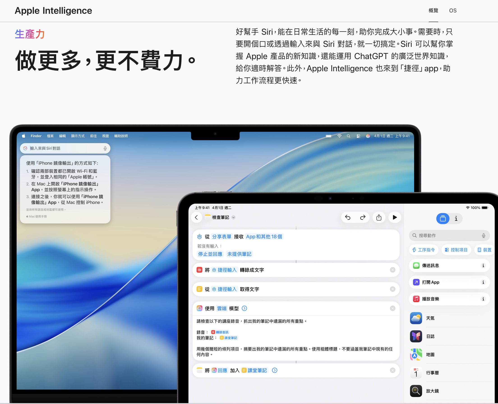

# Apple Intelligence

Apple 在 macOS / iOS 上內建的 AI 功能集合。和 ChatGPT 那類「開一個對話視窗」的產品定位不同，Apple Intelligence 的策略是**把 AI 散進既有的系統 App 裡**——你不會特地去「用 Apple Intelligence」，而是在寫郵件、看通知、記筆記時它就在那裡。

架構上的特點是**分層處理**：能在裝置端跑的就跑在本機（延遲低、資料不出裝置），需要更大模型時才送到 **Private Cloud Compute**（Apple 自建、宣稱不留存資料的伺服器），再更複雜的可選擇轉給 ChatGPT。

- 官方介紹：[Apple Intelligence（台灣）](https://www.apple.com/tw/apple-intelligence/)

## 主要功能（macOS 26.2）

| 功能 | 說明 | 官方說明 |
|---|---|---|
| **Writing Tools（書寫工具）** | 在任何 App 的文字欄位裡校對、改寫、調整語氣、摘要。是最常用到的一項 | [連結](https://support.apple.com/guide/mac-help/MCHLDCD6C260/26/mac/26.2) |
| **Image Playground** | 依文字描述或照片庫裡的人物生成圖片 | [連結](https://support.apple.com/guide/mac-help/MCHLD5412D00/26/mac/26.2) |
| **通知摘要** | 把一堆通知濃縮成幾行重點，搭配專注模式過濾打擾 | [連結](https://support.apple.com/guide/mac-help/MCHLDF5E4CB6/26/mac/26.2) |
| **備忘錄錄音轉逐字稿 + 摘要** | 在備忘錄裡直接錄音，產生逐字稿並自動摘要 | [連結](https://support.apple.com/guide/mac-help/MCHL2102C2AE/26/mac/26.2) |

## 幾個實務觀察

- **Writing Tools 是投報率最高的一項**——因為它在系統層，任何 App 的輸入框都能用，不必切換工具。
- **通知摘要品質不穩定**，訊息數量少時反而不如直接看原文。
- 備忘錄的錄音摘要適合會議快速回顧，但中文的逐字稿準確度仍不如專門的 ASR 方案（見 [Whisper 筆記](./ai_whisper.md)）。

## 相關筆記

- [AI 生態系整理](./AI.md)
- [Whisper / 語音轉文字](./ai_whisper.md)
