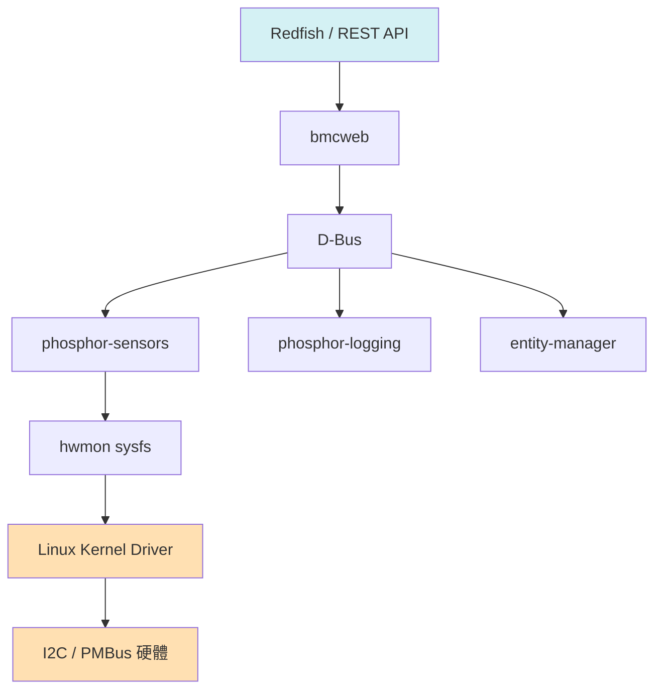

# AI 輔助 BMC 開發

用 AI 工具加速 OpenBMC / 韌體開發的實用筆記。

---

## 適合用 AI 的 BMC 開發場景

| 情境 | 推薦工具 | 說明 |
|------|---------|------|
| 快速查 IPMI / PMBus spec | ChatGPT / Claude | 省去翻 PDF 時間 |
| 寫 Linux device driver 骨架 | Claude / Copilot | probe、kconfig、makefile 模板 |
| 解讀 dmesg / journalctl 錯誤 | Claude | 貼錯誤直接問原因 |
| 理解 Yocto recipe 語法 | ChatGPT / Claude | bb、bbappend、meta-layer 概念 |
| 寫 DBus interface | Claude | phosphor-dbus-interfaces 格式 |
| Redfish API 測試腳本 | ChatGPT / Copilot | 產生 curl / Python 範例 |

---

## Prompt 技巧

### Device Driver

```
我正在為 OpenBMC 的 AST2600 平台寫一個 PMBus hwmon driver。
晶片名稱是 XYZ123，I2C address 0x58，支援 READ_VOUT (0x8B)。
請產生：
1. drivers/hwmon/pmbus/xyz123.c 的骨架（含 probe）
2. Kconfig 項目
3. Makefile 一行
4. DTS binding 範例
```

### 解讀錯誤訊息

```
以下是 OpenBMC 的 dmesg 輸出，請說明錯誤原因並給出修復方向：
[    3.142] xyz123 0-0058: PMBus status byte: 0x10
```

### IPMI raw command

```
請解釋這個 IPMI raw command 的每個 byte 意義：
ipmitool raw 0x04 0x2d 0x01
```

---

## OpenBMC 架構速查（AI 可協助的層次）



**各層對應的 AI 使用場景：**
- **Redfish / bmcweb**：產生 API 測試 script、理解 schema
- **D-Bus**：解釋 interface 定義、產生 introspect XML
- **hwmon / Driver**：撰寫 driver、理解 sysfs 路徑
- **PMBus**：Linear11 格式換算、register map 查詢

---

## 常用 AI Prompt 範本

### 查 PMBus Linear11 換算
```
PMBus Linear11 格式，raw word = 0xD400，請計算實際電壓值。
（N = 高5bit有號整數，Y = 低11bit有號整數，Value = Y × 2^N）
```

### 理解 Yocto recipe
```
請解釋這段 OpenBMC Yocto recipe 的作用：
SRC_URI += "file://0001-fix-sensor.patch"
FILESEXTRAPATHS:prepend := "${THISDIR}/${PN}:"
```

### systemd service debug
```
OpenBMC 上執行 `systemctl status xyz-sensor.service` 顯示 failed，
以下是 journalctl -u xyz-sensor.service 的輸出，請協助 debug：
（貼上 log）
```

---

## 實用工具搭配

- **Claude Code CLI**：直接在 OpenBMC repo 內問 code 問題，有 file context
- **GitHub Copilot**：寫 driver 時補完 kernel API（`pmbus_read_word_data` 等）
- **ChatGPT**：查 IPMI spec、Redfish schema 解釋，適合一次性問答

---

## 注意事項

- Kernel API 版本差異大，AI 產生的 code 需確認 kernel 版本（OpenBMC 常用 5.15 / 6.1）
- PMBus driver 細節（page、phase 參數）容易出錯，務必對照 datasheet 驗證
- D-Bus interface 名稱大小寫敏感，AI 有時會拼錯 `xyz.openbmc_project.*`

---

## 參考資源

- [OpenBMC 官方文件](https://github.com/openbmc/docs)
- [PMBus Spec](https://pmbus.org/specs.html)
- [Linux hwmon pmbus-core](https://www.kernel.org/doc/html/latest/hwmon/pmbus-core.html)
- [phosphor-dbus-interfaces](https://github.com/openbmc/phosphor-dbus-interfaces)
