https://antigravity.google/docs/get-started

## Mode
Fast: 直接執行
Planing: 先計劃，會產生artifacts
## MCP
https://antigravity.google/docs/mcp
## Task
因為這的重點在於Agent如何工作，Antigravity將每一次請求定義成task

## Knowledge
有這antigravity可以將學到的知識紀錄
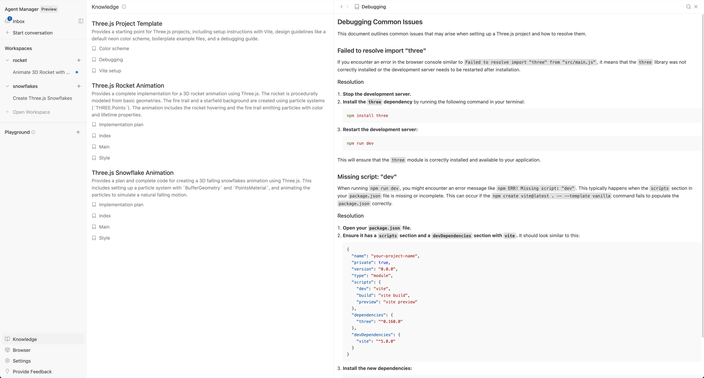

## start here
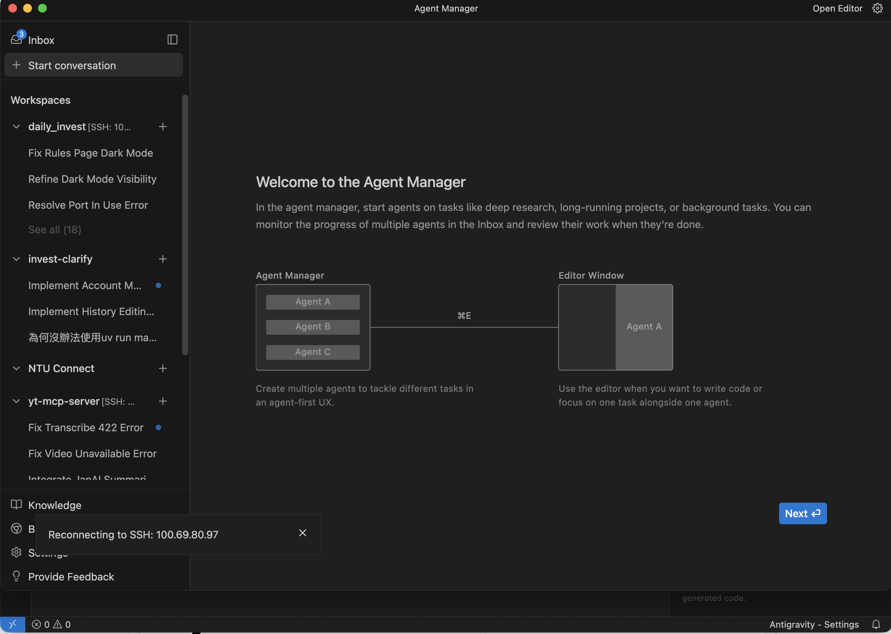
點進去Agent Manager

## Editor window
https://www.youtube.com/watch?v=3kMuohNwqVY
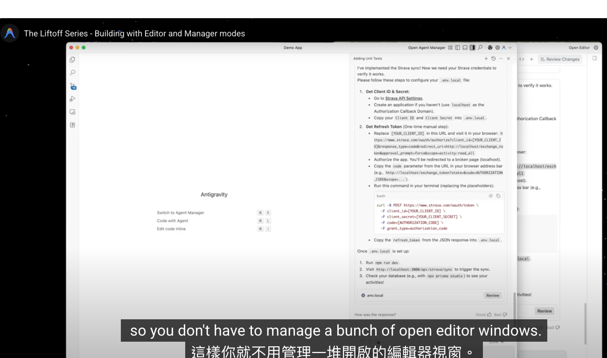
所有透過editor window避免開一堆視窗

## context switching
https://www.youtube.com/watch?v=B4do6xuIgD4
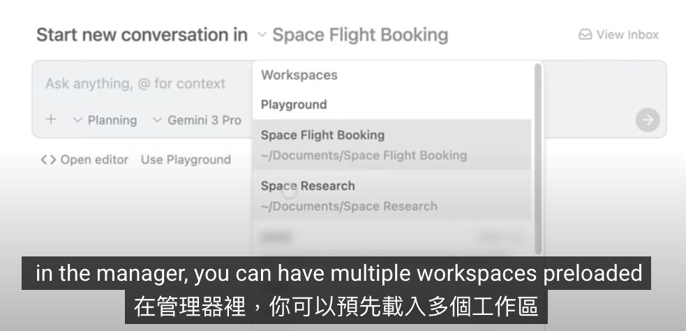
有agent manager
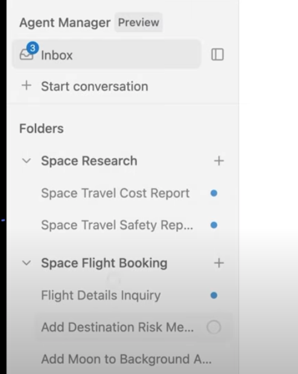

## for frontend
https://www.youtube.com/watch?v=yiHKlPuZ73c
- browser-in-the-loop: 可以透過瀏覽器打開或互動
- 直接視覺化編輯
	- 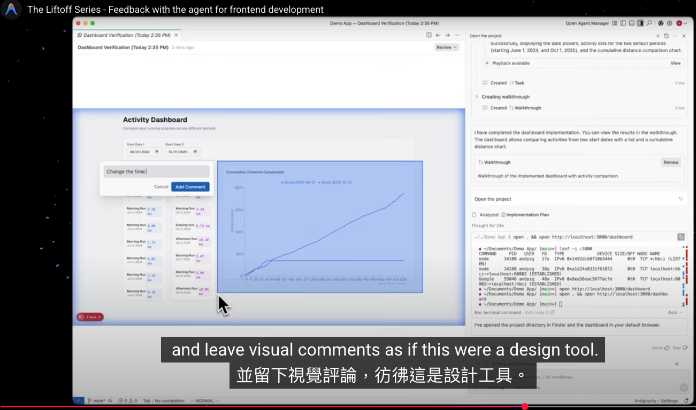
- 
## 新增 rule
可以在這新增rule
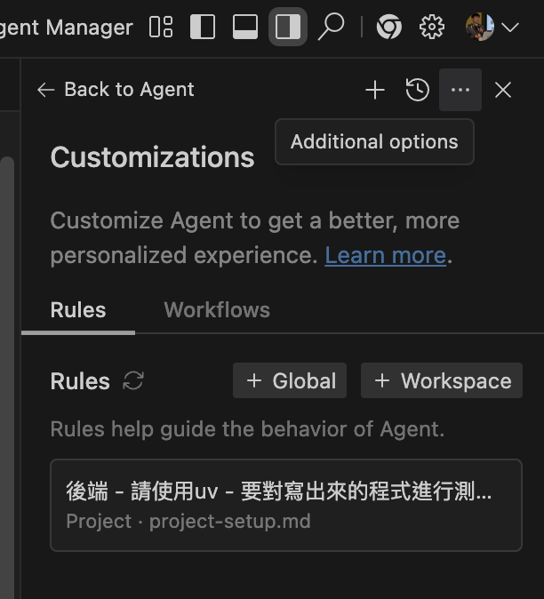
他會在專案底下
`.agent/rules > 新增`  `<剛才新增的>.md`

應該要研究一下 MCP Store
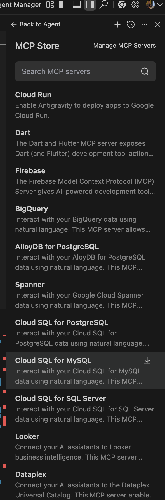

## 例子
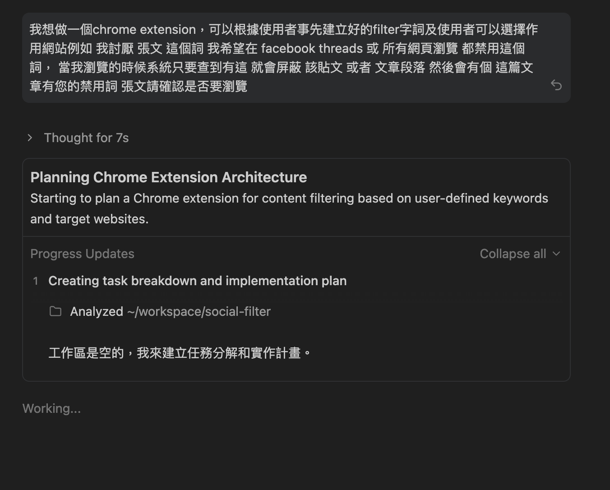
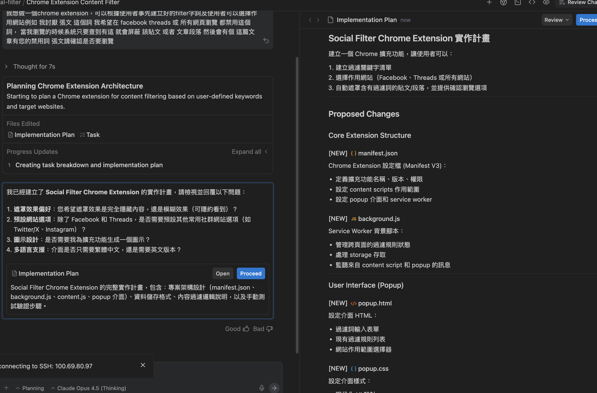
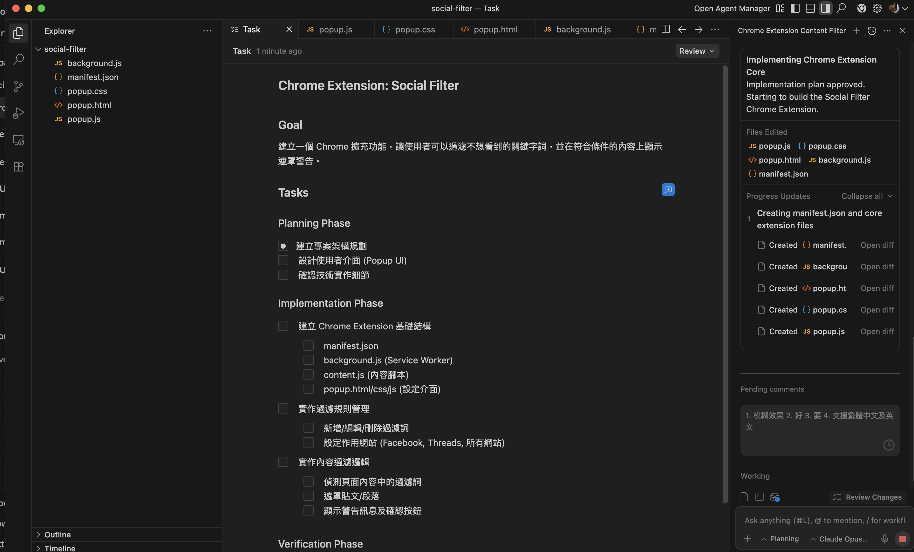
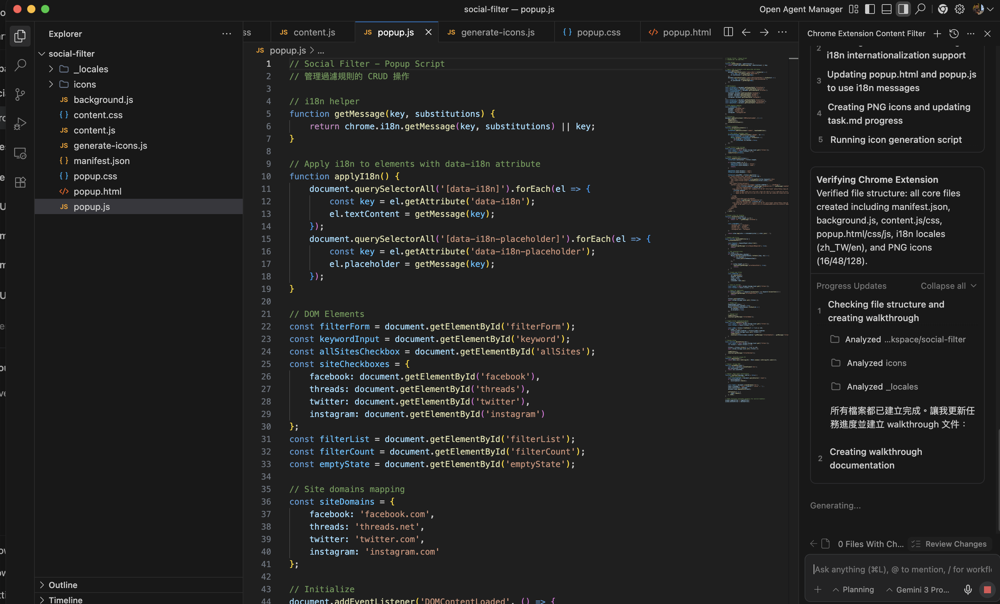