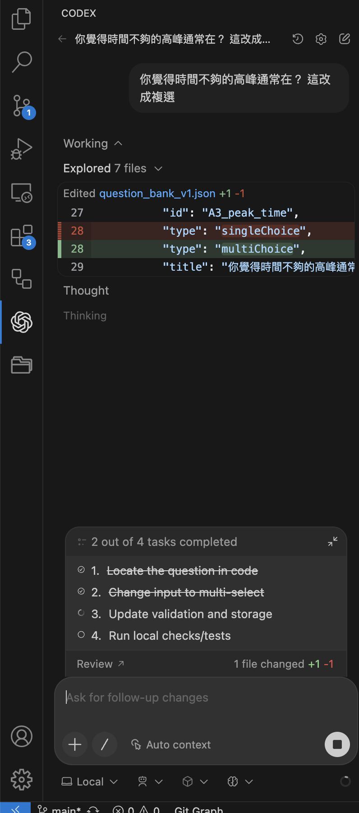

# 在 VSCode 使用 AI coding 工具

VSCode 可透過官方 extension 整合各家 AI coding agent，直接在編輯器中對話、產生與修改程式碼。常見選擇包含 GitHub Copilot、Claude Code、以及 OpenAI Codex 等。

## codex in vscode

OpenAI Codex 提供 VSCode extension，可在側邊欄與 agent 互動，讓它讀取工作區、提出修改建議並套用 diff。

- Codex 官方說明：https://developers.openai.com/codex/
