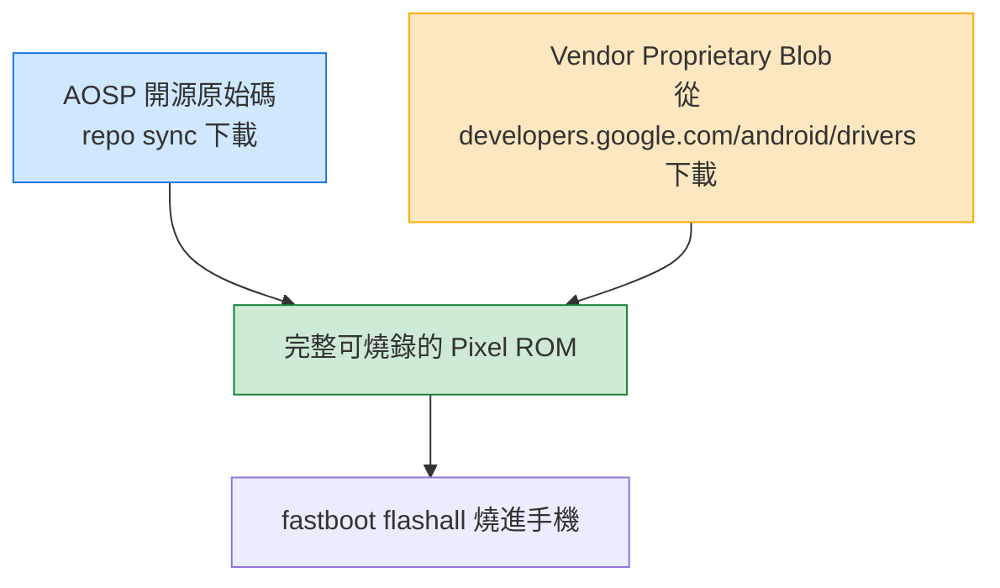
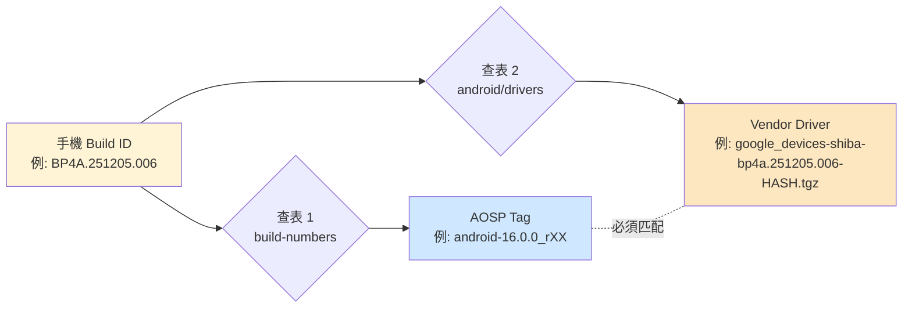
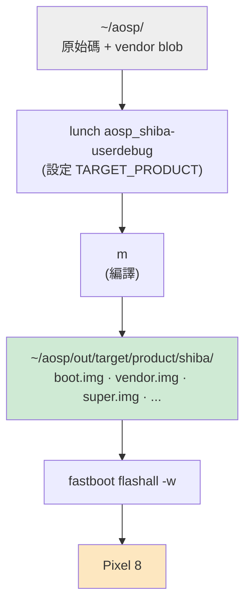
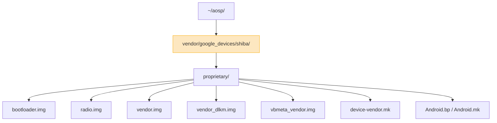
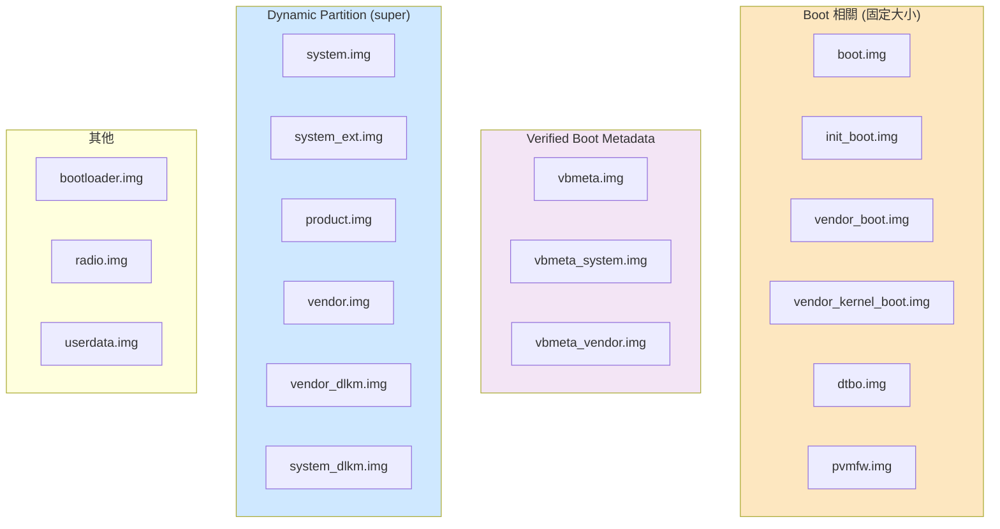

# Pixel 8 AOSP 完整工作流程：從查 build ID、選版本、編譯到燒錄

本文是給開發者的完整教學。和「把 Pixel 刷回原廠」不同，這篇要做的是：

1. **教你怎麼決定要 build 哪個版本**（手機 build ID ↔ AOSP tag ↔ Vendor driver，三者必須對齊）
2. **從零 `repo init` → `repo sync` → 下載對應 vendor driver → `m` 編譯 → `fastboot flashall` 燒回手機**

整個流程的核心觀念用圖解釋，避免把指令當咒語死背。

:::info 適用機型
- Pixel 8（codename `shiba`）
- Pixel 8 Pro（codename `husky`）只要把 `shiba` 換成 `husky` 就一樣可用
- 其他 Pixel 機型流程相同，差別只在 codename 與對應的 driver tarball 名稱
:::

---

## Part 0：先理解三個觀念

### 觀念 1：純 AOSP ≠ 可用的 Pixel ROM

純 AOSP 是 Google 開源的部分。Pixel 手機要正常運作，還需要一層 **vendor proprietary blob**（modem firmware、camera HAL、ISP/GPU 驅動、Tensor 專屬模組）。這些 blob 是閉源的，所以 AOSP 樹**不會包含**它們。



ASCII 版：

```
   ┌─────────────────────┐         ┌──────────────────────────┐
   │  AOSP 原始碼        │         │  Vendor Proprietary Blob │
   │  (開源, repo sync)  │         │  (閉源, Google 官方下載) │
   └──────────┬──────────┘         └──────────────┬───────────┘
              │                                   │
              └───────────┬───────────────────────┘
                          ▼
               ┌──────────────────────┐
               │  完整 Pixel ROM       │
               │  (m → out/.../*.img) │
               └──────────┬───────────┘
                          ▼
               ┌──────────────────────┐
               │  fastboot flashall   │
               └──────────────────────┘
```

只跑純 AOSP 也能 build 出 image 燒進手機，但會缺**相機、modem、指紋、5G、部分感測器**等需要 blob 的功能。所以 vendor blob 是必要的。

---

### 觀念 2：三個版本必須對齊

最容易踩雷的地方。**手機 build ID、AOSP source tag、Vendor driver** 這三個版本要互相對應，不然會：

- AOSP 比 vendor 新 → 編譯時找不到對應的 module / API
- AOSP 比 vendor 舊 → vendor blob 用到 AOSP 還沒有的 framework 介面
- bootloader / radio 版本對不上 → 燒進去開不了機



ASCII 版：

```
       手機 Build ID (從手機端讀出)
       ┌──────────────────────────┐
       │  BP4A.251205.006         │
       └────────────┬─────────────┘
                    │
        ┌───────────┴───────────┐
        ▼                       ▼
  source.android.com    developers.google.com
  /docs/setup/.../      /android/drivers
  build-numbers
        │                       │
        ▼                       ▼
   AOSP Source Tag        Vendor Driver tarball
   android-16.0.0_rXX     google_devices-shiba-
                          bp4a.251205.006-<HASH>.tgz

           ↑ 兩邊必須對應同一個 build ID ↑
```

這個對齊步驟在 Part 2 會一步一步做。

---

### 觀念 3：build → flash 的 pipeline

知道哪些檔案會被產出、哪些被燒進手機，後面看到 fastboot 輸出才不會迷路。



ASCII 版：

```
~/aosp/                                      手機 (Pixel 8)
  ├─ frameworks/                                ▲
  ├─ packages/                                  │ fastboot flashall -w
  ├─ vendor/google_devices/shiba/   ──┐         │
  └─ ...                              │      ┌──┴──────────────────┐
                                      │      │ out/target/product/  │
   source build/envsetup.sh           ├─►    │   shiba/             │
   lunch aosp_shiba-userdebug         │      │     boot.img         │
   m                                  ┘      │     vendor.img       │
                                             │     super.img        │
                                             │     ...              │
                                             └──────────────────────┘
```

---

## Part 1：環境準備（一次性）

### 系統套件

```bash
sudo apt-get update
sudo apt-get install -y \
  git-core gnupg flex bison build-essential zip curl \
  zlib1g-dev gcc-multilib g++-multilib libc6-dev-i386 \
  libncurses5 lib32ncurses5-dev x11proto-core-dev libx11-dev \
  lib32z1-dev libgl1-mesa-dev libxml2-utils xsltproc unzip fontconfig
```

### ADB / fastboot

```bash
sudo apt install -y android-tools-adb android-tools-fastboot
adb version          # 1.0.41 / 34.x
fastboot --version   # 34.x
```

### `repo`

```bash
mkdir -p ~/bin
curl https://storage.googleapis.com/git-repo-downloads/repo > ~/bin/repo
chmod a+x ~/bin/repo
echo 'export PATH=~/bin:$PATH' >> ~/.bashrc
export PATH=~/bin:$PATH
```

### 手機端設定

1. **設定 → 關於手機 → 連點「版本號」7 下** 開啟開發人員選項
2. **開發人員選項 → 打開「USB 偵錯」**
3. **開發人員選項 → 打開「OEM 解鎖」**（第一次燒 AOSP 必須）
4. USB 接電腦，手機跳出對話框點「永遠允許」

```bash
adb devices
# 38011FDJH00C9F   device   ← 看到 device 就 OK
```

---

## Part 2：決定要用哪個 build ID（三步對齊）

### 2.1 查手機目前 build ID

```bash
adb shell getprop ro.build.id
# 例: BP4A.251205.006

adb shell getprop ro.build.fingerprint
# 例: google/shiba/shiba:16/BP4A.251205.006/.../user/release-keys
```

> 也可以直接打開手機 **設定 → 關於手機 → 版本號** 看。

把這個 build ID 記下來（以下用 `<BUILD_ID>` 代稱）。例如 `BP4A.251205.006`。

#### Build ID 怎麼解讀

```
B  P    4A    .  251205      .  006
│  │    │      │             │
│  │    │      │             └── patch 序號
│  │    │      └─────────────── 分支日期 (2025-12-05)
│  │    └────────────────────── 分支代號
│  └─────────────────────────── support vertical
└────────────────────────────── 主版本 (B = Baklava = Android 16)
```

### 2.2 用 build ID 查 AOSP source tag

打開 [https://source.android.com/docs/setup/reference/build-numbers](https://source.android.com/docs/setup/reference/build-numbers)

在頁面用 Ctrl+F 搜 `<BUILD_ID>`（如 `BP4A.251205.006`），會看到對應的 tag，例如：

```
Build              Branch                   Tag
BP4A.251205.006    android16-qpr2-release   android-16.0.0_rXX
```

把 tag 記下（以下用 `<AOSP_TAG>` 代稱）。

> 如果該 build ID 還沒推送到 AOSP（剛 release 的 build 通常會延遲幾週），就只能改用更早一個對應的 tag，或直接用 `android-latest-release` branch。

### 2.3 用 build ID 查 Vendor driver

打開 [https://developers.google.com/android/drivers](https://developers.google.com/android/drivers)

頁面上會列出每個 device + build ID 的 vendor driver。Ctrl+F 搜 `shiba` 找對應 `<BUILD_ID>` 的那一列：

```
Hardware Component         Company    Download             SHA-256 Checksum
Vendor image (shiba)       Google     Link                 abcdef...
```

點 Link 會看到下載 URL，格式類似：

```
https://dl.google.com/dl/android/aosp/google_devices-shiba-bp4a.251205.006-<HASH>.tgz
```

把 URL 與 SHA-256 記下。

> **沒有對應 vendor 時**：跟 AOSP tag 同理，可能還沒 release。選下一個更早的 build ID 或選有 vendor 的最新版本作為 build target。

### 2.4 對齊檢查

到這一步你應該有：

| 項目 | 範例值 | 來源 |
|---|---|---|
| `<BUILD_ID>` | `BP4A.251205.006` | `adb shell getprop` |
| `<AOSP_TAG>` | `android-16.0.0_rXX` | source.android.com 查表 |
| Vendor URL | `https://dl.google.com/.../google_devices-shiba-bp4a.251205.006-<HASH>.tgz` | developers.google.com/android/drivers |

三者都指向同一個 `<BUILD_ID>` 才能繼續。

---

## Part 3：下載 AOSP 原始碼

### 3.1 建立工作目錄

```bash
mkdir -p ~/aosp && cd ~/aosp
```

### 3.2 repo init（用 Part 2.2 查到的 tag）

```bash
repo init \
  --partial-clone \
  --no-use-superproject \
  -b <AOSP_TAG> \
  -u https://android.googlesource.com/platform/manifest
```

例如：

```bash
repo init --partial-clone --no-use-superproject \
  -b android-16.0.0_rXX \
  -u https://android.googlesource.com/platform/manifest
```

成功後 `~/aosp/.repo/` 會被建立。

### 3.3 repo sync

```bash
repo sync -c -j8 2>&1 | tee -a repo_sync.log
```

- `-c`：只 sync 當前 branch（節省約 50% 空間）
- `-j8`：8 並行（**不要用 `$(nproc)` 全開**，容易撞 fetch error 和 503）
- 中斷後重跑同指令會續傳

預期輸出：

```
Fetching: 100% (XXXX/XXXX), done in XXh XXm XXs
repo sync has finished successfully.
```

視網路 30~90 分鐘。完成後 `~/aosp/` 會看到熟悉的 AOSP 目錄結構：

```
art/  bionic/  bootable/  build/  cts/  dalvik/  developers/
device/  external/  frameworks/  hardware/  kernel/  libcore/
packages/  pdk/  platform_testing/  prebuilts/  system/  test/  toolchain/  tools/
```

---

## Part 4：下載對應的 Vendor Driver

### 4.1 下載

```bash
cd ~/aosp
wget '<Part 2.3 取得的 URL>'
# 例:
# wget https://dl.google.com/dl/android/aosp/google_devices-shiba-bp4a.251205.006-<HASH>.tgz
```

### 4.2 驗 SHA-256

```bash
sha256sum google_devices-shiba-*.tgz
# 對照 Part 2.3 在網頁上看到的 SHA-256
```

**hash 對不上絕對不要繼續** — 表示檔案損毀或下載到錯版本。

### 4.3 解壓

```bash
cd ~/aosp
tar -xzf google_devices-shiba-bp4a.251205.006-*.tgz
ls extract-*.sh
# extract-google_devices-shiba.sh
```

### 4.4 跑 extract 腳本（同意授權）

```bash
./extract-google_devices-shiba.sh
```

腳本會把授權合約用 `more` 印出來，按 SPACE 翻到底，最後輸入：

```
I ACCEPT
```

回車後會解壓到 `vendor/google_devices/shiba/`。

### 4.5 確認 vendor 結構



ASCII：

```
~/aosp/
└── vendor/google_devices/shiba/
    └── proprietary/
        ├── bootloader.img        ← 第三方 bootloader
        ├── radio.img             ← modem firmware
        ├── vendor.img            ← vendor 分區內容
        ├── vendor_dlkm.img
        ├── vbmeta_vendor.img
        ├── device-vendor.mk      ← Android.mk 整合進 build
        ├── Android.bp / Android.mk
        └── ... (其他 .so / .apk)
```

驗證：

```bash
ls vendor/google_devices/shiba/proprietary/ | head
```

> 有些 build 還會要求第二個 tarball（例如 `qcom-shiba-...tgz`），照同樣流程下載 + extract 即可。**以 driver 頁面實際列出的為準。**

---

## Part 5：Lunch 與編譯

### 5.1 設定 lunch target

```bash
cd ~/aosp
source build/envsetup.sh
lunch aosp_shiba-userdebug
```

預期輸出：

```
TARGET_PRODUCT=aosp_shiba
TARGET_BUILD_VARIANT=userdebug
TARGET_ARCH=arm64
PRODUCT_SOONG_NAMESPACES=...
```

> Pixel 8 Pro：`lunch aosp_husky-userdebug`

### 5.2 編譯

```bash
m
```

第一次編譯約 1~3 小時，視 CPU / SSD 而定。完成標誌：

```
#### build completed successfully (XX:XX:XX (hh:mm:ss)) ####
```

### 5.3 確認產物

```bash
echo $PRODUCT_OUT
# /home/<you>/aosp/out/target/product/shiba

ls $PRODUCT_OUT/*.img | head
```

預期看到：

```
boot.img            init_boot.img         vbmeta.img
bootloader.img      pvmfw.img             vbmeta_system.img
dtbo.img            radio.img             vbmeta_vendor.img
super_empty.img     system.img            vendor_boot.img
system_dlkm.img     system_ext.img        vendor.img
system_other.img    userdata.img          vendor_dlkm.img
                                          vendor_kernel_boot.img
```

#### 為什麼產出這麼多 .img？— 分區結構



> **Dynamic Partition / super**：Android 10 之後，`system / vendor / product / system_ext / *_dlkm` 不再是固定大小分區，而是塞進一個叫 `super` 的容器裡，互相可以動態調整大小。`fastboot` 燒的時候會看到 `Sending sparse 'super' 1/N`，就是在分塊塞進這個 super 分區。

---

## Part 6：燒錄到手機

### 6.1 進 fastboot

```bash
adb reboot bootloader
```

確認：

```bash
fastboot devices
# 38011FDJH00C9F   fastboot

fastboot getvar product   # product: shiba
fastboot getvar unlocked  # unlocked: yes  ← 必須是 yes
```

> **`fastboot devices` 顯示為 `Mass Storage`** 是正常的（USB descriptor 字串差異），只要 `getvar` 能回應就 OK。

### 6.2（第一次必做）解鎖 bootloader

```bash
fastboot flashing unlock
```

手機螢幕用音量鍵選 **"Unlock the bootloader"**，電源鍵確認。**會清除 userdata**。

### 6.3 燒錄

```bash
cd ~/aosp
source build/envsetup.sh
lunch aosp_shiba-userdebug
cd "$(get_build_var PRODUCT_OUT)"
fastboot flashall -w
```

> **`-w` 會清 userdata**（恢復出廠設定）。日常迭代不想清資料就拿掉 `-w`。

或者直接帶環境變數：

```bash
cd ~/aosp/out/target/product/shiba
ANDROID_PRODUCT_OUT=$(pwd) fastboot flashall -w
```

#### A/B Slot 機制

Pixel 採 A/B 雙 slot 設計。每次 `flashall` 會把 image 寫進 inactive slot，再切 active 過去：

```
燒錄前         flashall 寫入        切換 active        重開機
─────────       ────────────        ──────────        ────────
  slot a *      slot a              slot a              slot a
  slot b        slot b ← write      slot b *            slot b *
                                    (切換)              (從 b 開機)

* = active slot
```

下次再燒會反過來寫到 slot a。**這代表壞了一個 slot 還能切回另一個**，是內建的 fail-safe。

#### 預期輸出（70 秒左右）

```
--------------------------------------------
Bootloader Version...: ripcurrent-16.4-XXXXXXXX
Baseband Version.....: g5300i-XXXXXX-XXXXXX-B-XXXXXXXX
Serial Number........: XXXXXXXXXXXXX
--------------------------------------------
Checking 'product'                                 OKAY
Setting current slot to 'b'                        OKAY
Sending 'boot_b' (65536 KB)                        OKAY
Writing 'boot_b'                                   OKAY
... (init_boot / dtbo / pvmfw / vbmeta×3 / vendor_boot / vendor_kernel_boot)
Sending sparse 'super' 1/10 ...                    OKAY
Writing 'super'                                    OKAY
... (super 共 ~10 chunks)
Erasing 'userdata'                                 OKAY
Erase successful, but not automatically formatting.
File system type raw not supported.
wipe task partition not found: cache
Erasing 'metadata'                                 OKAY
Rebooting                                          OKAY
Finished. Total time: ~70s
```

#### 三個會嚇到人但其實正常的訊息

| 訊息 | 為什麼正常 |
|---|---|
| `Erase successful, but not automatically formatting. File system type raw not supported.` | userdata 被 erase 但沒 format。**Android 第一次 boot 時會自動 format /data**。 |
| `wipe task partition not found: cache` | Pixel 8 用 A/B + dynamic partition，**根本沒有獨立 cache 分區**。 |
| `Setting current slot to 'b'` | A/B 機制，slot 會輪流。下次燒會切回 `a`。 |

### 6.4 第一次開機

第一次開機要做 dexopt + format /data，比較久（5~10 分鐘）。等進入 launcher 即可。

驗證：

```bash
adb shell getprop ro.build.fingerprint
# Android/aosp_shiba/shiba:16/.../userdebug/test-keys
```

看到 `aosp_shiba` 和 `userdebug` 就確認跑的是你 build 出來的那版。

---

## Part 7：日常迭代

之後改 code 想重燒：

```bash
cd ~/aosp
repo sync -c -j8                     # (可選) 拉新 code
source build/envsetup.sh
lunch aosp_shiba-userdebug
m                                    # 增量編譯，只重 build 改動模組

adb reboot bootloader
cd "$(get_build_var PRODUCT_OUT)"
fastboot flashall                    # 不加 -w 保留資料
```

只改 kernel 想加速：

```bash
fastboot flash boot boot.img
fastboot reboot
```

---

## Part 8：常見錯誤與救磚

### `image (bl1_a): rejected, anti-rollback`

刷的 bootloader 比手機目前舊。**解法**：用 ≥ 目前版本的 build ID。

### `Update requires Y. fastboot: error: requirements not met!`

factory image 太舊。**解法**：下載匹配或更新版本。

### `Bootloader is locked`

`fastboot flashall` 直接被擋。**解法**：`fastboot flashing unlock`（會清資料）。

### 變磚（無法開機）

按住 **電源 + 音量下鍵** 強制進 fastboot，用官方 factory image 救：

```bash
# 1. 到 https://developers.google.com/android/images 下載對應 build 的 zip
unzip shiba-<build-id>-factory-*.zip
cd shiba-<build-id>
./flash-all.sh
```

只要還能進 fastboot，這個指令幾乎都救得回來。

---

## 參考資料

- [AOSP 官方建置指南](https://source.android.com/docs/setup/start)
- [AOSP Build Numbers & Tags 對照表](https://source.android.com/docs/setup/reference/build-numbers) — Part 2.2 查 AOSP tag
- [Google Pixel Vendor Drivers](https://developers.google.com/android/drivers) — Part 2.3 查 vendor URL
- [Google Pixel Factory Images](https://developers.google.com/android/images) — Part 8 救磚
- [Android A/B System Updates](https://source.android.com/docs/core/ota/ab) — A/B slot 細節
- [Dynamic Partitions](https://source.android.com/docs/core/ota/dynamic_partitions) — super 分區細節