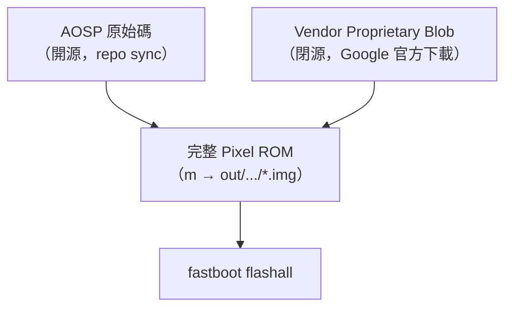
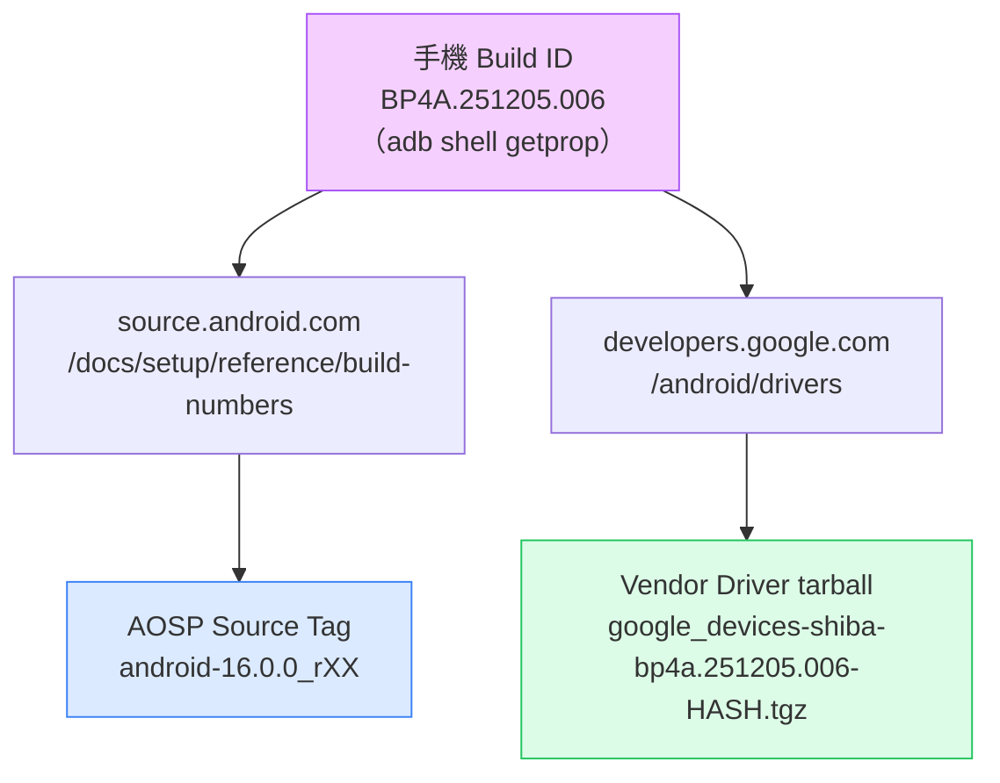
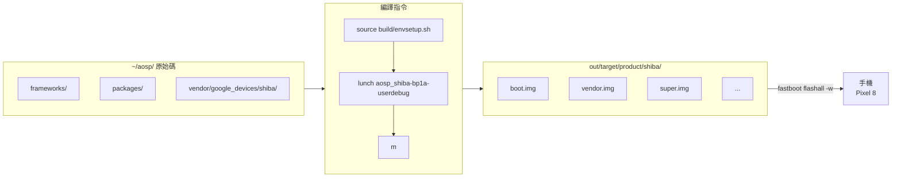
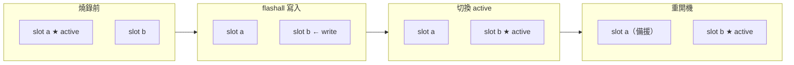

# Pixel 8 AOSP 完整工作流程：從查 build ID、選版本、編譯到燒錄

本文是給開發者的完整教學，和「把 Pixel 刷回原廠」不同，這篇要做的是：

1. **教你怎麼決定要 build 哪個版本**（手機 build ID ↔ AOSP tag ↔ Vendor driver，三者必須對齊）
2. **從零 `repo init` → `repo sync` → 下載對應 vendor driver → `m` 編譯 → `fastboot flashall` 燒回手機**

整個流程的核心觀念用圖解釋，避免把指令當咒語死背。

:::info 適用機型
- Pixel 8（codename `shiba`）
- Pixel 8 Pro（codename `husky`）只要把 `shiba` 換成 `husky` 就一樣可用
- 其他 Pixel 機型流程相同，差別只在 codename 與對應的 driver tarball 名稱
:::

---

## Part 0：先理解三個觀念

### 觀念 1：純 AOSP ≠ 可用的 Pixel ROM

純 AOSP 是 Google 開源的部分。Pixel 手機要正常運作，還需要一層 **vendor proprietary blob**（modem firmware、camera HAL、ISP/GPU 驅動、Tensor 專屬模組）。這些 blob 是閉源的，所以 AOSP 樹**不會包含**它們。



只跑純 AOSP 也能 build 出 image 燒進手機，但會缺**相機、modem、指紋、5G、部分感測器**等需要 blob 的功能。所以 vendor blob 是必要的。

---

### 觀念 2：三個版本必須對齊

最容易踩雷的地方。**手機 build ID、AOSP source tag、Vendor driver** 這三個版本要互相對應，不然會：

- AOSP 比 vendor 新 → 編譯時找不到對應的 module / API
- AOSP 比 vendor 舊 → vendor blob 用到 AOSP 還沒有的 framework 介面
- bootloader / radio 版本對不上 → 燒進去開不了機



兩邊必須對應同一個 build ID 才能繼續，對齊步驟在 Part 2 會一步一步做。

---

### 觀念 3：build → flash 的 pipeline



---

## Part 1：環境準備（一次性）

### 系統套件

```bash
sudo apt-get update
sudo apt-get install -y \
  git-core gnupg flex bison build-essential zip curl \
  zlib1g-dev gcc-multilib g++-multilib libc6-dev-i386 \
  libncurses5 lib32ncurses5-dev x11proto-core-dev libx11-dev \
  lib32z1-dev libgl1-mesa-dev libxml2-utils xsltproc unzip fontconfig
```

### ADB / fastboot

```bash
sudo apt install -y android-tools-adb android-tools-fastboot
adb version          # 1.0.41 / 34.x
fastboot --version   # 34.x
```

### `repo`

```bash
mkdir -p ~/bin
curl https://storage.googleapis.com/git-repo-downloads/repo > ~/bin/repo
chmod a+x ~/bin/repo
echo 'export PATH=~/bin:$PATH' >> ~/.bashrc
export PATH=~/bin:$PATH
```

### 手機端設定

1. **設定 → 關於手機 → 連點「版本號」7 下** 開啟開發人員選項
2. **開發人員選項 → 打開「USB 偵錯」**
3. **開發人員選項 → 打開「OEM 解鎖」**（第一次燒 AOSP 必須）
4. USB 接電腦，手機跳出對話框點「永遠允許」

```bash
adb devices
# 38011FDJH00C9F   device   ← 看到 device 就 OK
```

---

## Part 2：決定要用哪個 build ID（三步對齊）

### 2.1 查手機目前 build ID

```bash
adb shell getprop ro.build.id
# 例: BP4A.251205.006

adb shell getprop ro.build.fingerprint
# 例: google/shiba/shiba:16/BP4A.251205.006/.../user/release-keys
```

> 也可以直接打開手機 **設定 → 關於手機 → 版本號** 看。

把這個 build ID 記下來（以下用 `<BUILD_ID>` 代稱）。

#### Build ID 格式解讀

```
B  P    4A      .  251205      .  006
│  │    │          │              │
│  │    │          │              └── patch 序號
│  │    │          └─────────────── 分支日期（2025-12-05）
│  │    └────────────────────────── 分支代號（也是 release config 名稱）
│  └─────────────────────────────── support vertical
└────────────────────────────────── 主版本（B = Baklava = Android 16）
```

**分支代號小寫即為 lunch 的 release config**：`BP4A` → `bp4a`，`BP1A` → `bp1a`。

### 2.2 用 build ID 查 AOSP source tag

打開 `https://source.android.com/docs/setup/reference/build-numbers`

用 Ctrl+F 搜 `<BUILD_ID>`，找到對應的 tag，例如：

```
Build              Branch                   Tag
BP4A.251205.006    android16-qpr2-release   android-16.0.0_rXX
```

把 tag 記下（以下用 `<AOSP_TAG>` 代稱）。

> 如果該 build ID 還沒推送到 AOSP（剛 release 的 build 通常會延遲幾週），就只能改用更早一個對應的 tag。

### 2.3 用 build ID 查 Vendor driver

打開 `https://developers.google.com/android/drivers`

Ctrl+F 搜 `shiba` 找對應 `<BUILD_ID>` 的那一列，取得下載 URL 和 SHA-256。

> **沒有對應 vendor 時**：選下一個更早的 build ID，或選有 vendor 的最新版本。

### 2.4 對齊檢查

到這一步你應該有：

| 項目 | 範例值 | 來源 |
|---|---|---|
| `<BUILD_ID>` | `BP1A.250505.005.B1` | `adb shell getprop` |
| `<AOSP_TAG>` | `android-15.0.0_r34` | source.android.com 查表 |
| Vendor URL | `https://dl.google.com/.../google_devices-shiba-bp1a.250505.005.b1-ef15dd6d.tgz` | developers.google.com/android/drivers |

三者都指向同一個 `<BUILD_ID>` 才能繼續。

---

## Part 3：下載 AOSP 原始碼

### 3.1 建立工作目錄

```bash
mkdir -p ~/aosp && cd ~/aosp
```

### 3.2 repo init（用 Part 2.2 查到的 tag）

```bash
repo init \
  --partial-clone \
  --no-use-superproject \
  -b <AOSP_TAG> \
  -u https://android.googlesource.com/platform/manifest
```

### 3.3 repo sync

```bash
repo sync -c -j8 2>&1 | tee -a repo_sync.log
```

- `-c`：只 sync 當前 branch（節省約 50% 空間）
- `-j8`：8 並行（不要用 `$(nproc)` 全開，容易撞 503）
- 中斷後重跑同指令會續傳

視網路 30~90 分鐘。

---

## Part 4：下載對應的 Vendor Driver

### 4.1 下載

```bash
cd ~/aosp
wget '<Part 2.3 取得的 URL>'
```

### 4.2 驗 SHA-256

```bash
sha256sum google_devices-shiba-*.tgz
# 對照 Part 2.3 在網頁上看到的 SHA-256
```

**hash 對不上絕對不要繼續**。

### 4.3 解壓

```bash
cd ~/aosp
tar -xzf google_devices-shiba-*.tgz
ls extract-*.sh
# extract-google_devices-shiba.sh
```

### 4.4 跑 extract 腳本（同意授權）

```bash
cd ~/aosp
./extract-google_devices-shiba.sh
```

腳本會把授權合約印出來，先按 **Enter** 翻頁，翻完後輸入：

```
I ACCEPT
```

> 如果要自動化（script 或 AI 執行）：
> ```bash
> printf '\nI ACCEPT\n' | bash extract-google_devices-shiba.sh
> ```
> 需要送兩次輸入：第一個換行是 Enter 翻頁，第二個是 `I ACCEPT`。只送一次會靜默失敗。

### 4.5 確認 vendor 結構

```bash
ls vendor/google_devices/shiba/proprietary/device-vendor.mk
```

**這個檔案必須存在才能繼續**。如果不存在，表示 extract 失敗，需重新執行 4.4。

缺少這個檔案直接跑 `m`，編譯會成功但燒進去之後手機開機循環——因為 `super.img` 裡缺少 vendor library，症狀很難追蹤。

```
~/aosp/
└── vendor/google_devices/shiba/
    └── proprietary/
        ├── bootloader.img        ← 第三方 bootloader
        ├── radio.img             ← modem firmware
        ├── vendor.img            ← vendor 分區內容
        ├── vendor_dlkm.img
        ├── vbmeta_vendor.img
        ├── device-vendor.mk      ← 整合進 build 系統
        └── ... (其他 .so / .apk)
```

---

## Part 5：Lunch 與編譯

### 5.1 設定 lunch target

```bash
cd ~/aosp
source build/envsetup.sh
lunch aosp_shiba-bp1a-userdebug
```

:::caution Android 14+ lunch 格式變更
Android 14 開始，lunch 格式從兩段式改為三段式，加入了 release config：

```bash
# 舊格式（Android 13 以前）— 現在會報錯
lunch aosp_shiba-userdebug

# 新格式（Android 14+）
lunch aosp_shiba-bp1a-userdebug
#              ^^^^
#              release config = build ID 前綴小寫
#              BP1A → bp1a, BP4A → bp4a
```

release config 名稱可以從 `build/release/release_configs/` 目錄確認有效值。
:::

預期輸出：

```
TARGET_PRODUCT=aosp_shiba
TARGET_BUILD_VARIANT=userdebug
TARGET_ARCH=arm64
```

> Pixel 8 Pro：`lunch aosp_husky-bp1a-userdebug`（或對應的 release config）

### 5.2 編譯

```bash
m
```

第一次編譯約 1~3 小時。完成標誌：

```
#### build completed successfully (XX:XX:XX (hh:mm:ss)) ####
```

### 5.3 確認產物

```bash
ls $PRODUCT_OUT/*.img | head
```

---

## Part 6：燒錄到手機

### 6.1 進 fastboot

```bash
adb reboot bootloader
```

```bash
fastboot devices
fastboot getvar product   # product: shiba
fastboot getvar unlocked  # unlocked: yes  ← 必須是 yes
```

### 6.2（第一次必做）解鎖 bootloader

```bash
fastboot flashing unlock
```

手機螢幕用音量鍵選 **"Unlock the bootloader"**，電源鍵確認。**會清除 userdata**。

### 6.3 燒錄

```bash
cd ~/aosp/out/target/product/shiba
ANDROID_PRODUCT_OUT=$(pwd) fastboot flashall -w
```

或透過 build 環境：

```bash
cd ~/aosp
source build/envsetup.sh
lunch aosp_shiba-bp1a-userdebug
cd "$(get_build_var PRODUCT_OUT)"
fastboot flashall -w
```

> **`-w` 會清 userdata**（恢復出廠設定）。日常迭代不想清資料就拿掉 `-w`。

:::caution 不要加 --disable-verity
不要對 `fastboot flashall` 加 `--disable-verity --disable-verification`。

`m` 在 userdebug build 時已經把正確的 AVB flags 寫進 `vbmeta.img`，不需要再 patch。在 fastboot 37+ / Pixel 8+ 上加了這兩個 flag 反而會報錯：

```
fastboot: error: Failed to find AVB_MAGIC at offset: 0
```

原因是 fastboot 試圖 patch `vbmeta_vendor_kernel_boot`，但這個 image 不在 image 目錄裡。
:::

#### 預期輸出（約 70 秒）

```
Setting current slot to 'b'                        OKAY
Sending 'boot_b' (65536 KB)                        OKAY
Writing 'boot_b'                                   OKAY
...
Sending sparse 'super' 1/10 ...                    OKAY
...
Erasing 'userdata'                                 OKAY
Erase successful, but not automatically formatting.
File system type raw not supported.
wipe task partition not found: cache
Finished. Total time: ~70s
```

#### 三個正常但看起來像錯誤的訊息

| 訊息 | 為什麼正常 |
|---|---|
| `Erase successful, but not automatically formatting. File system type raw not supported.` | Android 第一次 boot 時會自動 format /data。 |
| `wipe task partition not found: cache` | Pixel 8 採 A/B + dynamic partition，沒有獨立 cache 分區。 |
| `Setting current slot to 'b'` | A/B 機制，slot 輪流使用。下次燒會切回 `a`。 |

#### A/B Slot 機制



壞了一個 slot 還能切回另一個，是內建的 fail-safe。

### 6.4 第一次開機

第一次開機要做 dexopt + format /data，約 5~10 分鐘才進 launcher。

```bash
adb shell getprop ro.build.fingerprint
# Android/aosp_shiba/shiba:15/.../userdebug/test-keys
```

看到 `aosp_shiba` 和 `userdebug` 就確認跑的是你 build 的版本。

---

## Part 7：日常迭代

改 code 想重燒：

```bash
cd ~/aosp
source build/envsetup.sh
lunch aosp_shiba-bp1a-userdebug
m                                    # 增量編譯

adb reboot bootloader
cd "$(get_build_var PRODUCT_OUT)"
fastboot flashall                    # 不加 -w 保留資料
```

只改 kernel：

```bash
fastboot flash boot boot.img
fastboot reboot
```

---

## Part 8：跨機器燒錄（從 Mac 或其他 Linux flash）

Build 在 Linux，flash 在另一台機器（例如 Mac）：

```bash
# 在 build machine 打包（注意：android-info.txt 不是 .img，要單獨加）
tar -czf shiba-images.tar.gz \
  -C ~/aosp/out/target/product/shiba \
  $(cd ~/aosp/out/target/product/shiba && ls *.img) \
  android-info.txt

# 傳到另一台機器
scp shiba-images.tar.gz user@other-machine:~/

# 在另一台機器解壓並 flash
mkdir shiba-images && tar -xzf shiba-images.tar.gz -C shiba-images
cd shiba-images
ANDROID_PRODUCT_OUT=$(pwd) fastboot flashall -w
```

> Mac 安裝 fastboot：`brew install android-platform-tools`

:::caution android-info.txt 不能漏
`*.img` glob 不包含 `android-info.txt`，但 `fastboot flashall` 需要它來確認裝置型號。漏掉會報：
```
fastboot: error: could not read android-info.txt
```
:::

---

## Part 9：常見錯誤與救磚

### `Invalid lunch combo: aosp_shiba-userdebug`

Android 14+ 格式改變，需要三段式：

```bash
lunch aosp_shiba-bp1a-userdebug
```

### 手機 flash 完開機循環（回到 fastboot）

通常是 vendor blob 缺失。先檢查：

```bash
ls ~/aosp/vendor/google_devices/shiba/proprietary/device-vendor.mk
```

不存在的話重新 extract 再 build：

```bash
cd ~/aosp
printf '\nI ACCEPT\n' | bash extract-google_devices-shiba.sh
# 再跑 m（增量，約 3 分鐘）
source build/envsetup.sh && lunch aosp_shiba-bp1a-userdebug && m
```

### `image (bl1_a): rejected, anti-rollback`

刷的 bootloader 比手機目前舊。用 ≥ 目前版本的 build ID。

### `Bootloader is locked`

```bash
fastboot flashing unlock
```

（會清資料）

### 變磚（無法開機）

按住 **電源 + 音量下鍵** 強制進 fastboot，用官方 factory image 救：

```bash
# 到 https://developers.google.com/android/images 下載對應 zip
unzip shiba-<build-id>-factory-*.zip
cd shiba-<build-id>
./flash-all.sh
```

---

## 參考資料

- [AOSP 官方建置指南](https://source.android.com/docs/setup/start)
- [AOSP Build Numbers & Tags 對照表](https://source.android.com/docs/setup/reference/build-numbers)
- [Google Pixel Vendor Drivers](https://developers.google.com/android/drivers)
- [Google Pixel Factory Images](https://developers.google.com/android/images)
- [Android A/B System Updates](https://source.android.com/docs/core/ota/ab)
- [Dynamic Partitions](https://source.android.com/docs/core/ota/dynamic_partitions)
