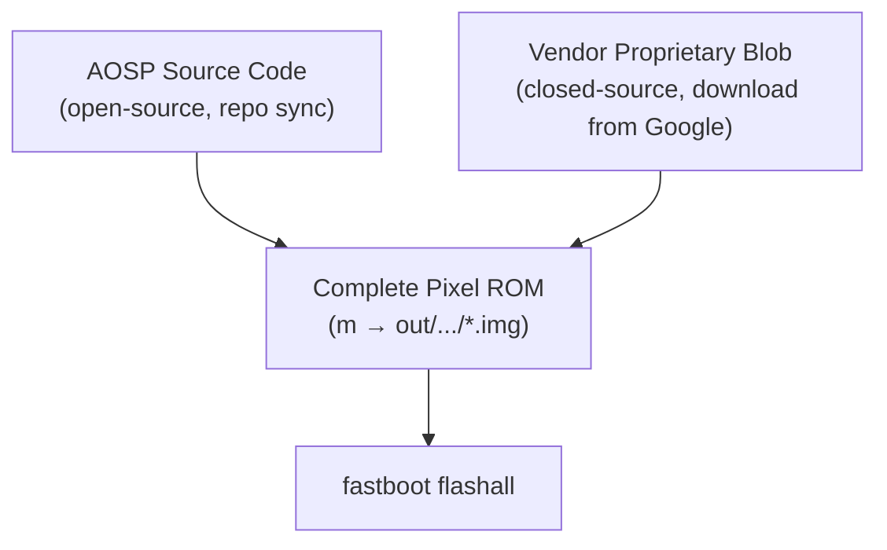
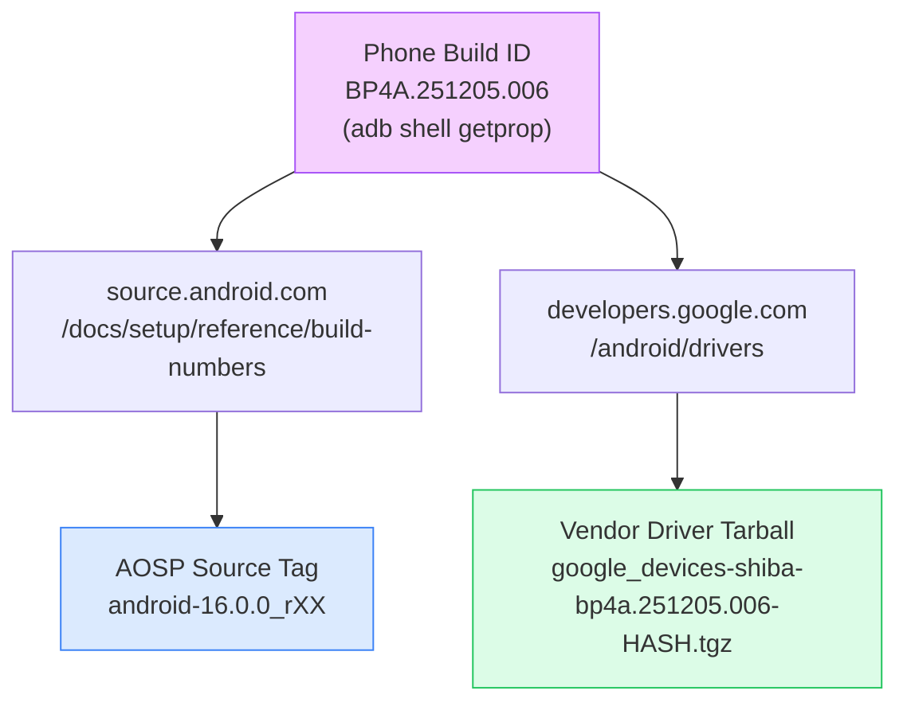
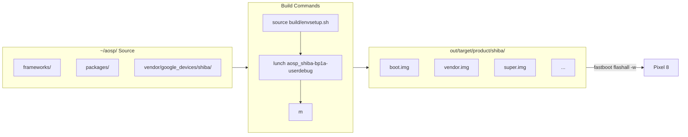
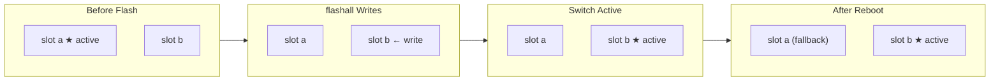

# Pixel 8 AOSP Full Workflow: Build ID, Version Selection, Compilation, and Flashing

This is a complete developer guide. Unlike "restoring a Pixel to stock," this guide covers:

1. **How to decide which version to build** — the phone's build ID, AOSP tag, and vendor driver must all be aligned.
2. **The full pipeline from `repo init` → `repo sync` → vendor driver download → `m` compile → `fastboot flashall`.**

The core concepts are explained with diagrams to avoid blindly copying commands.

:::info Supported Devices
- Pixel 8 (codename `shiba`)
- Pixel 8 Pro (codename `husky`) — same steps, just replace `shiba` with `husky`
- Other Pixel devices follow the same process; only the codename and driver tarball name differ
:::

---

## Part 0: Understand Three Core Concepts

### Concept 1: Stock AOSP ≠ A Working Pixel ROM

Stock AOSP is Google's open-source portion. For a Pixel to work properly, it also needs a layer of **vendor proprietary blobs** (modem firmware, camera HAL, ISP/GPU drivers, Tensor-specific modules). These blobs are closed-source and are **not included** in the AOSP tree.



You can build and flash a pure AOSP image, but it will be missing **camera, modem, fingerprint, 5G, and other blob-dependent features**. Vendor blobs are therefore required.

---

### Concept 2: Three Versions Must Be Aligned

This is the most common pitfall. The **phone's build ID, AOSP source tag, and vendor driver** must all correspond to each other. Mismatches cause:

- AOSP newer than vendor → missing modules/APIs at compile time
- AOSP older than vendor → vendor blobs reference framework interfaces not yet available
- Bootloader/radio version mismatch → device won't boot after flashing



Both sides must point to the same build ID before you proceed. The alignment steps are covered in Part 2.

---

### Concept 3: The build → flash Pipeline



---

## Part 1: Environment Setup (One-time)

### System Packages

```bash
sudo apt-get update
sudo apt-get install -y \
  git-core gnupg flex bison build-essential zip curl \
  zlib1g-dev gcc-multilib g++-multilib libc6-dev-i386 \
  libncurses5 lib32ncurses5-dev x11proto-core-dev libx11-dev \
  lib32z1-dev libgl1-mesa-dev libxml2-utils xsltproc unzip fontconfig
```

### ADB / fastboot

```bash
sudo apt install -y android-tools-adb android-tools-fastboot
adb version          # 1.0.41 / 34.x
fastboot --version   # 34.x
```

### `repo`

```bash
mkdir -p ~/bin
curl https://storage.googleapis.com/git-repo-downloads/repo > ~/bin/repo
chmod a+x ~/bin/repo
echo 'export PATH=~/bin:$PATH' >> ~/.bashrc
export PATH=~/bin:$PATH
```

### Phone Setup

1. **Settings → About phone → tap "Build number" 7 times** to enable Developer Options
2. **Developer Options → Enable "USB debugging"**
3. **Developer Options → Enable "OEM unlocking"** (required for first-time AOSP flash)
4. Connect via USB and tap "Always allow" on the phone dialog

```bash
adb devices
# 38011FDJH00C9F   device   ← "device" means you're good
```

---

## Part 2: Choosing the Right Build ID (Three-Step Alignment)

### 2.1 Read the Phone's Current Build ID

```bash
adb shell getprop ro.build.id
# e.g.: BP4A.251205.006

adb shell getprop ro.build.fingerprint
# e.g.: google/shiba/shiba:16/BP4A.251205.006/.../user/release-keys
```

> You can also find it under **Settings → About phone → Build number**.

Note this value down (referred to as `<BUILD_ID>` below).

#### How to Read a Build ID

```
B  P    4A      .  251205      .  006
│  │    │          │              │
│  │    │          │              └── patch sequence number
│  │    │          └─────────────── branch date (2025-12-05)
│  │    └────────────────────────── branch code (also the release config name)
│  └─────────────────────────────── support vertical
└────────────────────────────────── major version (B = Baklava = Android 16)
```

**The branch code in lowercase is the lunch release config**: `BP4A` → `bp4a`, `BP1A` → `bp1a`.

### 2.2 Look Up the AOSP Source Tag from the Build ID

Open `https://source.android.com/docs/setup/reference/build-numbers`

Press Ctrl+F to search for `<BUILD_ID>` and find the corresponding tag, e.g.:

```
Build              Branch                   Tag
BP4A.251205.006    android16-qpr2-release   android-16.0.0_rXX
```

Note the tag down (referred to as `<AOSP_TAG>` below).

> If the build ID hasn't been pushed to AOSP yet (freshly released builds are typically delayed by a few weeks), use the closest earlier tag instead.

### 2.3 Look Up the Vendor Driver from the Build ID

Open `https://developers.google.com/android/drivers`

Ctrl+F for `shiba`, find the row matching your `<BUILD_ID>`, and copy the download URL and SHA-256.

> **If no matching vendor exists**: use the previous build ID, or pick the latest available one that has a vendor tarball.

### 2.4 Alignment Checklist

At this point you should have:

| Item | Example value | Source |
|---|---|---|
| `<BUILD_ID>` | `BP1A.250505.005.B1` | `adb shell getprop` |
| `<AOSP_TAG>` | `android-15.0.0_r34` | source.android.com lookup |
| Vendor URL | `https://dl.google.com/.../google_devices-shiba-bp1a.250505.005.b1-ef15dd6d.tgz` | developers.google.com/android/drivers |

All three must point to the same `<BUILD_ID>` before proceeding.

---

## Part 3: Download AOSP Source

### 3.1 Create the Working Directory

```bash
mkdir -p ~/aosp && cd ~/aosp
```

### 3.2 repo init (using the tag from Part 2.2)

```bash
repo init \
  --partial-clone \
  --no-use-superproject \
  -b <AOSP_TAG> \
  -u https://android.googlesource.com/platform/manifest
```

### 3.3 repo sync

```bash
repo sync -c -j8 2>&1 | tee -a repo_sync.log
```

- `-c`: sync only the current branch (saves ~50% disk space)
- `-j8`: 8 parallel jobs (avoid `$(nproc)` at full throttle — it hits 503s)
- If interrupted, re-run the same command to resume

Expect 30–90 minutes depending on your connection.

---

## Part 4: Download the Vendor Driver

### 4.1 Download

```bash
cd ~/aosp
wget '<URL from Part 2.3>'
```

### 4.2 Verify SHA-256

```bash
sha256sum google_devices-shiba-*.tgz
# Compare against the SHA-256 shown on the website in Part 2.3
```

**Never proceed if the hash doesn't match.**

### 4.3 Extract

```bash
cd ~/aosp
tar -xzf google_devices-shiba-*.tgz
ls extract-*.sh
# extract-google_devices-shiba.sh
```

### 4.4 Run the Extract Script (Accept License)

```bash
cd ~/aosp
./extract-google_devices-shiba.sh
```

The script prints the license agreement. Press **Enter** to scroll through it, then type:

```
I ACCEPT
```

> For automation (scripts or AI agents):
> ```bash
> printf '\nI ACCEPT\n' | bash extract-google_devices-shiba.sh
> ```
> Two inputs are required: the first newline scrolls through the agreement, the second sends `I ACCEPT`. Sending only one will silently fail.

### 4.5 Verify Vendor Structure

```bash
ls vendor/google_devices/shiba/proprietary/device-vendor.mk
```

**This file must exist before continuing.** If it's missing, the extract failed — re-run step 4.4.

Without this file, `m` will compile successfully, but the phone will boot-loop after flashing because `super.img` is missing vendor libraries. This is very hard to diagnose.

```
~/aosp/
└── vendor/google_devices/shiba/
    └── proprietary/
        ├── bootloader.img        ← third-party bootloader
        ├── radio.img             ← modem firmware
        ├── vendor.img            ← vendor partition contents
        ├── vendor_dlkm.img
        ├── vbmeta_vendor.img
        ├── device-vendor.mk      ← integrated into the build system
        └── ... (other .so / .apk)
```

---

## Part 5: Lunch and Compile

### 5.1 Set the Lunch Target

```bash
cd ~/aosp
source build/envsetup.sh
lunch aosp_shiba-bp1a-userdebug
```

:::caution Android 14+ lunch format change
Starting with Android 14, the lunch format changed from two segments to three, adding a release config:

```bash
# Old format (Android 13 and earlier) — now errors out
lunch aosp_shiba-userdebug

# New format (Android 14+)
lunch aosp_shiba-bp1a-userdebug
#              ^^^^
#              release config = build ID prefix in lowercase
#              BP1A → bp1a, BP4A → bp4a
```

Valid release config names can be found in `build/release/release_configs/`.
:::

Expected output:

```
TARGET_PRODUCT=aosp_shiba
TARGET_BUILD_VARIANT=userdebug
TARGET_ARCH=arm64
```

> Pixel 8 Pro: `lunch aosp_husky-bp1a-userdebug` (or the corresponding release config)

### 5.2 Compile

```bash
m
```

First-time compilation takes roughly 1–3 hours. Success indicator:

```
#### build completed successfully (XX:XX:XX (hh:mm:ss)) ####
```

### 5.3 Verify Build Artifacts

```bash
ls $PRODUCT_OUT/*.img | head
```

---

## Part 6: Flash to the Phone

### 6.1 Enter Fastboot Mode

```bash
adb reboot bootloader
```

```bash
fastboot devices
fastboot getvar product   # product: shiba
fastboot getvar unlocked  # unlocked: yes  ← must be yes
```

### 6.2 (First Time Only) Unlock the Bootloader

```bash
fastboot flashing unlock
```

Use the volume keys to select **"Unlock the bootloader"** and confirm with the power button. **This erases userdata.**

### 6.3 Flash

```bash
cd ~/aosp/out/target/product/shiba
ANDROID_PRODUCT_OUT=$(pwd) fastboot flashall -w
```

Or via the build environment:

```bash
cd ~/aosp
source build/envsetup.sh
lunch aosp_shiba-bp1a-userdebug
cd "$(get_build_var PRODUCT_OUT)"
fastboot flashall -w
```

> **`-w` wipes userdata** (factory reset). For iterative development, omit `-w` to keep your data.

:::caution Do not add --disable-verity
Do not pass `--disable-verity --disable-verification` to `fastboot flashall`.

`m` already writes the correct AVB flags into `vbmeta.img` for userdebug builds — no patching is needed. On fastboot 37+ / Pixel 8+, adding these flags actually causes an error:

```
fastboot: error: Failed to find AVB_MAGIC at offset: 0
```

This happens because fastboot tries to patch `vbmeta_vendor_kernel_boot`, which is not present in the image directory.
:::

#### Expected Output (~70 seconds)

```
Setting current slot to 'b'                        OKAY
Sending 'boot_b' (65536 KB)                        OKAY
Writing 'boot_b'                                   OKAY
...
Sending sparse 'super' 1/10 ...                    OKAY
...
Erasing 'userdata'                                 OKAY
Erase successful, but not automatically formatting.
File system type raw not supported.
wipe task partition not found: cache
Finished. Total time: ~70s
```

#### Three Messages That Look Like Errors but Aren't

| Message | Why it's normal |
|---|---|
| `Erase successful, but not automatically formatting. File system type raw not supported.` | Android formats /data automatically on first boot. |
| `wipe task partition not found: cache` | Pixel 8 uses A/B + dynamic partitions — there is no dedicated cache partition. |
| `Setting current slot to 'b'` | A/B mechanism — slots alternate. The next flash will switch back to `a`. |

#### A/B Slot Mechanism



A broken slot can always be switched back to the other — this is the built-in fail-safe.

### 6.4 First Boot

The first boot runs dexopt and formats /data — expect 5–10 minutes before reaching the launcher.

```bash
adb shell getprop ro.build.fingerprint
# Android/aosp_shiba/shiba:15/.../userdebug/test-keys
```

Seeing `aosp_shiba` and `userdebug` confirms you're running your own build.

---

## Part 7: Day-to-Day Iteration

After modifying code and wanting to reflash:

```bash
cd ~/aosp
source build/envsetup.sh
lunch aosp_shiba-bp1a-userdebug
m                                    # incremental build

adb reboot bootloader
cd "$(get_build_var PRODUCT_OUT)"
fastboot flashall                    # omit -w to keep userdata
```

Kernel-only change:

```bash
fastboot flash boot boot.img
fastboot reboot
```

---

## Part 8: Cross-Machine Flashing (Flash from Mac or Another Linux Box)

Build on Linux, flash from another machine (e.g., Mac):

```bash
# On the build machine — pack the images (android-info.txt is not a .img, add it explicitly)
tar -czf shiba-images.tar.gz \
  -C ~/aosp/out/target/product/shiba \
  $(cd ~/aosp/out/target/product/shiba && ls *.img) \
  android-info.txt

# Transfer to the other machine
scp shiba-images.tar.gz user@other-machine:~/

# On the other machine — extract and flash
mkdir shiba-images && tar -xzf shiba-images.tar.gz -C shiba-images
cd shiba-images
ANDROID_PRODUCT_OUT=$(pwd) fastboot flashall -w
```

> Install fastboot on Mac: `brew install android-platform-tools`

:::caution Don't forget android-info.txt
The `*.img` glob does not include `android-info.txt`, but `fastboot flashall` needs it to verify the device model. Omitting it causes:
```
fastboot: error: could not read android-info.txt
```
:::

---

## Part 9: Common Errors and Brick Recovery

### `Invalid lunch combo: aosp_shiba-userdebug`

Android 14+ requires the three-segment format:

```bash
lunch aosp_shiba-bp1a-userdebug
```

### Boot Loop After Flashing (Returns to Fastboot)

Usually caused by missing vendor blobs. Check first:

```bash
ls ~/aosp/vendor/google_devices/shiba/proprietary/device-vendor.mk
```

If it doesn't exist, re-extract and rebuild:

```bash
cd ~/aosp
printf '\nI ACCEPT\n' | bash extract-google_devices-shiba.sh
# Then rebuild incrementally (~3 minutes)
source build/envsetup.sh && lunch aosp_shiba-bp1a-userdebug && m
```

### `image (bl1_a): rejected, anti-rollback`

The bootloader being flashed is older than the one currently on the device. Use a build ID ≥ the current version.

### `Bootloader is locked`

```bash
fastboot flashing unlock
```

(This will wipe userdata.)

### Bricked Device (Won't Boot)

Hold **Power + Volume Down** to force into fastboot, then recover using an official factory image:

```bash
# Download the matching zip from https://developers.google.com/android/images
unzip shiba-<build-id>-factory-*.zip
cd shiba-<build-id>
./flash-all.sh
```

---

## References

- [AOSP Official Build Guide](https://source.android.com/docs/setup/start)
- [AOSP Build Numbers & Tags Reference](https://source.android.com/docs/setup/reference/build-numbers)
- [Google Pixel Vendor Drivers](https://developers.google.com/android/drivers)
- [Google Pixel Factory Images](https://developers.google.com/android/images)
- [Android A/B System Updates](https://source.android.com/docs/core/ota/ab)
- [Dynamic Partitions](https://source.android.com/docs/core/ota/dynamic_partitions)
