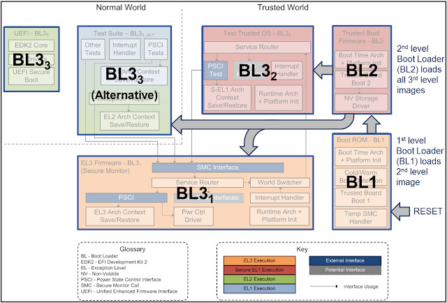

What: ARM 官方的Secure World 執行環境的詞作
Why: ARMv8 引入 Trustzone+EL3(Secure Monitor)，並且不再維護vendor BL1 BL2
When Armv8 2013-14第一版ATF 2015 ATF 成標準

## Major component 
- Boot loader (BL1 BL2 BL31 BL32 BL33)
- TF-A
- PSCI
- SMC Dispatcher
- SiPserice
- Certificated Chain/ROT(Root of Truest)

## 名詞解釋
- ATF
- TEE
- BL Boot Process
- ARM Exeception Level
- OP-TEE
- Secure Boot Chain
- trustzone
- secure world

BL1 BL2 BL31 BL32 BL31 BL33 

https://pyjamabrah.com/posts/arm64-day0-exception-levels/

https://www.cnblogs.com/arnoldlu/p/14175126.html
