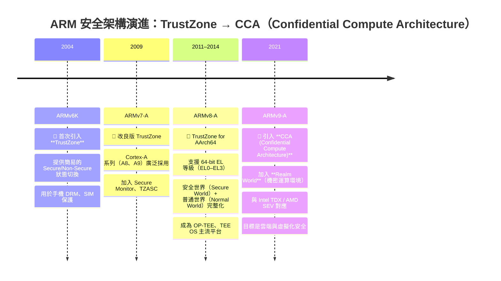

## 名詞
- OP-TEE(Open Portable Trusted Execution Environment): 一個開源的 TEE（Trusted Execution Environment）實作，由 Linaro 維護，通常跑在 **Secure World**。
- Exception Level: ARMv8 之後的 CPU 權限分層機制，用於區分 OS、hypervisor、固件等不同層級的權限。
- Boot Loader stage: 

| 階段        | 常見名稱                           | 任務                              | 層級             |
| --------- | ------------------------------ | ------------------------------- | -------------- |
| **BL1**   | ROM Code / BootROM             | 硬體初始化、載入下一階                     | EL3            |
| **BL2**   | Trusted Boot Loader            | 設定安全屬性、載入 U-Boot/TF-A           | EL3            |
| **BL3-1** | **ARM Trusted Firmware (ATF)** | 實作 Secure Monitor（TrustZone 切換） | EL3            |
| **BL3-2** | **OP-TEE OS**                  | Secure World 的 OS               | Secure EL1     |
| **BL3-3** | **U-Boot / Linux Kernel**      | Normal World 的 OS               | Non-secure EL1 |
ROM → 2. ATF (EL3) → 3. OP-TEE (Secure EL1) → 4. U-Boot (Non-secure EL1) → 5. Linux


- TrustZone: TrustZone 是 ARM 的硬體級安全隔離機制，將整個系統切成兩個「世界」：
	- Normal World
	- Secure World
- Root of Trust: 系統啟動過程中，最早被「信任」的元件（通常是 SoC 內建的 BootROM）。
```
[Normal World]
   ├── Linux / Android
   ├── TEE Client API (libteec)
   └── OP-TEE Driver
[Secure World]
   ├── OP-TEE OS (kernel)
   └── Trusted Applications (.ta)
```

```
+----------------------------------------------------------+
|                    ARM SoC 啟動流程                      |
|                                                          |
|  ┌──────────────────────────┐                            |
|  │ Root of Trust (BootROM)  │ ← 驗證下一階               |
|  └─────────────┬────────────┘                            |
|                ↓                                         |
|      [BL1/BL2: ARM Trusted Firmware (ATF)]               |
|                ↓                                         |
|   ┌────────────┴────────────┐                            |
|   │   Secure World          │   │   Normal World          |
|   │   (OP-TEE OS, TA)       │   │   (U-Boot, Linux)       |
|   └────────────┬────────────┘                            |
|                ↓ SMC 切換                               |
|            Secure Monitor (EL3)                          |
+----------------------------------------------------------+

```

| Exception Level | 權限層   | 說明                              |
| --------------- | ----- | ------------------------------- |
| **EL0**         | 使用者層  | 一般應用程式（App）                     |
| **EL1**         | 作業系統層 | OS kernel（Linux、Android kernel） |
| **EL2**         | 虛擬化層  | Hypervisor（KVM、Xen）             |
| **EL3**         | 安全監控層 | Secure Monitor（TrustZone 切換控制器） |

| 階段        | 常見名稱                           | 任務                              | 層級             |
| --------- | ------------------------------ | ------------------------------- | -------------- |
| **BL1**   | ROM Code / BootROM             | 硬體初始化、載入下一階                     | EL3            |
| **BL2**   | Trusted Boot Loader            | 設定安全屬性、載入 U-Boot/TF-A           | EL3            |
| **BL3-1** | **ARM Trusted Firmware (ATF)** | 實作 Secure Monitor（TrustZone 切換） | EL3            |
| **BL3-2** | **OP-TEE OS**                  | Secure World 的 OS               | Secure EL1     |
| **BL3-3** | **U-Boot / Linux Kernel**      | Normal World 的 OS               | Non-secure EL1 |
**順序範例：**
1. ROM → 2. ATF (EL3) → 3. OP-TEE (Secure EL1) → 4. U-Boot (Non-secure EL1) → 5. Linux

**Secure World vs Normal World：**
- Secure World 也有自己的 EL0–EL3 對應層（例如 Secure EL1、Secure EL3）。
- Secure Monitor 通常執行在 **EL3**，負責世界切換（SMC handler）。
![[Pasted image 20251104215201.png]]

https://github.com/ARM-software/arm-trusted-firmware
ARM TrustZone = Secure World 保護 SoC 裡的信任根

| 項目   | ARM TrustZone                                                                   | 機密運算（Confidential Computing）                                   |
| ---- | ------------------------------------------------------------------------------- | -------------------------------------------------------------- |
| 定義   | 一種硬體級安全隔離技術，將系統分為「安全世界（Secure World）」與「普通世界（Normal World）」                      | 一種資料保護理念，讓資料在「使用中（in use）」的狀態仍可被保密處理                           |
| 層級   | CPU 架構級別（ARMv8-A, ARMv9）                                                        | 系統與雲端平台層級                                                      |
| 實作方式 | 透過硬體隔離 + TrustZone Address Space Controller (TZASC) + Secure Monitor Call (SMC) | 透過 TEE（Trusted Execution Environment）或 SEV、TDX、TrustZone 等技術實現 |
| 範例   | ARM TrustZone, OP-TEE                                                           | Intel SGX, AMD SEV, ARM CCA, Azure Confidential VM             |
ARM 的方案是：
- 在 SoC 層建立 **Secure World（TEE）**；
- 使用 TrustZone 來保護敏感運算，例如金鑰管理、支付、DRM；
- 配合 **OP-TEE (Open Portable Trusted Execution Environment)** 提供應用框架。
因此：
> ✅ **TrustZone = 一種硬體層的 TEE 實作**，  
> 而 **Confidential Computing = 更廣的概念**，包含多種 TEE 技術（TrustZone、Intel SGX、AMD SEV、ARM CCA）。

| 架構          | 安全隔離模型                   | 世界數量                           | 特點                                 |
| ----------- | ------------------------ | ------------------------------ | ---------------------------------- |
| **ARMv7-A** | TrustZone Classic        | 2 個世界（Secure / Normal）         | 簡單的安全切換                            |
| **ARMv8-A** | TrustZone for AArch64    | 2 個世界 + SMC + EL3              | 支援 64-bit EL 等級（EL0~EL3）           |
| **ARMv9-A** | TrustZone + CCA (Realms) | 3 個世界（Secure / Normal / Realm） | 真正支援雲端機密運算（類似 Intel TDX / AMD SEV） |


