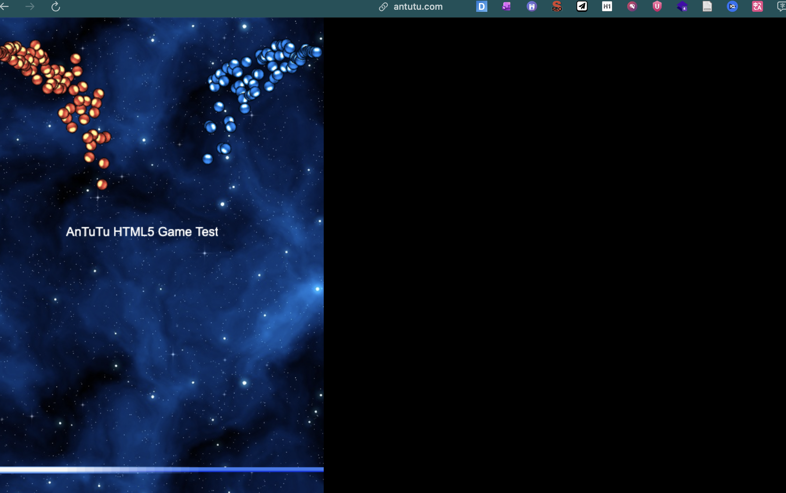
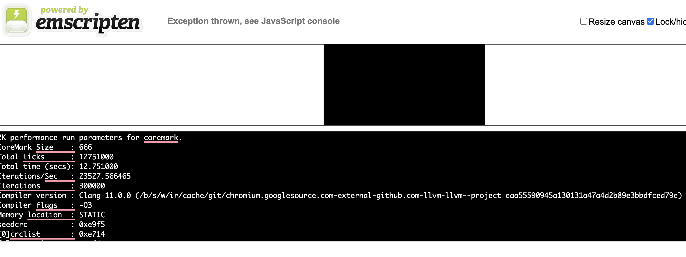
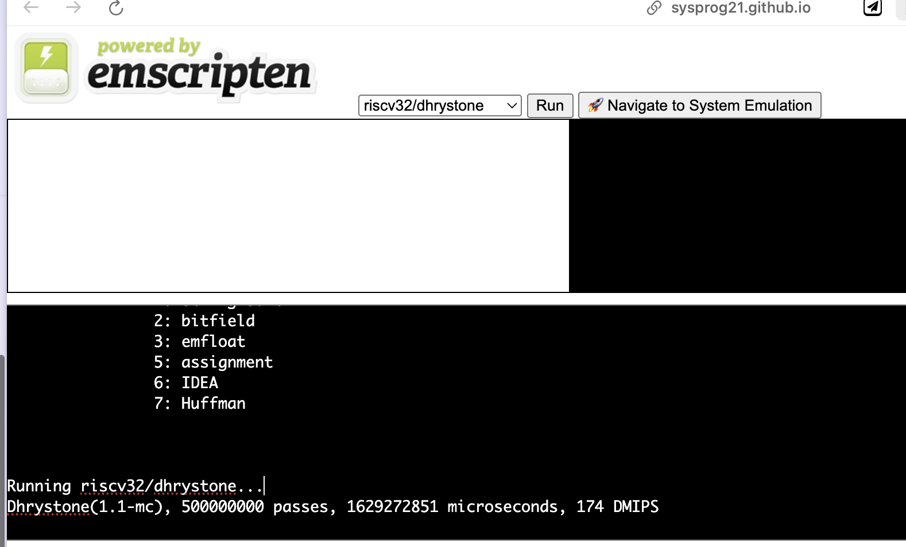
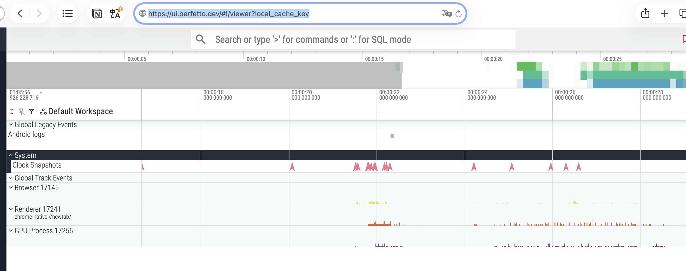

我想透過網頁的benchmark 測試來了解某一台的機體性能

## 有哪些指標

## cpu gpu memory 如何透過網站衡量？底層原理？

## 怎麼進行實驗
## 指標
- 純計算吞吐: Wasm 通常更穩、更容易接近理想機器碼（型別固定、語義簡單）JS 如果也寫成 TypedArray + 穩定型別的 tight loop，差距會縮小；但遇到動態型別、物件、GC，就容易掉速
- 真實 Web App 體感: 
	- DOM 操作、layout/reflow、style 計算
	- JS 框架更新、事件處理、GC、資源載入
	- 圖形管線（Canvas/WebGL/WebGPU）+ 合成

## 有哪些工具
- **JetStream 2**：混合 JavaScript + WebAssembly 的測試，偏「引擎/語言層」綜合能力
- **Speedometer 3.x**：量 Web App 的互動/回應性（更貼近真實網站體感）
- **Basemark Web 3.0**：偏圖形/瀏覽器圖形能力的線上測試（常被當作 web graphics benchmark）

## 有哪些限制
Benchmark瀏覽器是在作業系統之上的一個「沙盒 (Sandbox)」，因此網頁 Benchmark 測的是**「硬體 + OS + 瀏覽器引擎（JS Engine）」的綜合表現**。
多執行緒（Threads）也可以，但有門檻
如果你想測到更接近「多核」的上限（例如 Wasm threads），通常會用到 `SharedArrayBuffer`，而它需要頁面處於 **cross-origin isolated**（典型做法是設 COOP/COEP header）
**Wasm 不會直接在 GPU 上執行**。
實際跑在 GPU 的部分通常是：
- **WebGPU**（新一代 GPU/Compute API）
或 **WebGL**（偏圖形渲染）
測 GPU 時間怎麼量？
最粗：看 frame time / FPS（很容易被 VSync、UI thread、合成器影響）
更準：WebGPU 有 **timestamp-query**（如果裝置/瀏覽器支援）可量 compute/render pass 的 GPU 執行時間
## 有哪些可以測AI的？ onnx? tensorflow.js? transformer.js?

浏览器js性能测试
https://blog.csdn.net/weixin_42654603/article/details/151798354

https://pwhiddy.github.io/webgpu-atomics-benchmark/

https://mayfield.github.io/webbench/pages/bench.html

Benchmarking WebAssembly for Embedded Systems
https://dl.acm.org/doi/10.1145/3736169

https://huggingface.co/spaces/Xenova/webgpu-embedding-benchmark

https://webgpu.github.io/webgpu-samples/?sample=animometer

https://ajlaston.github.io/Nova-Web/

https://toji.github.io/webgpu-test/

https://maksim4351.github.io/test/index.html

https://maksim4351.github.io/test/gpu_stress_test.html

https://wasm3.github.io/wasm-coremark/coremark-minimal.html

https://www.videogames.ai/tensorflow-js-benchmark

https://samrat079.github.io/Fractal_Benchmark/

https://tfjs-benchmarks.web.app/local-benchmark/

https://tfjs-benchmarks.web.app/local-benchmark/

https://www.antutu.com/html5/octane.html?inner=1

https://www.antutu.com/html5/

https://alanhc.github.io/wasm-coremark/

## 看cpu gpu memory 狀態
https://ui.perfetto.dev/#!/viewer?local_cache_key
