我想透過網頁的benchmark 測試來了解某一台的機體性能

## 有哪些指標

## cpu gpu memory 如何透過網站衡量？底層原理？

## 怎麼進行實驗

## 有哪些限制
Benchmark瀏覽器是在作業系統之上的一個「沙盒 (Sandbox)」，因此網頁 Benchmark 測的是**「硬體 + OS + 瀏覽器引擎（JS Engine）」的綜合表現**。

## 有哪些可以測AI的？ onnx? tensorflow.js? transformer.js?

浏览器js性能测试
https://blog.csdn.net/weixin_42654603/article/details/151798354

https://pwhiddy.github.io/webgpu-atomics-benchmark/
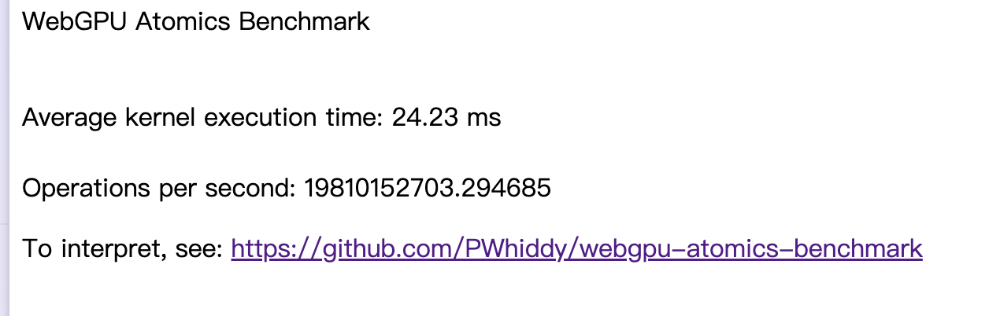

https://mayfield.github.io/webbench/pages/bench.html
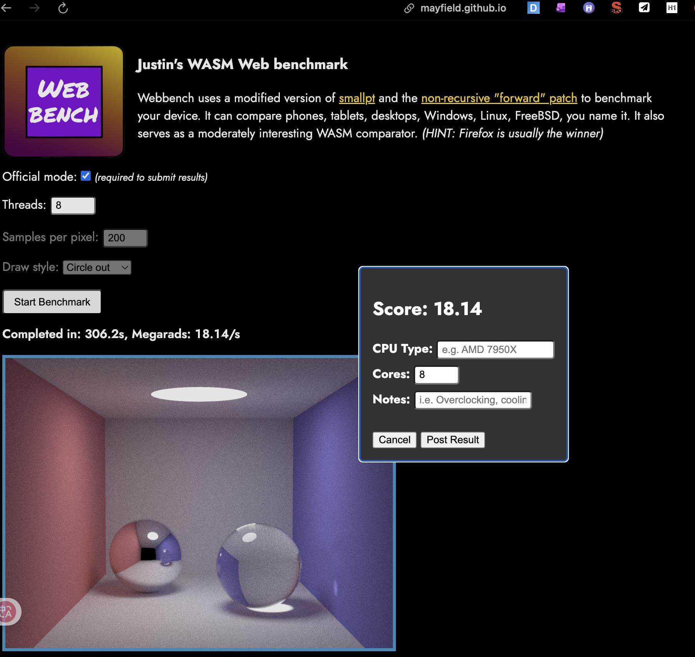

Benchmarking WebAssembly for Embedded Systems
https://dl.acm.org/doi/10.1145/3736169

https://huggingface.co/spaces/Xenova/webgpu-embedding-benchmark
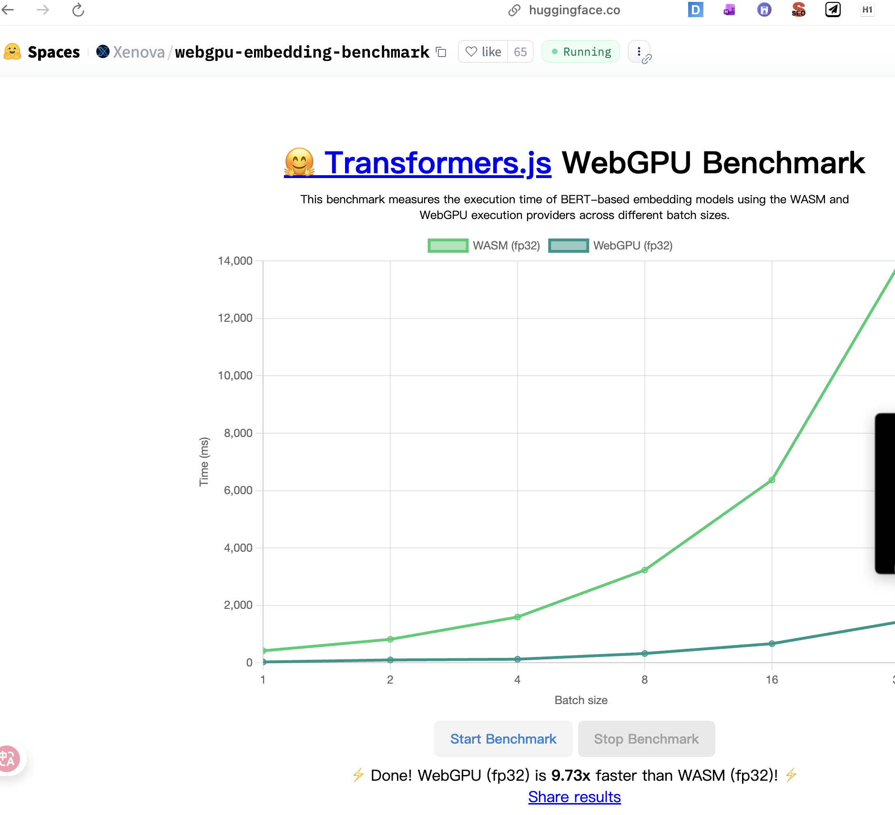
https://webgpu.github.io/webgpu-samples/?sample=animometer
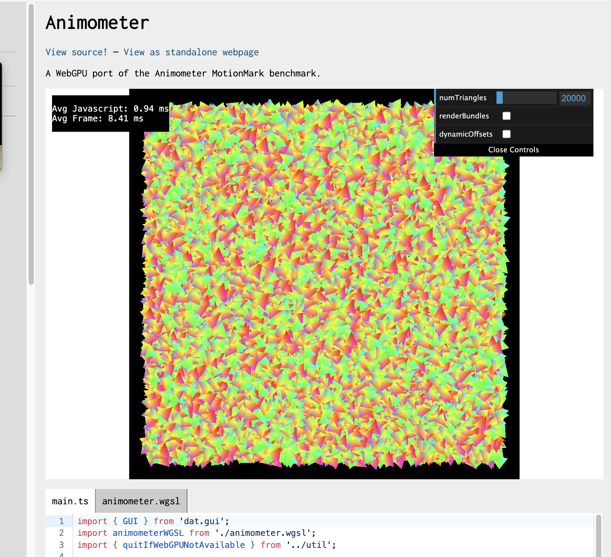
https://ajlaston.github.io/Nova-Web/
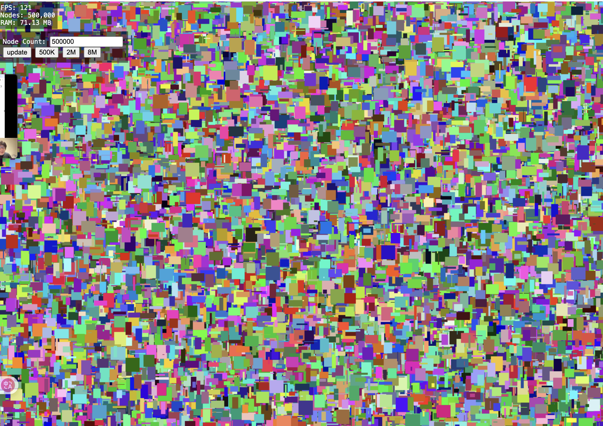
https://toji.github.io/webgpu-test/

https://maksim4351.github.io/test/index.html
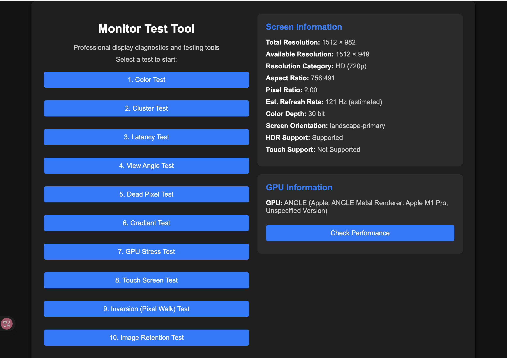
https://maksim4351.github.io/test/gpu_stress_test.html
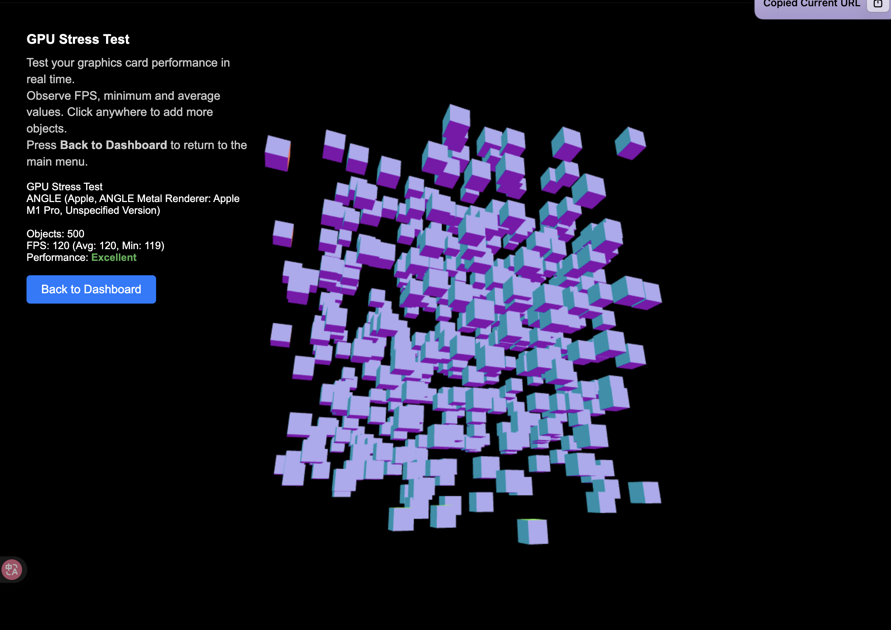
https://wasm3.github.io/wasm-coremark/coremark-minimal.html
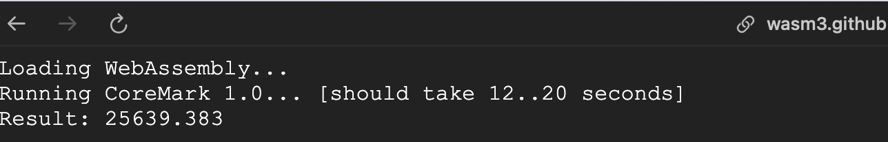
https://www.videogames.ai/tensorflow-js-benchmark
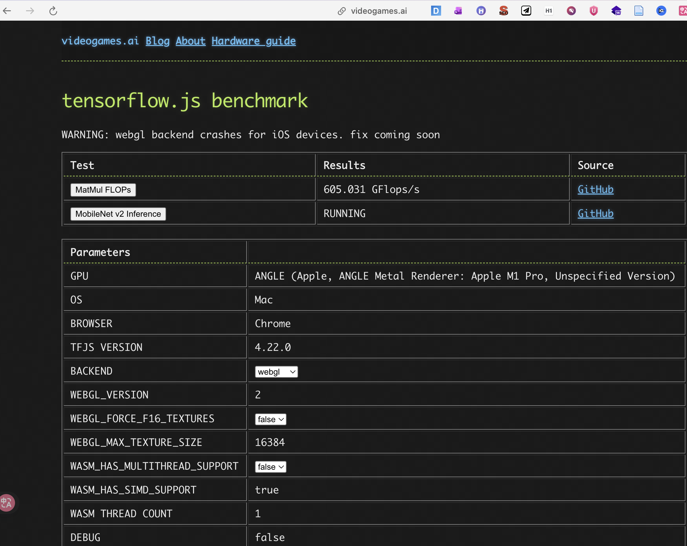
https://samrat079.github.io/Fractal_Benchmark/
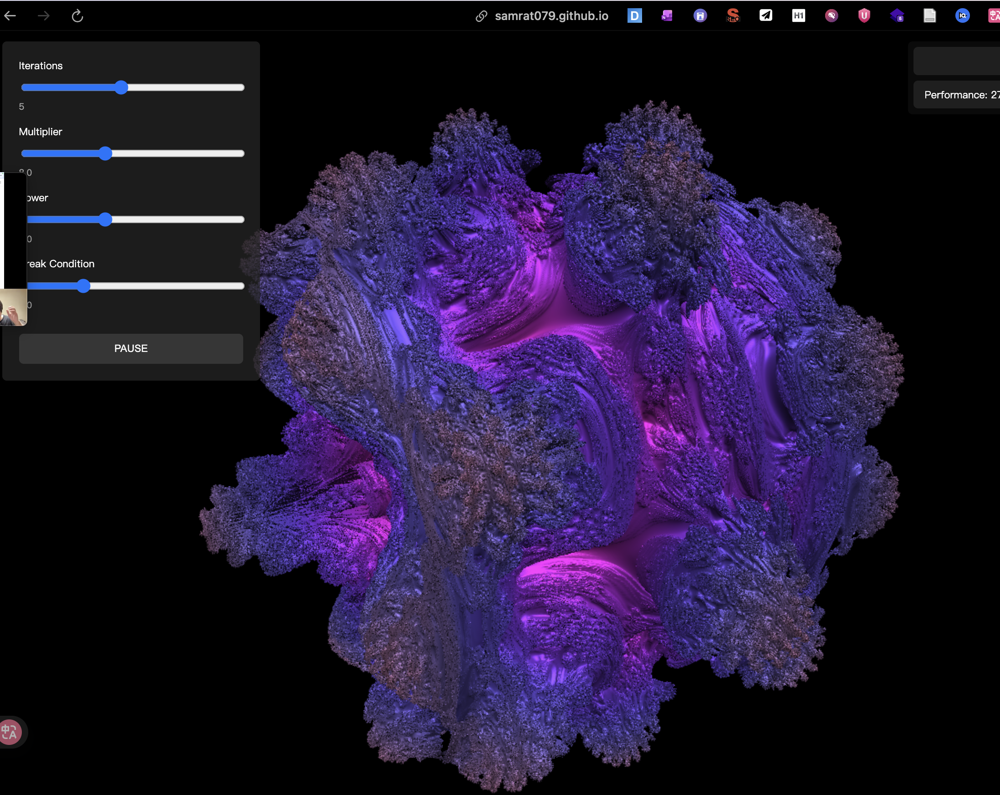
https://tfjs-benchmarks.web.app/local-benchmark/
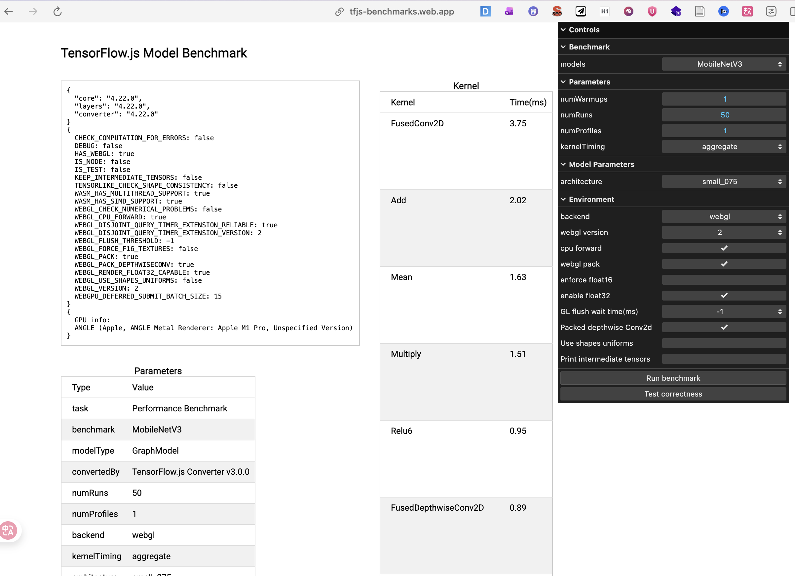
https://tfjs-benchmarks.web.app/local-benchmark/
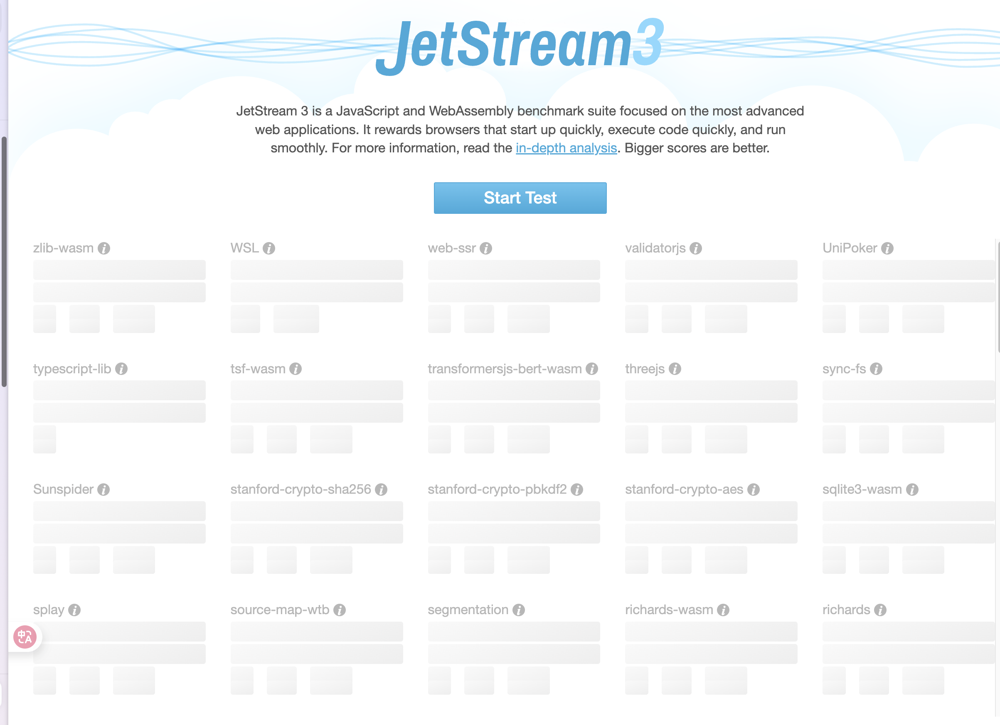