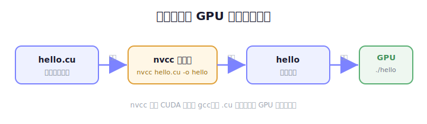
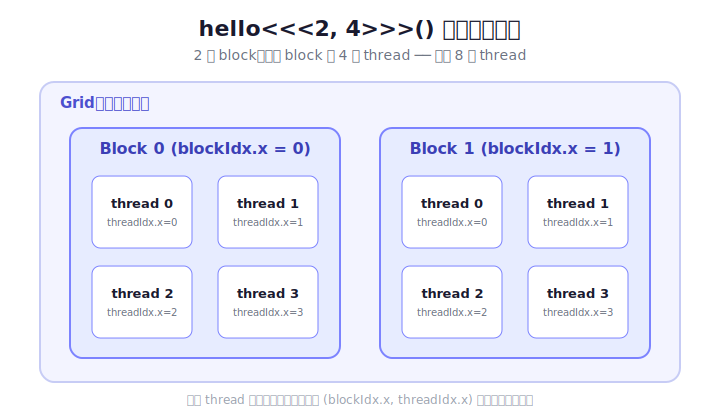
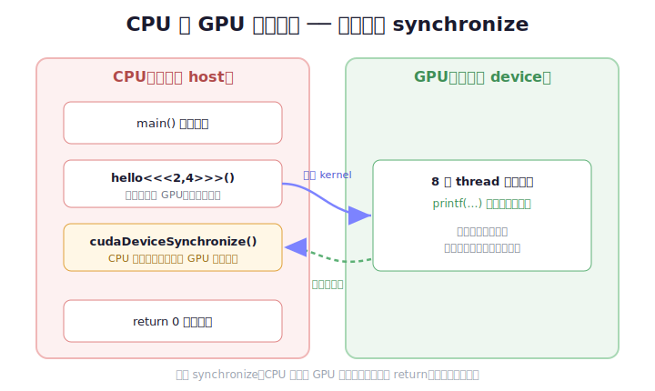

# CUDA 入門第一步：安裝 Toolkit，跑出你的第一支 GPU 程式

如果你聽過「用 GPU 做平行運算」，卻不知道從哪裡開始，這篇就是為你寫的。我們會從零開始：先把 NVIDIA 官方的 CUDA Toolkit 裝好，接著寫一支只有十幾行的 `Hello World`，讓數千個執行緒（thread）同時跟你打招呼。全程不需要任何背景，跟著做就會動。

> 前提：你的電腦要有一張 NVIDIA 顯示卡，而且已經裝好 NVIDIA 驅動程式。這篇以 Ubuntu / Debian 這類使用 `apt` 的 Linux 系統為例。

---

## 一、CUDA 到底是什麼？

CPU 很擅長「一件事快速做完」，而 GPU 擅長「同一件事分成上萬份、一起做」。CUDA 是 NVIDIA 提供的一套工具，讓你可以用接近 C++ 的語法，把程式碼丟到 GPU 上、由成千上萬個執行緒同時跑。

要寫 CUDA 程式，你需要兩樣東西：

- **CUDA Toolkit**：包含編譯器 `nvcc`、函式庫、標頭檔等等。
- **NVIDIA 驅動程式**：讓作業系統認得你的顯示卡（通常裝驅動時就有了）。

整個流程可以先用一張圖抓個印象——你寫的 `.cu` 檔會被 `nvcc` 編譯成執行檔，最後丟到 GPU 上跑：



接下來我們先把 Toolkit 裝好。

---

## 二、安裝 CUDA Toolkit

下面這段指令會做四件事：註冊 NVIDIA 的軟體來源、安裝最新版 Toolkit、移除系統內建的舊版本，最後把執行路徑寫進設定檔。逐行貼上執行即可：

```bash
sudo dpkg -i cuda-keyring.deb && \
sudo apt-get update && \
sudo apt-get install -y cuda-toolkit-13-0 && \
sudo apt-get remove -y nvidia-cuda-toolkit nvidia-cuda-toolkit-doc && \
echo 'export PATH=/usr/local/cuda/bin:$PATH' >> ~/.bashrc && \
echo 'export LD_LIBRARY_PATH=/usr/local/cuda/lib64:$LD_LIBRARY_PATH' >> ~/.bashrc && \
echo "=== 完成。接著執行： source ~/.bashrc ==="
```

一行一行拆解它在做什麼：

- **`sudo dpkg -i cuda-keyring.deb`**：安裝 NVIDIA 的「金鑰環」套件。有了它，`apt` 才信任 NVIDIA 的官方軟體來源。（這個 `.deb` 檔需先從 NVIDIA 官網下載，記得換成你實際的檔案路徑。）
- **`sudo apt-get update`**：更新軟體清單，讓系統看得到剛加進來的 CUDA 套件。
- **`sudo apt-get install -y cuda-toolkit-13-0`**：安裝 CUDA Toolkit 13.0。`-y` 代表「一路 yes」，不用手動確認。
- **`sudo apt-get remove ... nvidia-cuda-toolkit ...`**：移除 Ubuntu 內建、通常比較舊的 CUDA 版本，避免和剛裝的新版打架。
- **兩行 `echo ... >> ~/.bashrc`**：把 CUDA 的執行檔與函式庫路徑加進環境變數，這樣你在任何資料夾都能直接呼叫 `nvcc`。
  - `PATH` 決定系統去哪裡找可執行檔（例如 `nvcc`）。
  - `LD_LIBRARY_PATH` 決定程式執行時去哪裡找共享函式庫（`.so` 檔）。
- **最後一行 `echo`**：只是印一句提示，告訴你下一步要做什麼。

裝完後，讓剛剛寫進 `~/.bashrc` 的設定「立刻生效」：

```bash
source ~/.bashrc
```

`source` 的意思是「在目前這個終端機重新讀取設定檔」。不做這步的話，你得關掉終端機重開才會生效。

---

## 三、確認裝好了：`nvcc --version`

`nvcc` 是 CUDA 的編譯器，就像 C 語言的 `gcc`。用它查版本，是確認安裝成功最快的方法：

```bash
nvcc --version
```

如果一切正常，你會看到類似這樣的輸出：

```
nvcc: NVIDIA (R) Cuda compiler driver
Copyright (c) 2005-2025 NVIDIA Corporation
Built on Wed_Aug_20_01:58:59_PM_PDT_2025
Cuda compilation tools, release 13.0, V13.0.88
Build cuda_13.0.r13.0/compiler.36424714_0
```

看到 `release 13.0` 就代表 Toolkit 已經就位。如果這裡跳出「command not found」，通常是 `source ~/.bashrc` 沒做，或路徑設錯了，回上一節檢查一下。

---

## 四、寫下你的第一支 CUDA 程式

新增一個檔案 `hello.cu`（CUDA 程式的副檔名是 `.cu`），貼上以下內容：

```cpp
#include <cstdio>

__global__ void hello() {
    printf("Hello from block %d, thread %d\n", blockIdx.x, threadIdx.x);
}

int main() {
    hello<<<2, 4>>>();          // 2 個 block × 每個 4 條 thread
    cudaDeviceSynchronize();
    return 0;
}
```

短短十幾行，卻藏了 CUDA 幾個最核心的觀念。我們一段一段看。

### `__global__` 是什麼？

```cpp
__global__ void hello() { ... }
```

`__global__` 是 CUDA 特有的關鍵字，意思是「這個函式要在 **GPU** 上執行，但由 **CPU** 來呼叫」。這種函式有個專有名稱叫 **kernel（核函式）**。你可以把 kernel 想成「要複製成千上萬份、一起跑的那段工作」。

### `blockIdx.x` 和 `threadIdx.x`

這是理解 CUDA 的關鍵。當你啟動一個 kernel，GPU 不是只跑「一次」，而是同時開出一大群執行緒。這些執行緒被組織成兩層：

- **thread（執行緒）**：最小的執行單位，真正幹活的人。
- **block（區塊）**：一群 thread 打包在一起。

每一條 thread 執行的是「同一份程式碼」，那它怎麼知道自己是誰、該處理哪一份資料？答案就是這兩個內建變數：

- `blockIdx.x`：我在第幾個 block。
- `threadIdx.x`：我在自己的 block 裡是第幾條 thread。

有了這組「身分證」，每條 thread 就能算出自己該負責哪一塊工作。這也是 GPU 平行運算的核心思路。

下面這張圖把 `<<<2, 4>>>` 展開，一眼就能看懂 Grid、Block、Thread 三層是怎麼包起來的：



### `hello<<<2, 4>>>()` 那個奇怪的三角括號

```cpp
hello<<<2, 4>>>();
```

這個 `<<< >>>` 是 CUDA 專屬語法，用來設定「這個 kernel 要開幾條執行緒」：

- 第一個數字 `2`：開 **2 個 block**。
- 第二個數字 `4`：**每個 block 有 4 條 thread**。

所以總共會有 `2 × 4 = 8` 條 thread 同時執行 `hello()`，每條都印出自己的 block 和 thread 編號。

### `cudaDeviceSynchronize()` 為什麼不能少

```cpp
cudaDeviceSynchronize();
```

GPU 和 CPU 是各跑各的。當 CPU 執行到 `hello<<<...>>>()`，它只是「把工作丟給 GPU」就繼續往下走，並不會停下來等 GPU 做完。如果少了這行，CPU 可能在 GPU 還沒印出東西之前，就跑到 `return 0` 結束程式了——結果你什麼都看不到。

`cudaDeviceSynchronize()` 的意思是「CPU 在這裡停下來，等 GPU 全部做完再繼續」。對新手來說，先記住一句話就好：**呼叫完 kernel，通常要接一個同步。**

用一張圖看 CPU 和 GPU 各自的時間線，就明白這個同步在擋什麼：



---

## 五、編譯與執行

用 `nvcc` 編譯，再執行產生出來的程式：

```bash
nvcc -arch=native hello.cu -o hello && ./hello
```

拆解一下：

- `nvcc hello.cu -o hello`：把 `hello.cu` 編譯成一支叫 `hello` 的執行檔。
- `-arch=native`：叫編譯器「照著你這台機器的 GPU 架構」最佳化，讓程式跑得更貼合硬體。（如果這個選項報錯，可以先拿掉試試。）
- `&& ./hello`：編譯成功後，馬上執行它。

如果一切順利，你會看到：

```
Hello from block 0, thread 0
Hello from block 0, thread 1
Hello from block 0, thread 2
Hello from block 0, thread 3
Hello from block 1, thread 0
Hello from block 1, thread 1
Hello from block 1, thread 2
Hello from block 1, thread 3
```

恭喜，你剛剛讓 GPU 上的 8 條執行緒同時跟你打了招呼！

仔細看這 8 行：block 0 有 thread 0～3，block 1 也有 thread 0～3，正好對應你設定的 `<<<2, 4>>>`。

> 小提醒：實際跑的時候，這幾行的順序**可能會不一樣**。因為這些 thread 是「同時」在跑的，誰先印出來並不固定。這其實正好幫你體會到——GPU 上的一切都是平行發生的，沒有保證的先後順序。

---

## 六、接下來可以玩什麼？

你現在已經完成了 CUDA 世界的「Hello World」。想繼續往下，可以試試：

- **改數字**：把 `<<<2, 4>>>` 換成 `<<<4, 8>>>`，觀察輸出怎麼變。
- **算全域編號**：在 kernel 裡試著用 `blockIdx.x * blockDim.x + threadIdx.x` 算出每條 thread 的「全域唯一編號」，這是之後處理陣列資料的基本功。
- **做真的運算**：下一個里程碑通常是「向量相加」——把兩個陣列丟上 GPU，讓每條 thread 負責加一個元素。這會帶你認識 GPU 記憶體配置（`cudaMalloc`、`cudaMemcpy`）。

從「印字串」到「平行運算」，你已經踏出最關鍵的第一步了。
