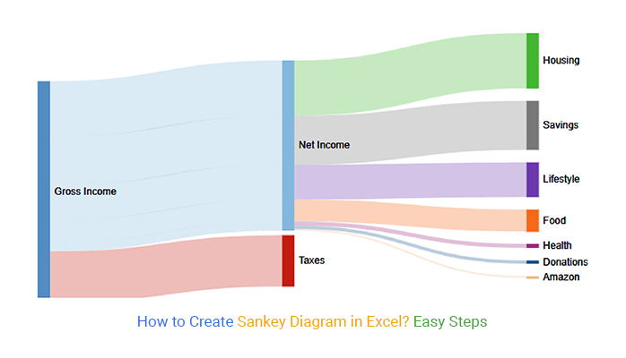

# data viz
## sankey diagram


Sankiey Diagram 的重點是能量流向的視覺化，適合用來表示流程、資源分配等情境。

Sankey Diagram 的結構有
- 節點 (Nodes)：代表系統中的不同狀態或部分。
- 流 (Flows)：表示節點之間的連接，流的寬代表流量的大小。

如何實作？
```
import plotly.graph_objects as go

# 節點名稱
labels = ["燃料能量", "發電", "電力輸出", "發電損耗", "燃燒損耗"]

# 連線（source -> target）
sources = [0, 1, 1, 0]
targets = [1, 2, 3, 4]
values  = [100, 85, 5, 10]

# 建立 Sankey 圖
fig = go.Figure(data=[go.Sankey(
    node=dict(label=labels, pad=15, thickness=20),
    link=dict(source=sources, target=targets, value=values)
)])

fig.update_layout(title_text="能源流向 Sankey Diagram", font_size=14)
fig.show()
```
一開始要知道有哪些狀態，然後定義成label
然後他們怎麼連 source -> target
以及流量 values
不適用
沒有「守恆」概念


## Chord Diagram
系統 A → 系統 B → 又回 A
經濟模型中存在雙向交易
跟sankey diagram 不同的是Chord Diagram強調兩個節點的雙向關係


## Treemap
