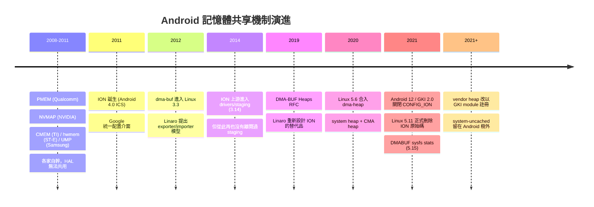
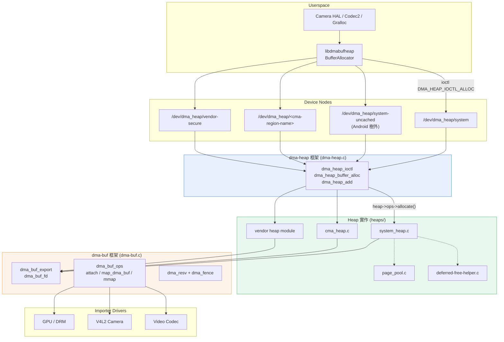
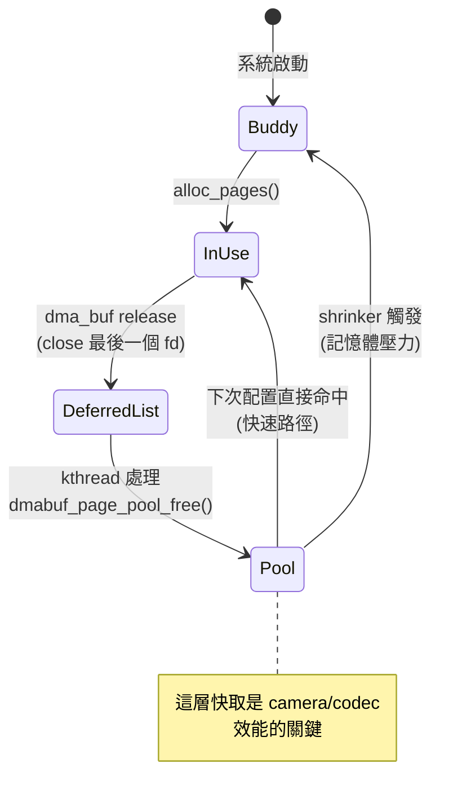
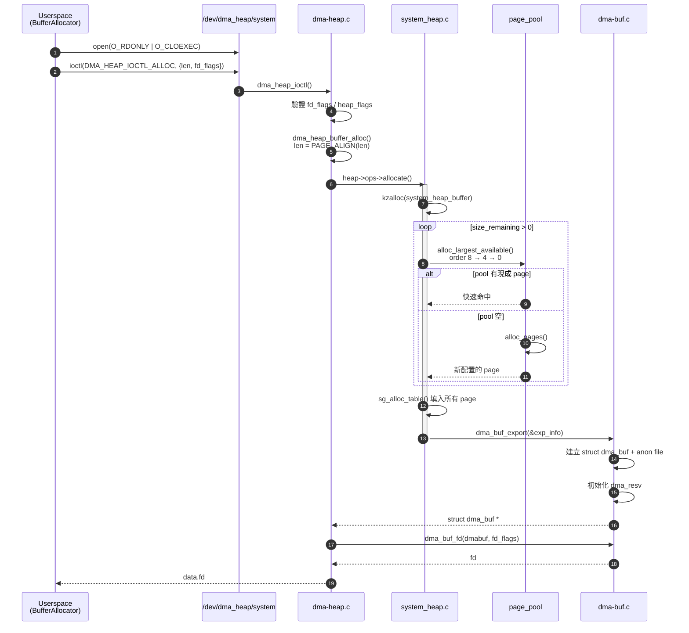
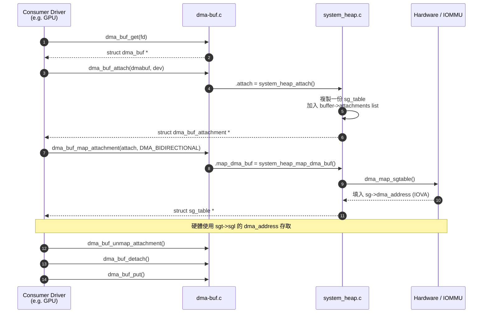
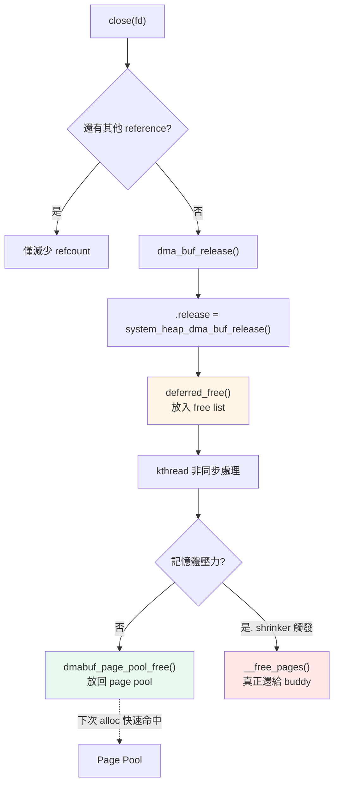

# DMA-BUF Heaps 完整導覽：Android 記憶體共享機制的前世今生

> 從 PMEM 的群雄割據，到 ION 的十年統治，再到 dma-heap 的正式接班。
> 這篇文章拆解 dma-heap 的歷史脈絡、元件組成、關鍵 API 與核心流程，並附上實務除錯手法。
>
> **適讀對象**：Android BSP / Kernel driver / Multimedia HAL 工程師
> **對應版本**：Linux 5.6+，Android 12 (kernel 5.10) 以後

---

## 目錄

1. [問題的起點：為什麼需要專門的記憶體配置器](#1-問題的起點)
2. [歷史演進](#2-歷史演進)
3. [架構總覽](#3-架構總覽)
4. [Components 逐一拆解](#4-components-逐一拆解)
5. [關鍵資料結構](#5-關鍵資料結構)
6. [核心 Flow](#6-核心-flow)
7. [ION → dma-heap 遷移對照](#7-ion--dma-heap-遷移對照)
8. [除錯與觀測](#8-除錯與觀測)
9. [常見踩雷](#9-常見踩雷)

---

## 1. 問題的起點

在一支手機上拍一段影片，這塊 buffer 會經過：

```
Camera sensor → ISP → GPU (預覽合成) → Video encoder → Display
```

五個不同的硬體 IP，來自五家不同的 IP 供應商。它們對記憶體的要求彼此衝突：

| 需求 | 誰在意 |
|---|---|
| 實體連續 | 沒有 IOMMU 的舊 display controller、部分 codec |
| 特定對齊 / 特定 memory bank | ISP、DSP |
| Uncached / Write-combine | CPU 只寫不讀的 buffer（避免 cache 汙染） |
| 受保護記憶體（TZ 隔離） | DRM 影片解碼 |
| 純粹一般記憶體 | 大多數情況 |

如果每一段轉手都要 `memcpy`，4K 影片的頻寬直接爆掉。所以核心必須提供兩件事：

1. **配置**：依照硬體限制配出合適的實體記憶體
2. **分享**：讓這塊記憶體能零複製地在 driver 之間傳遞，且帶著同步語意

**dma-buf 解決了第 2 件事，dma-heap 解決了第 1 件事。** 這個分工是理解整套機制的關鍵。

---

## 2. 歷史演進



### 2.1 群雄割據時期（2008–2011）

Android 早期沒有統一機制，每家 SoC 廠自己寫配置器：Qualcomm 的 **PMEM**、NVIDIA 的 **NVMAP**、TI 的 **CMEM**、ST-Ericsson 的 **hwmem**、Samsung 的 **UMP**。

結果是 Gralloc、OMX component 這些理應共用的程式碼，每一家都要重寫一遍。這是 ION 誕生的直接動機。

### 2.2 dma-buf 誕生（Linux 3.3, 2012）

Linaro 的 Sumit Semwal 提出 **dma-buf**，定義了一套乾淨的 buffer 共享模型：

- **Exporter**：擁有並管理記憶體的一方，實作 `struct dma_buf_ops`
- **Importer**：要使用這塊記憶體的 device
- **傳遞媒介**：file descriptor（可以跨 process 傳，可以走 binder）

關鍵在於 **dma-buf 本身不配置任何記憶體**。它只是一層抽象，把「誰擁有」跟「誰使用」拆開。任何 driver 都可以當 exporter（GPU driver 就常常自己 export）。

### 2.3 ION 的十年（2011–2021）

ION 補上了「通用 exporter」這一塊：提供標準 heap 型別（system、carveout、CMA、chunk），userspace 透過 `/dev/ion` 配置，拿到的是 dma-buf fd。

它確實統一了 Android 生態，但也累積了幾個致命的設計債：

**單一 device node 導致權限失控**

```
/dev/ion    ← 只有這一個節點
```

所有 heap 走同一個 node。這代表你**無法**用檔案權限或 SELinux 區分「誰可以配置一般記憶體」與「誰可以配置 secure 記憶體」。DRM 保護記憶體只能靠 driver 內部自己檢查 caller，非常脆弱。

**Heap ID 是數字，語意由 vendor 自訂**

```c
/* userspace 必須先 query 再猜 */
ion_alloc(fd, len, align, heap_id_mask, flags, &handle);
```

`heap_id_mask` 的意義每家不同。`ION_HEAP_TYPE_CUSTOM` 滿天飛，userspace 要先跑 `ION_IOC_HEAP_QUERY` 拿名稱再反查 ID，還得處理各家命名差異。

**ABI 反覆變動**

舊版 ION 的 `ION_IOC_ALLOC` 回傳的是 `ion_handle`（一個不透明整數），要再呼叫 `ION_IOC_SHARE` 換成 fd；後來簡化成直接回 fd。`struct ion_allocation_data` 改過至少三次，跨版本相容是災難。

**非標準的 cache 維護**

`ION_IOC_SYNC` 語意含糊，也跟 dma-buf 自己的 `DMA_BUF_IOCTL_SYNC` 重疊。

以上種種讓 ION 從 Linux 3.14（2014）進 staging 之後，**從來沒有通過 upstream review**，在 staging 待了整整七年。

### 2.4 dma-heap 接班（Linux 5.6, 2020）

Andrew F. Davis 與 John Stultz 主導重新設計。核心哲學：

> **一個 heap 一個 device node，其餘的交給既有的 dma-buf 框架。**

| 版本 | 里程碑 |
|---|---|
| Linux 5.6 | `drivers/dma-buf/heaps/` 框架、system heap、CMA heap |
| Linux 5.10 | Android 12 / GKI 2.0 起跑，`CONFIG_ION` 於 2021-03 關閉 |
| Linux 5.11 | **ION 原始碼從 staging 刪除**；page pool 與 deferred-free 移植進 dma-heap |
| Linux 5.15 | `CONFIG_DMABUF_SYSFS_STATS`（提供 `/sys/kernel/dmabuf/buffers/`，現已標記 deprecated） |
| `android13-5.15` | AOSP 分支中 ION 原始碼完全消失；vendor heap 只能以 GKI module 註冊 |

> **常見誤解**：`system-uncached` heap **從未合入 mainline**。John Stultz 2020 年的 patch 未被接受，它至今只存在於 Android common kernel，在 AOSP 是標記 `ONHOLD-FROMLIST` 的 out-of-tree patch。如果你在 mainline 找不到它，不是你的錯。

---

## 3. 架構總覽



一句話總結：**dma-heap 是 dma-buf 的一種標準化 exporter，專門服務 userspace 的配置需求。**

---

## 4. Components 逐一拆解

### 4.1 Kernel 檔案佈局

```
drivers/dma-buf/
├── dma-buf.c                    # dma-buf 本體
├── dma-heap.c                   # ★ dma-heap 框架：class / chrdev / ioctl
├── dma-resv.c                   # reservation object（fence 容器）
├── dma-fence.c                  # 同步原語
├── sync_file.c                  # fence ↔ fd 轉換
├── udmabuf.c                    # 從 memfd 造 dmabuf（不走 heap）
└── heaps/
    ├── system_heap.c            # system heap
    ├── cma_heap.c               # CMA heap
    ├── page_pool.c              # 從 ION 移植的 page 快取
    └── deferred-free-helper.c   # 非同步釋放 + shrinker

include/linux/dma-heap.h         # kernel 端 API
include/uapi/linux/dma-heap.h    # ★ UAPI
```

### 4.2 核心框架：`dma-heap.c`

責任非常單純：

- 建立 `dma_heap` class 與 chrdev 區段
- 提供 `dma_heap_add()` 讓各 heap 註冊，並產生 `/dev/dma_heap/<name>`
- 實作 `dma_heap_fops`，處理唯一的 ioctl：`DMA_HEAP_IOCTL_ALLOC`
- 參數驗證後把工作丟給 `heap->ops->allocate()`

整個檔案不到 400 行。**框架刻意做得極薄**，這是相對 ION 最大的設計轉變 —— ION 的 `ion_heap_ops` 有 8 個 callback，dma-heap 只有 1 個。

### 4.3 System Heap

最常用的 heap，從 buddy allocator 抓 page，**非實體連續**。Mainline 的 `system_heap.c` 只註冊一個名為 `system` 的 heap。

Android common kernel 額外帶了一個 out-of-tree patch，用同一份實作衍生出 `system-uncached`：

| Heap | vm_page_prot | 用途 | 在哪 |
|---|---|---|---|
| `system` | 一般 cached | CPU 會頻繁讀寫的 buffer | mainline |
| `system-uncached` | `pgprot_writecombine` | CPU 只寫不讀、或幾乎不碰的 buffer | 僅 Android common kernel |

`system-uncached` 的價值在於**省掉 cache maintenance**。當一塊 buffer 是 CPU 寫一次、GPU 讀很多次時，用 write-combine 對映可以避免每次 sync 都要 flush 整塊 cache。它在 Android 上很常用，但寫程式時要注意 **mainline 沒有這個節點**，跨平台的程式碼必須有 fallback。

它的配置策略值得注意：

```c
static const unsigned int orders[] = {8, 4, 0};
/* 依序嘗試 1MB (2^8 pages) → 64KB (2^4) → 4KB (2^0) */
```

先搶大 order 的目的：

- 減少 sg_table entry 數量 → IOMMU 建表更快、TLB pressure 更低
- 部分硬體對 sg entry 數量有上限
- 記憶體碎片化時自動降階，不會直接失敗

### 4.4 CMA Heap

配置**實體連續**記憶體，服務沒有 IOMMU 的硬體。實作相對簡單：`cma_alloc()` 之後包成單一 sg entry。

**節點名稱不是固定的**，這一點很多人搞錯。長期以來 cma_heap 的寫法是：

```c
exp_info.name = cma_get_name(cma);
```

名字來自 CMA region 本身：用 device tree `reserved-memory` 宣告時常叫 `linux,cma`，但用 cmdline / Kconfig 宣告時會是 `reserved`，vendor 也常自己命名。Linux 6.18 起 mainline 改為每個 CMA region 各註冊一個 heap，預設名稱是 `default_cma_region`。**所以不要在程式碼裡硬寫 `linux,cma`。**

代價是 CMA region 需要在開機時預留，且 CMA 配置在系統有 movable page 佔用時可能非常慢（要先 migrate）。因此 CMA heap 通常只給真正必要的 IP 使用。

### 4.5 Page Pool 與 Deferred Free

這兩個 helper 是從 ION 移植過來的**效能關鍵**：

**`page_pool.c`** — 每個 order 維護一組 free page list。釋放時不還給 buddy，而是放回 pool；下次配置直接拿。camera / codec 這種每秒配置釋放數十次的場景，這層快取避免了反覆進 buddy allocator。

**`deferred-free-helper.c`** — 釋放動作丟到 kthread 非同步處理，讓 `close(fd)` 快速返回。同時註冊 shrinker，系統記憶體壓力上升時才真正把 page pool 吐回 buddy。



### 4.6 相關 Components

**上游依賴（dma-buf 側）**

| Component | 角色 |
|---|---|
| `dma_buf` | buffer 物件本體，持有 `dma_buf_ops` 與 file |
| `dma_buf_attachment` | 一個 device 對一塊 buffer 的綁定，各自有獨立 sg_table |
| `dma_resv` | 掛在 dmabuf 上的 fence 容器，管理讀寫依賴 |
| `dma_fence` | 非同步完成通知，跨 driver 同步的基礎 |
| `sync_file` | 把 fence 包成 fd 給 userspace（Android 的 acquire/release fence） |

**下游消費者**

- DRM/KMS：`drm_gem_prime_import_dev()`
- V4L2：`V4L2_MEMORY_DMABUF`
- GPU driver：Mali、Adreno KGSL 的 import path
- Video codec：Venus / MFC / VPU

**Android userspace stack**

```
system/memory/libdmabufheap/     # BufferAllocator（主要 API）
system/memory/libion/            # 舊 ION API 相容層
system/memory/libmeminfo/        # libdmabufinfo + dmabuf_dump 工具
```

`BufferAllocator` 的核心介面：

```cpp
class BufferAllocator {
public:
    // 主要配置介面
    int Alloc(const std::string& heap_name, size_t len,
              unsigned int heap_flags = 0, size_t legacy_align = 0);

    // ION heap 名稱 → dma-heap 名稱對映（相容舊程式碼）
    int MapNameToIonHeap(const std::string& heap_name,
                         const std::string& ion_heap_name,
                         unsigned int ion_heap_flags = 0, ...);

    // 包裝 DMA_BUF_IOCTL_SYNC
    int CpuSyncStart(unsigned int dmabuf_fd, SyncType sync_type = kSyncRead, ...);
    int CpuSyncEnd(unsigned int dmabuf_fd, SyncType sync_type = kSyncRead, ...);
};
```

**權限控管層** —— 這是 dma-heap 相對 ION 最有實務價值的差異：

```bash
# ueventd.rc：per-heap 的 DAC 權限
/dev/dma_heap/system            0666  system  graphics
/dev/dma_heap/system-uncached   0666  system  graphics
/dev/dma_heap/vendor-secure     0660  system  drmrpc
```

```
# SELinux：per-heap 的 type
type dmabuf_system_heap_device, dev_type;
type dmabuf_system_secure_heap_device, dev_type;

allow mediacodec dmabuf_system_heap_device:chr_file r_file_perms;
# 一般 app 拿不到 secure heap 的存取權
neverallow { appdomain -mediaprovider } dmabuf_system_secure_heap_device:chr_file *;
```

DRM 保護記憶體終於能靠 OS 層機制擋住，而不是 driver 裡自己判斷 caller。

---

## 5. 關鍵資料結構

### Kernel API

```c
/* include/linux/dma-heap.h */

struct dma_heap_ops {
    struct dma_buf *(*allocate)(struct dma_heap *heap,
                                unsigned long len,
                                u32 fd_flags,      /* O_CLOEXEC / O_RDWR */
                                u64 heap_flags);   /* 目前保留，必須為 0 */
};

struct dma_heap_export_info {
    const char *name;                   /* → /dev/dma_heap/<name> */
    const struct dma_heap_ops *ops;
    void *priv;                         /* heap 私有資料 */
};

/* 註冊 / 查詢 */
struct dma_heap *dma_heap_add(const struct dma_heap_export_info *exp_info);
const char *dma_heap_get_name(struct dma_heap *heap);
void *dma_heap_get_drvdata(struct dma_heap *heap);

/* kernel 內部配置（較新版本才 export） */
struct dma_buf *dma_heap_buffer_alloc(struct dma_heap *heap, size_t len,
                                      u32 fd_flags, u64 heap_flags);
```

注意 `struct dma_heap` 本身是**不透明的**，vendor 只能透過 accessor 取用 —— 這是 GKI ABI 穩定性的要求。

### UAPI

```c
/* include/uapi/linux/dma-heap.h */

#define DMA_HEAP_VALID_FD_FLAGS   (O_CLOEXEC | O_ACCMODE)
#define DMA_HEAP_VALID_HEAP_FLAGS (0ULL)

struct dma_heap_allocation_data {
    __u64 len;          /* in:  要求的大小 */
    __u32 fd;           /* out: 回傳的 dma-buf fd */
    __u32 fd_flags;     /* in:  O_CLOEXEC | O_RDWR */
    __u64 heap_flags;   /* in:  保留 */
};

#define DMA_HEAP_IOC_MAGIC 'H'
#define DMA_HEAP_IOCTL_ALLOC \
    _IOWR(DMA_HEAP_IOC_MAGIC, 0x0, struct dma_heap_allocation_data)
```

**整個 UAPI 只有一個 ioctl。** 對比 ION 的七八個，這種克制正是它能通過 upstream review 的原因。

### System Heap 私有結構

```c
/* drivers/dma-buf/heaps/system_heap.c */

struct system_heap_buffer {
    struct dma_heap        *heap;
    struct list_head        attachments;
    struct mutex            lock;
    unsigned long           len;
    struct sg_table         sg_table;
    int                     vmap_cnt;
    void                   *vaddr;
    struct deferred_freelist_item deferred_free;
    bool                    uncached;
};

/* 每個 importer device 一份 */
struct dma_heap_attachment {
    struct device      *dev;
    struct sg_table    *table;      /* 這個 device 專屬的 sgtable */
    struct list_head    list;
    bool                mapped;
    bool                uncached;
};
```

`attachments` 是一個 list —— **同一塊 buffer 對每個 device 有獨立的 sg_table**，因為各 device 的 IOMMU domain 不同，DMA address 也就不同。這是 dma-buf 模型的核心概念。

---

## 6. 核心 Flow

### Flow A：Heap 註冊

```c
static const struct dma_heap_ops system_heap_ops = {
    .allocate = system_heap_allocate,
};

static int system_heap_create(void)
{
    struct dma_heap_export_info exp_info = {
        .name = "system",
        .ops  = &system_heap_ops,
        .priv = NULL,
    };

    sys_heap = dma_heap_add(&exp_info);
    if (IS_ERR(sys_heap))
        return PTR_ERR(sys_heap);

    /* Android common kernel 額外註冊 uncached 變體，
     * 共用同一份 ops，靠 heap 名稱區分（mainline 沒有這段） */
    exp_info.name = "system-uncached";
    sys_uncached_heap = dma_heap_add(&exp_info);
    ...
}
module_init(system_heap_create);
```

`dma_heap_add()` 內部做的事：

```
dma_heap_add()
 ├─ 檢查 name 唯一性、ops->allocate 非 NULL
 ├─ 取得 minor number
 ├─ cdev_init(&heap->heap_cdev, &dma_heap_fops)
 ├─ cdev_add()
 └─ device_create(dma_heap_class, NULL, devt, NULL, "%s", name)
        → /dev/dma_heap/system 出現
```

**對 vendor 的意義**：只要在自家 module 的 probe 裡呼叫 `dma_heap_add()`，就能掛上專屬 heap，完全不需要修改 GKI 核心。這正是 Android GKI 想要的模式。

### Flow B：配置（最重要的一條路徑）



程式碼骨架：

```c
/* dma-heap.c */
static long dma_heap_ioctl_allocate(struct file *file, void *data)
{
    struct dma_heap_allocation_data *heap_allocation = data;
    struct dma_heap *heap = file->private_data;
    struct dma_buf *dmabuf;
    int fd;

    if (heap_allocation->fd)
        return -EINVAL;
    if (heap_allocation->fd_flags & ~DMA_HEAP_VALID_FD_FLAGS)
        return -EINVAL;
    if (heap_allocation->heap_flags & ~DMA_HEAP_VALID_HEAP_FLAGS)
        return -EINVAL;

    dmabuf = dma_heap_buffer_alloc(heap, heap_allocation->len,
                                   heap_allocation->fd_flags,
                                   heap_allocation->heap_flags);
    if (IS_ERR(dmabuf))
        return PTR_ERR(dmabuf);

    fd = dma_buf_fd(dmabuf, heap_allocation->fd_flags);
    if (fd < 0) {
        dma_buf_put(dmabuf);
        return fd;
    }

    heap_allocation->fd = fd;
    return 0;
}
```

```c
/* system_heap.c — 精簡版 */
static struct dma_buf *system_heap_allocate(struct dma_heap *heap,
                                            unsigned long len,
                                            u32 fd_flags, u64 heap_flags)
{
    struct system_heap_buffer *buffer;
    DEFINE_DMA_BUF_EXPORT_INFO(exp_info);
    unsigned long size_remaining = len;
    struct list_head pages;
    struct page *page, *tmp;
    int i = 0;

    buffer = kzalloc(sizeof(*buffer), GFP_KERNEL);
    INIT_LIST_HEAD(&buffer->attachments);
    mutex_init(&buffer->lock);
    buffer->heap = heap;
    buffer->len  = len;

    INIT_LIST_HEAD(&pages);
    while (size_remaining > 0) {
        /* 依 orders[] = {8, 4, 0} 由大到小嘗試 */
        page = alloc_largest_available(size_remaining, max_order);
        if (!page)
            goto free_buffer;
        list_add_tail(&page->lru, &pages);
        size_remaining -= page_size(page);
        max_order = compound_order(page);
        i++;
    }

    sg_alloc_table(&buffer->sg_table, i, GFP_KERNEL);
    sg = buffer->sg_table.sgl;
    list_for_each_entry_safe(page, tmp, &pages, lru) {
        sg_set_page(sg, page, page_size(page), 0);
        sg = sg_next(sg);
        list_del(&page->lru);
    }

    exp_info.exp_name = dma_heap_get_name(heap);
    exp_info.ops   = &system_heap_buf_ops;
    exp_info.size  = buffer->len;
    exp_info.flags = fd_flags;
    exp_info.priv  = buffer;

    return dma_buf_export(&exp_info);
    ...
}
```

CMA heap 的版本簡單得多：

```c
static struct dma_buf *cma_heap_allocate(struct dma_heap *heap, ...)
{
    ...
    cma_pages = cma_alloc(cma_heap->cma, pagecount, align, false);
    /* 只有一個 sg entry，因為實體連續 */
    sg_alloc_table(&buffer->sg_table, 1, GFP_KERNEL);
    sg_set_page(buffer->sg_table.sgl, cma_pages, size, 0);
    ...
}
```

### Flow C：Import 與 DMA 對映



實際程式碼：

```c
/* consumer driver 標準流程 */
struct dma_buf *dmabuf;
struct dma_buf_attachment *attach;
struct sg_table *sgt;

dmabuf = dma_buf_get(fd);
if (IS_ERR(dmabuf))
    return PTR_ERR(dmabuf);

attach = dma_buf_attach(dmabuf, dev);
if (IS_ERR(attach))
    goto err_put;

sgt = dma_buf_map_attachment(attach, DMA_BIDIRECTIONAL);
if (IS_ERR(sgt))
    goto err_detach;

/* 把 sgt->sgl 的 dma_address 寫進硬體暫存器 */
program_hw_descriptor(sgt);

/* 用完 */
dma_buf_unmap_attachment(attach, sgt, DMA_BIDIRECTIONAL);
dma_buf_detach(dmabuf, attach);
dma_buf_put(dmabuf);
```

**重點**：`dma_buf_attach()` 只是建立綁定關係，`dma_buf_map_attachment()` 才真正產生 DMA address。這個兩階段設計讓 exporter 有機會在 map 時做 migration（例如把 buffer 搬到該 device 可存取的區域）。

### Flow D：CPU 存取與 Cache 維護

```c
/* 對映 */
void *ptr = mmap(NULL, len, PROT_READ | PROT_WRITE,
                 MAP_SHARED, dmabuf_fd, 0);
/* → .mmap = system_heap_mmap()
 *    逐頁 vm_insert_page()
 *    uncached heap 會先設 vma->vm_page_prot = pgprot_writecombine(...)
 */

/* CPU 讀寫前：sync start */
struct dma_buf_sync sync = {
    .flags = DMA_BUF_SYNC_START | DMA_BUF_SYNC_RW
};
ioctl(dmabuf_fd, DMA_BUF_IOCTL_SYNC, &sync);
/* → dma_buf_begin_cpu_access()
 *    → .begin_cpu_access
 *        對每個 attachment 做 dma_sync_sgtable_for_cpu()
 *        （invalidate cache，確保讀到硬體寫入的資料）
 */

memcpy(ptr, src, len);

/* CPU 讀寫後：sync end */
sync.flags = DMA_BUF_SYNC_END | DMA_BUF_SYNC_RW;
ioctl(dmabuf_fd, DMA_BUF_IOCTL_SYNC, &sync);
/* → dma_buf_end_cpu_access()
 *    → dma_sync_sgtable_for_device()（flush cache，讓硬體看得到）
 */
```

**漏做 sync 是最經典的 dma-buf bug** —— 症狀是資料偶發性錯亂、畫面出現舊 frame 的殘影，而且在 cache coherent 的平台上根本重現不出來，一換平台就爆。

Kernel 端要對映則用：

```c
struct iosys_map map;
dma_buf_vmap(dmabuf, &map);      /* 較新版本用 iosys_map */
/* ... 使用 map.vaddr ... */
dma_buf_vunmap(dmabuf, &map);
```

### Flow E：釋放



`close(fd)` 之所以要非同步，是因為釋放大 buffer（例如 4K frame 的數十 MB）要走過幾千個 page，同步做會讓呼叫端卡住。

### Flow F：同步（Fence）

```c
/* Producer：送 job 給硬體前先掛 fence */
dma_resv_lock(dmabuf->resv, NULL);
dma_resv_reserve_fences(dmabuf->resv, 1);
dma_resv_add_fence(dmabuf->resv, out_fence, DMA_RESV_USAGE_WRITE);
dma_resv_unlock(dmabuf->resv);

/* Consumer（kernel）：等待 */
dma_resv_wait_timeout(dmabuf->resv, DMA_RESV_USAGE_READ, true, timeout);

/* Consumer（userspace）：poll 或取出 sync_file */
struct pollfd pfd = { .fd = dmabuf_fd, .events = POLLIN };
poll(&pfd, 1, -1);   /* POLLIN 等 write fence；POLLOUT 等所有 fence */

/* 或匯出成 sync_file fd */
struct dma_buf_export_sync_file arg = { .flags = DMA_BUF_SYNC_READ };
ioctl(dmabuf_fd, DMA_BUF_IOCTL_EXPORT_SYNC_FILE, &arg);
```

Android 的 `AHardwareBuffer` / `ANativeWindow` 傳的 acquire fence 與 release fence，底層就是這一套。

---

## 7. ION → dma-heap 遷移對照

| 面向 | ION | dma-heap |
|---|---|---|
| Device node | `/dev/ion`（單一） | `/dev/dma_heap/<name>`（每 heap 一個） |
| Heap 識別 | heap ID mask（數字） | heap 名稱（node 名稱） |
| 配置 ioctl | `ION_IOC_ALLOC` | `DMA_HEAP_IOCTL_ALLOC` |
| Heap 列舉 | `ION_IOC_HEAP_QUERY` | `ls /dev/dma_heap/` |
| Cache 維護 | `ION_IOC_SYNC`（自訂） | `DMA_BUF_IOCTL_SYNC`（標準） |
| Heap ops 數量 | 8 個 callback | 1 個（`allocate`） |
| 權限控管 | 全有全無 | per-heap DAC + SELinux |
| Vendor 擴充 | 改 ION 核心程式碼 | `dma_heap_add()` from module |
| Userspace lib | `libion` | `libdmabufheap` / `BufferAllocator` |
| Upstream 狀態 | staging 七年，5.11 刪除 | mainline（5.6 起） |

**遷移建議**：直接改用 `BufferAllocator`。它內建 `MapNameToIonHeap()` 做新舊名稱對映，同一份程式碼可以同時跑在有 ION 與只有 dma-heap 的核心上：

```cpp
BufferAllocator allocator;

// 註冊對映：dma-heap 叫 "system"，舊 ION 叫 "ion_system_heap"
allocator.MapNameToIonHeap(kDmabufSystemHeapName,
                           "ion_system_heap",
                           0 /* ion_heap_flags */);

// 之後統一用 heap 名稱配置，底層自動選擇路徑
int fd = allocator.Alloc(kDmabufSystemHeapName, size);
```

---

## 8. 除錯與觀測

```bash
# 1. 看有哪些 heap
ls -l /dev/dma_heap/

# 2. 全系統 dmabuf 用量（Android）
dmabuf_dump
dmabuf_dump -a              # 含 attachment 資訊
dmabuf_dump <pid>           # 特定 process

# 3. 誰持有這個 buffer
cat /proc/<pid>/fdinfo/<fd>
#   size:      8294400
#   count:     3
#   exp_name:  system
#   name:      Gralloc:RGBA_8888:1920x1080
#   ino:       98765

# 4. sysfs 統計（需 CONFIG_DMABUF_SYSFS_STATS，Linux 5.15+，現已 deprecated）
ls /sys/kernel/dmabuf/buffers/
cat /sys/kernel/dmabuf/buffers/<ino>/size
cat /sys/kernel/dmabuf/buffers/<ino>/exporter_name

# 5. debugfs
cat /sys/kernel/debug/dma_buf/bufinfo

# 6. CMA 狀態（配置失敗時先看這個）
cat /proc/meminfo | grep -i cma
cat /sys/kernel/debug/cma/*/count
```

**追蹤 buffer 生命週期**的 tracepoint：

```bash
echo 1 > /sys/kernel/debug/tracing/events/dma_fence/enable
# 部分 Android 核心另有 dmabuf_heap 相關 trace event
```

---

## 9. 常見踩雷

### 9.1 dma-buf 洩漏在記憶體統計上「隱形」

dma-buf 配置的記憶體**不計入 process 的 RSS / PSS**（除非有 mmap 進來）。所以洩漏的症狀是「free memory 一直掉，但 `dumpsys meminfo` 上沒有任何 process 變胖」。

追法：`dmabuf_dump` 對照 `/proc/<pid>/fdinfo/` 的 `name` 欄位。Gralloc 會在 name 標記用途，這是最快的線索來源。

### 9.2 忘記 sync

前面提過但值得重複：**CPU 讀寫 dmabuf 前後一定要做 `DMA_BUF_IOCTL_SYNC`**。在 cache-coherent 的開發板上不做也能跑，換到量產機就開始出現隨機的畫面錯亂。

### 9.3 attachment 沒有正確 unmap 就 detach

`dma_buf_detach()` 前必須先 `dma_buf_unmap_attachment()`，否則 IOMMU 對映洩漏。長時間運作後表現為 IOVA 空間耗盡，配置突然開始失敗。

### 9.4 對 CMA heap 期望過高

CMA 配置在系統跑久之後可能需要 page migration，耗時從微秒級跳到數十毫秒，甚至失敗。**不要在即時路徑（例如每一 frame）配置 CMA buffer**，要在初始化時配好並重複使用。

### 9.5 heap 名稱的可攜性

只有 `system` 是 mainline 保證存在的名稱。`system-uncached` 只在 Android common kernel 有，CMA heap 的名稱取決於 region 怎麼宣告（`linux,cma` / `reserved` / vendor 自訂 / 6.18 起的 `default_cma_region`）。**不要硬寫 heap 名稱**，用設定檔、`ls /dev/dma_heap/` 探測，或 `MapNameToIonHeap()` 抽象掉。

### 9.6 GKI 下的 vendor heap 註冊時機

Vendor heap module 的載入時機若晚於使用者（例如某個 HAL 開機就要配置），會拿到 `ENOENT`。確認 module 在 `first_stage_init` 或適當的 init 階段就載入。

---

## 結語

dma-heap 的設計價值不在於它做了多少事，而在於它**刻意不做什麼**：

- 只有一個 ioctl
- `dma_heap_ops` 只有一個 callback
- Cache 維護、同步、對映全部交給既有的 dma-buf 框架
- 權限控管交給 VFS 與 SELinux，而不是 driver 自己判斷

ION 失敗的原因是它試圖在一個 driver 裡解決所有問題；dma-heap 成功的原因是它認清自己只是「一個標準化的 dma-buf exporter」。這對任何要設計 kernel 子系統的人來說，都是很值得記住的一課。

---

## 參考資料

**Kernel 文件與原始碼**

- [Allocating dma-buf using heaps — Linux Kernel docs](https://docs.kernel.org/userspace-api/dma-buf-heaps.html)
- [DMA Buffer Sharing API Guide — Linux Kernel docs](https://docs.kernel.org/driver-api/dma-buf.html)
- Linux source：`drivers/dma-buf/dma-heap.c`、`drivers/dma-buf/heaps/`、`include/uapi/linux/dma-heap.h`

**歷史脈絡（LWN）**

- [DMA buffer sharing in 3.3](https://lwn.net/Articles/474819/)
- [The Android ION memory allocator](https://lwn.net/Articles/480055/)
- [Android ION for drivers/staging](https://lwn.net/Articles/576966/)
- [Destaging ION](https://lwn.net/Articles/792733/)
- [DMA-BUF Heaps (destaging ION)](https://lwn.net/Articles/801230/)

**Android**

- [Transition from ION to DMA-BUF heaps — AOSP](https://source.android.com/docs/core/architecture/kernel/dma-buf-heaps)
- [Implement DMABUF and GPU memory accounting in Android 12 — AOSP](https://source.android.com/docs/core/graphics/implement-dma-buf-gpu-mem)
- AOSP source：`system/memory/libdmabufheap`、`system/memory/libmeminfo/libdmabufinfo`
