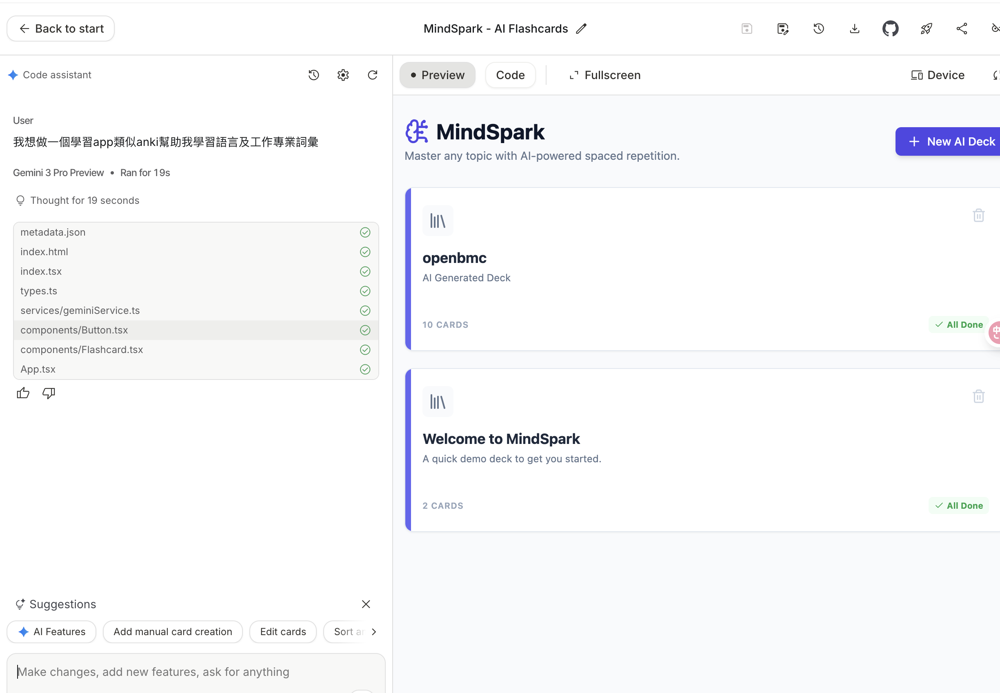
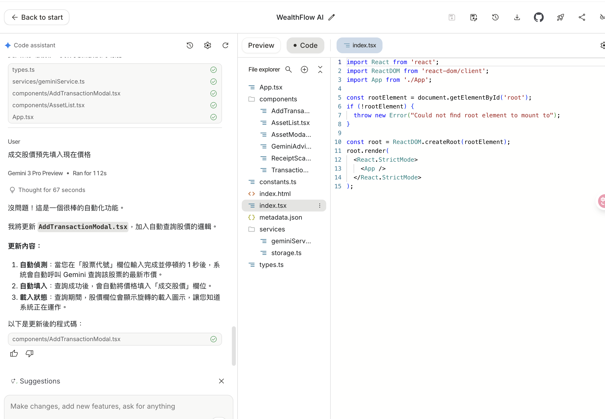

目前體感上還蠻喜歡的建立幾個App

類似Anki的閃卡App

看起來是CSR

可以從下載的folder發現
```
.
├── App.tsx
├── README.md
├── components
│   ├── AddTransactionModal.tsx
│   ├── AssetList.tsx
│   ├── AssetModal.tsx
│   ├── GeminiAdvisor.tsx
│   ├── ReceiptScanner.tsx
│   └── TransactionList.tsx
├── constants.ts
├── index.html
├── index.tsx
├── metadata.json
├── package.json
├── services
│   ├── geminiService.ts
│   └── storage.ts
├── tsconfig.json
├── types.ts
└── vite.config.ts
```


反思
可以先在別的地方跟AI討論完來這實作POC