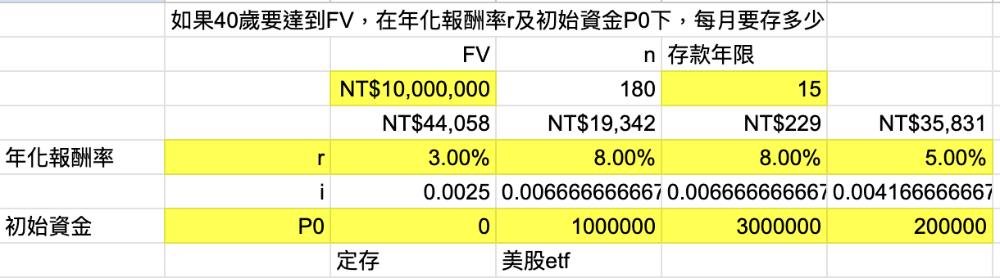

名詞
72法則

## 了解自己的目標
假設我想要在40歲時，讓我每個月有3萬元的被動收入（約等於基本薪資），接下來可以來思考需要存多少錢？
假設我現在26歲，所以距離40還有14年的時間。

## 到底要存多少？
我們知道如果要每個月要有3萬的收入，每年就是3萬 x 12 = 36萬
回到公式，

本金 * 年化報酬率 = 每年收益
所以
本金 = 每年收益 / 年化報酬率
已知我們需要每年36萬的收益，假設年化報酬率是3%（比較保守的數字 e.g. 定存），需要的本金就是
36萬 / 0.03 = 1200萬
所以我們的存款目標就是在 14 年內存到1200萬。

## 每月怎麼存？

我們要知道到底每個月要存多少
r 是我們設定的預期年化報酬，i = r/12 是月化報酬，
算出來，若以平均複利年報酬8%來算，每個月存 NT$38,958元，14年後可以存到約 1200 萬。

https://docs.google.com/spreadsheets/d/1YUxhozkRM6cVerxMCcI-50orvxZRavgVtHWyXH8_4RA/edit?usp=sharing

## 積極與防禦資產
積極/保守 7:3

## 投資標的
- 股票
- 債券
REITs
- 黃金
- 現金

## 有哪些書可以參考
- 持續買進

https://www.threads.com/@alanhc.316/post/DJvc_KGyFji

https://www.threads.com/@alanhc.316/post/DJKR7J4SRM3?
