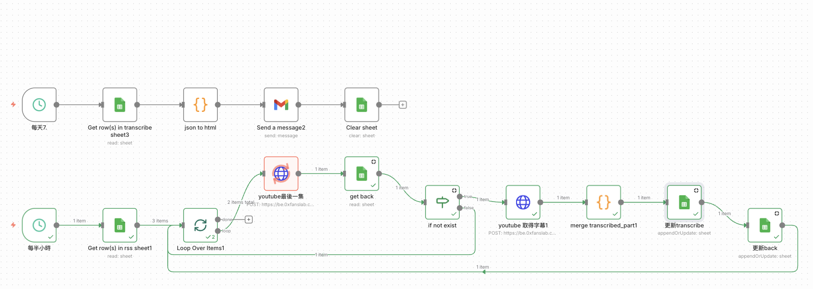

# 用 n8n 自動總結 YouTube 影片

用 [n8n](https://n8n.io/)（開源 workflow 自動化工具）打造 YouTube 影片自動摘要流程。

## 流程概念

1. **觸發**：手動輸入影片網址，或用 Schedule / RSS 監看特定頻道的新片。
2. **取得字幕 / transcript**：透過 YouTube API 或字幕擷取節點取得影片逐字稿。
3. **呼叫 LLM 摘要**：把 transcript 丟給 LLM 節點（如 OpenAI / Claude）產生重點摘要。
4. **輸出**：將摘要寄到 email、Notion、Discord 或 Telegram。

n8n 以節點串接、支援自架，適合把重複的資訊處理流程自動化。

