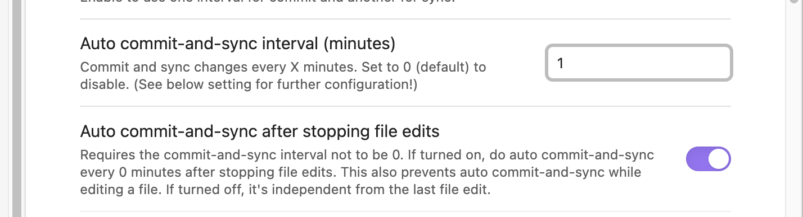
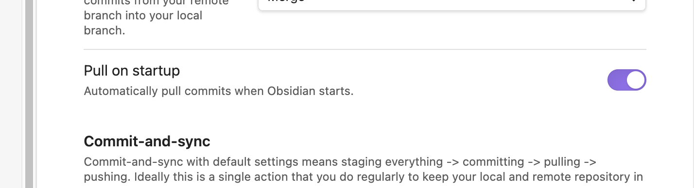

# Obsidian

[Obsidian](https://obsidian.md/) 是本機優先 (local-first) 的 markdown 筆記軟體，筆記以純文字檔存在自己的資料夾（vault）中。

## 特點

- **雙向連結 (backlinks)**：用 `[[筆記名稱]]` 建立筆記間的連結，並自動列出反向連結。
- **Graph view**：把筆記與連結視覺化成關係圖，方便發現知識間的關聯。
- **Plugin 生態**：豐富的社群外掛（Dataview、Templater、Excalidraw 等）可高度客製。
- 檔案為本機 markdown，方便用 Git 版控或同步到雲端。

