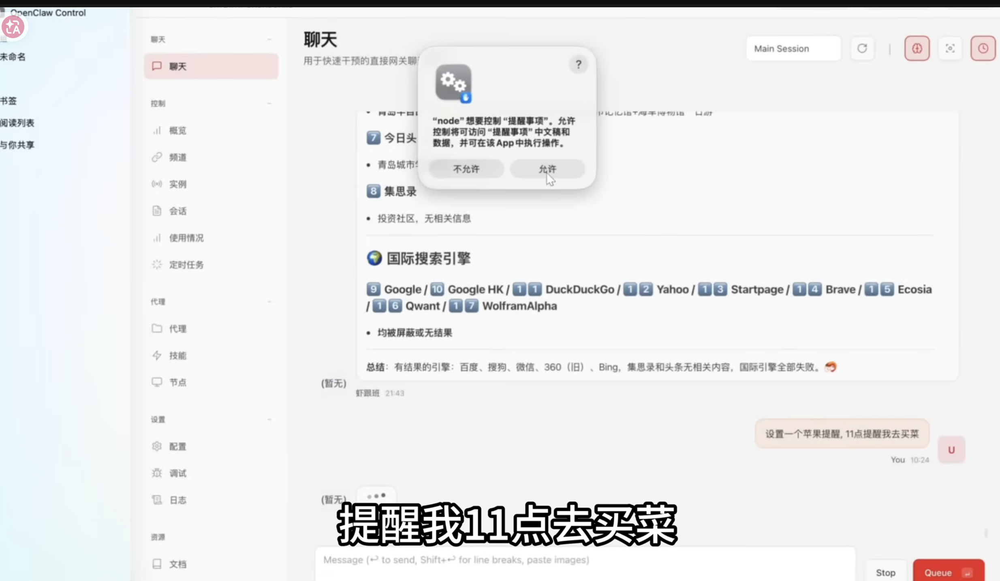

https://clawhub.ai/

  
一期视频精通OpenClaw变高手，从中级到高级完整教程
https://youtu.be/4LZEWPlDmsU?

在筆電下
```
  ssh -N -L 18789:127.0.0.1:18789 alanhc@<ip>
```

```

ssh -N -L 18790:127.0.0.1:18789 alanhc@<ip>
```

```
alanhc@<ip?'s password: 
bind [127.0.0.1]:18789: Address already in use
channel_setup_fwd_listener_tcpip: cannot listen to port: 18789
Could not request local forwarding.
```


```
pnpm add -g clawhub
```

```
clawhub search "yfinance"
```

```
clawhub install  yahoo-finance
```


```
openclaw skills list
```


```
openclaw pairing approve telegram <pass>
openclaw message send --channel telegram --target <id> --message "Hi"
```

```
nvidia-smi --query-compute-apps=pid,process_name,used_memory --format=csv
```


```
ollama pull gemma3:12b
```


```
openclaw channels status --probe
 ```