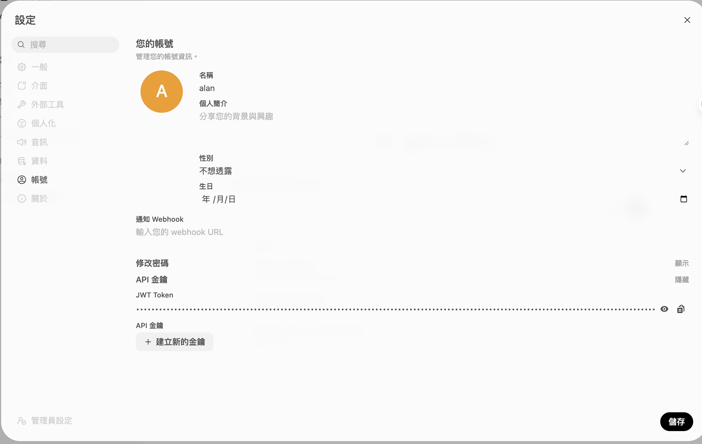

使用openwebui
curl -N \  'https://openwebui.0xfanslab.com/api/chat/completions' \  -H 'Authorization: Bearer <API Key>' \
  -H 'Content-Type: application/json' \
  -H 'Accept: text/event-stream' \
  -d '{
    "model": "ministral-3:latest",
    "stream": true,
    "messages": [
      { "role": "user", "content": "測試一下你有沒有回應，請慢慢打一段話。" }
    ]
  }'
