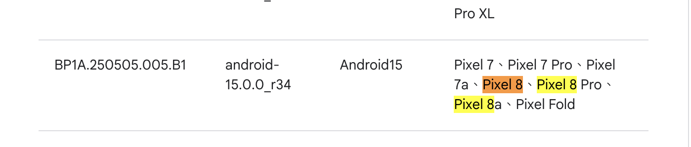
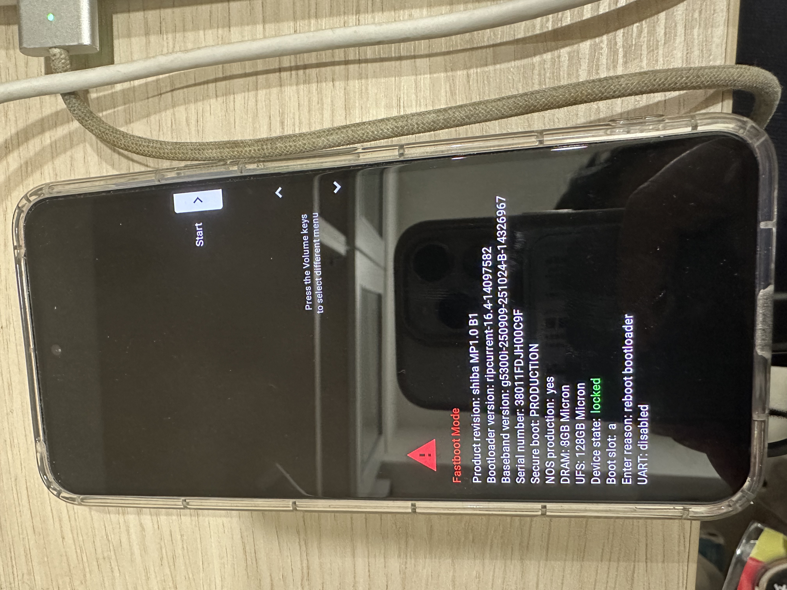
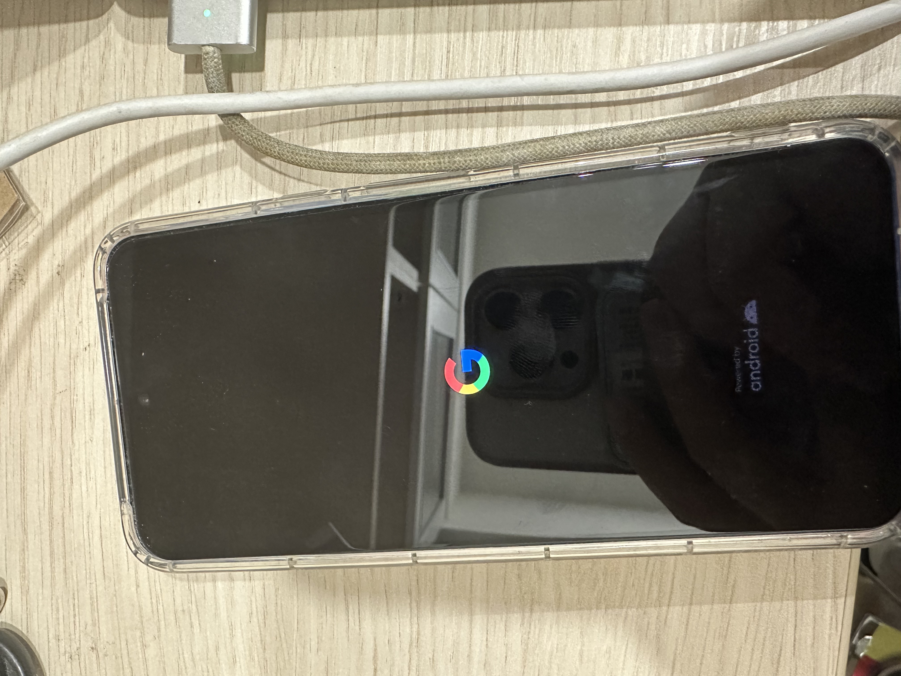
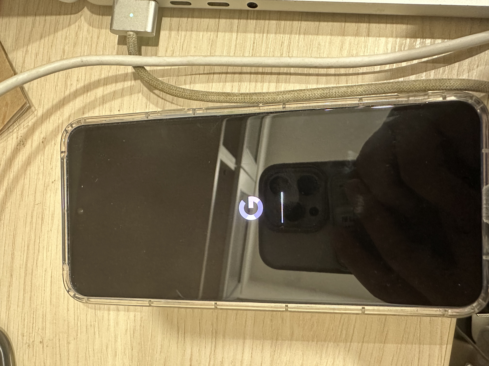
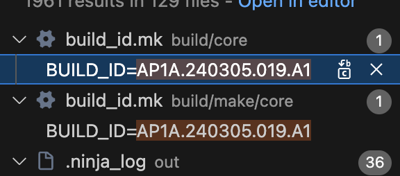

## 名詞
adb

## Hardware
pixel8

## ADB
brew install android-platform-tools
adb version
Android Debug Bridge version 1.0.41
Version 36.0.2-14143358
Installed as /opt/homebrew/bin/adb
Running on Darwin 25.2.0 (arm64)

## 開發人員模式
- 手機 → 設定 → 關於手機 → 連點「版本號」開啟 **開發人員選項**
- 開發人員選項 → 打開 **USB 偵錯 (USB debugging)**
- 用 USB 線接到 Mac（第一次會跳出授權視窗，選「允許」）

```
adb devices
List of devices attached
38011FDJH00C9F	device
```


adb install AnTuTu\ AI\ Benchmark.apk 
Performing Streamed Install
Success

## 刪除
adb shell pm list packages | grep 關鍵字
adb uninstall com.example.app


## ubuntu 安裝
sudo apt install -y android-tools-adb android-tools-fastboot
adb version
fastboot --version
Android Debug Bridge version 1.0.41
Version 34.0.4-debian
Installed as /usr/lib/android-sdk/platform-tools/adb
Running on Linux 6.14.0-37-generic (x86_64)
fastboot version 34.0.4-debian
Installed as /usr/lib/android-sdk/platform-tools/fastboo
## aosp
brew install android-platform-tools

```

sudo apt-get install git-core gnupg flex bison build-essential zip curl zlib1g-dev gcc-multilib g++-multilib libc6-dev-i386 libncurses5 lib32ncurses5-dev x11proto-core-dev libx11-dev lib32z1-dev libgl1-mesa-dev libxml2-utils xsltproc unzip fontconfig
```

```
mkdir -p ~/bin
curl https://storage.googleapis.com/git-repo-downloads/repo > ~/bin/repo
chmod a+x ~/bin/repo
export PATH=~/bin:$PATH
```

```
mkdir -p ~/aosp && cd ~/aosp
```

```
repo init --partial-clone --no-use-superproject -b android-latest-release -u https://android.googlesource.com/platform/manifest
```
會產生 `.repo`

repo sync -c -j8 2>&1 | tee -a repo_sync.log
> 這邊建議不要開太多核心 e.g. $(nproc)，可能會遇到error

```
$ repo sync -c -j8 2>&1 | tee -a repo_sync.log
repo sync has finished successfully.
```
看到這就可以了
這邊可能會有遇到error，建議使用 ai cli e.g. gemini cli, codex, antigravity


adb --version
fastboot --version


https://chatgpt.com/c/697478a8-8b74-8321-8275-d3f49352e5be
https://gemini.google.com/app/046a11a4616f5e9a?hl=zh-TW


https://wiki.lineageos.org/devices/shiba/build/



這邊會產出一堆東西
```
vendor/
vendor/google_devices/
vendor/google_devices/shiba/
vendor/google_devices/shiba/proprietary/
vendor/google_devices/shiba/proprietary/radio.img
vendor/google_devices/shiba/proprietary/vbmeta_vendor.img
vendor/google_devices/shiba/proprietary/com.android.qns.xml
vendor/google_devices/shiba/proprietary/PixelQualifiedNetworksService.apk
vendor/google_devices/shiba/proprietary/lib64/
vendor/google_devices/shiba/proprietary/lib64/libmediaadaptor.so
vendor/google_devices/shiba/proprietary/ShannonRcs.apk
vendor/google_devices/shiba/proprietary/ShannonIms.apk
vendor/google_devices/shiba/proprietary/device-vendor.mk
vendor/google_devices/shiba/proprietary/Android.mk
vendor/google_devices/shiba/proprietary/com.shannon.imsservice.xml
vendor/google_devices/shiba/proprietary/bootloader.img
vendor/google_devices/shiba/proprietary/vendor_dlkm.img
vendor/google_devices/shiba/proprietary/vendor.img
vendor/google_devices/shiba/proprietary/Android.bp
vendor/google_devices/shiba/proprietary/com.shannon.rcsservice.xml
vendor/google_devices/shiba/proprietary/BoardConfigVendor.mk
vendor/google_devices/shiba/LICENSE
vendor/google_devices/shiba/android-info.txt
vendor/google_devices/shiba/COPYRIGHT
vendor/google_devices/shiba/BoardConfigPartial.mk
vendor/google_devices/shiba/device-partial.mk
```

source build/envsetup.sh

```

repo init -u https://android.googlesource.com/platform/manife
st -b android-14.0.0_r17

Downloading Repo source from https://gerrit.googlesource.com/git-repo

```

wget https://dl.google.com/dl/android/aosp/google_devices-shiba-uq1a.231205.015-9a0b48c0.tgz


source build/envsetup.sh

lunch

Android device 相關 e.g. Pixel 8
```
/home/alanhc/aosp/device/google/shusky
```

```
/home/alanhc/aosp/device/google/shusky/AndroidProducts.mk
```

```
/home/alanhc/aosp/device/google/shusky/device-shiba.mk
```

```
$ sed -n '1,200p' device/google/shusky/AndroidProducts.mk
#
# Copyright (C) 2019 The Android Open-Source Project
#
# Licensed under the Apache License, Version 2.0 (the "License");
# you may not use this file except in compliance with the License.
# You may obtain a copy of the License at
#
#      http://www.apache.org/licenses/LICENSE-2.0
#
# Unless required by applicable law or agreed to in writing, software
# distributed under the License is distributed on an "AS IS" BASIS,
# WITHOUT WARRANTIES OR CONDITIONS OF ANY KIND, either express or implied.
# See the License for the specific language governing permissions and
# limitations under the License.
#

PRODUCT_MAKEFILES := \
    $(LOCAL_DIR)/aosp_ripcurrent.mk \
    $(LOCAL_DIR)/aosp_ripcurrent_fullmte.mk \
    $(LOCAL_DIR)/factory_ripcurrent.mk \
    $(LOCAL_DIR)/aosp_husky.mk \
    $(LOCAL_DIR)/aosp_husky_61_pgagnostic.mk \
    $(LOCAL_DIR)/aosp_husky_fullmte.mk \
    $(LOCAL_DIR)/aosp_husky_pgagnostic.mk \
    $(LOCAL_DIR)/factory_husky.mk \
    $(LOCAL_DIR)/aosp_shiba.mk \
    $(LOCAL_DIR)/aosp_shiba_61_pgagnostic.mk \
    $(LOCAL_DIR)/aosp_shiba_fullmte.mk \
    $(LOCAL_DIR)/aosp_shiba_pgagnostic.mk \
    $(LOCAL_DIR)/factory_shiba.mk

COMMON_LUNCH_CHOICES := \
    aosp_ripcurrent-trunk_staging-userdebug \
    aosp_husky-trunk_staging-userdebug \
    aosp_shiba-trunk_staging-userdebug
```


```
$ source build/envsetup.sh
lunch aosp_shiba-ap1a-userdebug
15:24:09 Build sandboxing disabled due to nsjail error.

============================================
PLATFORM_VERSION_CODENAME=REL
PLATFORM_VERSION=14
PRODUCT_INCLUDE_TAGS=com.android.mainline mainline_module_prebuilt_nightly
TARGET_PRODUCT=aosp_shiba
TARGET_BUILD_VARIANT=userdebug
TARGET_ARCH=arm64
TARGET_ARCH_VARIANT=armv8-2a
TARGET_CPU_VARIANT=cortex-a55
HOST_OS=linux
HOST_OS_EXTRA=Linux-6.14.0-37-generic-x86_64-Ubuntu-24.04.3-LTS
HOST_CROSS_OS=windows
BUILD_ID=AP1A.240305.019.A1
OUT_DIR=out
============================================

Want FASTER LOCAL BUILDS? Use -eng instead of -userdebug (however for performance benchmarking continue to use userdebug)
```


```
#### build completed successfully (01:03:22 (hh:mm:ss)) ####
```

```
PRODUCT_OUT=$(get_build_var PRODUCT_OUT)
```


```
$ echo $PRODUCT_OUT
out/target/product/shiba
```

adb reboot bootloader
手機會黑頻
開發人員選項 > OEM 解鎖
撤銷 USB aㄔ




alanhc@alanhc-14700:~/aosp$ adb kill-serverrm -f ~/.android/adbkey ~/.android/adbkey.pub
adb: unknown command kill-serverrm
alanhc@alanhc-14700:~/aosp$ rm -f ~/.android/adbkey ~/.android/adbkey.pub
alanhc@alanhc-14700:~/aosp$ export ADB_VENDOR_KEYS="$HOME/.android/adbkey"

alanhc@alanhc-14700:~/aosp$ adb start-server
* daemon not running; starting now at tcp:5037
* daemon started successfully
alanhc@alanhc-14700:~/aosp$ adb devices
List of devices attached
38011FDJH00C9F  unauthorized

之後點開手機要點選允許使用這台電腦進行偵錯
```
alanhc@alanhc-14700:~/aosp$ adb devices
List of devices attached
38011FDJH00C9F  device
```
只要不是unauthorized代表有連接上

## 進入 bootloader
adb reboot bootloader

alanhc@alanhc-14700:~/aosp$ fastboot devices
38011FDJH00C9F   fastboot


source build/envsetup.sh
cd "$(get_build_var PRODUCT_OUT)"
fastboot flashall -w

```
$ fastboot flashall -w
--------------------------------------------
Bootloader Version...: ripcurrent-16.4-14097582
Baseband Version.....: g5300i-250909-251024-B-14326967
Serial Number........: 38011FDJH00C9F
--------------------------------------------
Checking 'product'                                 OKAY [  0.000s]
Setting current slot to 'a'                        OKAY [  0.074s]
[liblp] Partition system_a will resize from 0 bytes to 848281600 bytes
[liblp] Partition system_dlkm_a will resize from 0 bytes to 11145216 bytes
[liblp] Partition system_ext_a will resize from 0 bytes to 254935040 bytes
[liblp] Partition product_a will resize from 0 bytes to 369336320 bytes
[liblp] Partition vendor_a will resize from 0 bytes to 775467008 bytes
[liblp] Partition vendor_dlkm_a will resize from 0 bytes to 27426816 bytes
[liblp] Partition system_b will resize from 0 bytes to 18411520 bytes
Sending 'boot_a' (65536 KB)                        OKAY [  1.596s]
Writing 'boot_a'                                   OKAY [  0.099s]
Sending 'init_boot_a' (8192 KB)                    OKAY [  0.202s]
Writing 'init_boot_a'                              OKAY [  0.016s]
Sending 'dtbo_a' (16384 KB)                        OKAY [  0.401s]
Writing 'dtbo_a'                                   OKAY [  0.026s]
Sending 'vendor_kernel_boot_a' (65536 KB)          OKAY [  1.594s]
Writing 'vendor_kernel_boot_a'                     OKAY [  0.103s]
Sending 'pvmfw_a' (1024 KB)                        OKAY [  0.025s]
Writing 'pvmfw_a'                                  OKAY [  0.010s]
Sending 'vendor_boot_a' (65536 KB)                 OKAY [  1.585s]
Writing 'vendor_boot_a'                            OKAY [  0.097s]
Sending 'vbmeta_a' (8 KB)                          OKAY [  0.001s]
Writing 'vbmeta_a'                                 OKAY [  0.005s]
Sending 'vbmeta_system_a' (4 KB)                   OKAY [  0.001s]
Writing 'vbmeta_system_a'                          OKAY [  0.005s]
Sending 'vbmeta_vendor_a' (4 KB)                   OKAY [  0.001s]
Writing 'vbmeta_vendor_a'                          OKAY [  0.005s]
Erasing 'userdata'                                 OKAY [  0.721s]
Erase successful, but not automatically formatting.
File system type raw not supported.
Erasing 'metadata'                                 OKAY [  0.022s]
Erase successful, but not automatically formatting.
File system type raw not supported.
Sending sparse 'super' 1/9 (254972 KB)             OKAY [  6.227s]
Writing 'super'                                    OKAY [  0.368s]
Sending sparse 'super' 2/9 (254972 KB)             OKAY [  6.203s]
Writing 'super'                                    OKAY [  0.378s]
Sending sparse 'super' 3/9 (254972 KB)             OKAY [  6.204s]
Writing 'super'                                    OKAY [  0.392s]
Sending sparse 'super' 4/9 (254972 KB)             OKAY [  6.126s]
Writing 'super'                                    OKAY [  0.404s]
Sending sparse 'super' 5/9 (254972 KB)             OKAY [  6.240s]
Writing 'super'                                    OKAY [  0.407s]
Sending sparse 'super' 6/9 (254972 KB)             OKAY [  6.214s]
Writing 'super'                                    OKAY [  0.387s]
Sending sparse 'super' 7/9 (254972 KB)             OKAY [  6.198s]
Writing 'super'                                    OKAY [  0.396s]
Sending sparse 'super' 8/9 (254972 KB)             OKAY [  6.198s]
Writing 'super'                                    OKAY [  0.379s]
Sending sparse 'super' 9/9 (211236 KB)             OKAY [  5.163s]
Writing 'super'                                    OKAY [  0.333s]
Erasing 'userdata'                                 OKAY [  0.697s]
Erase successful, but not automatically formatting.
File system type raw not supported.
wipe task partition not found: cache
Erasing 'metadata'                                 OKAY [  0.014s]
Erase successful, but not automatically formatting.
File system type raw not supported.
Rebooting                                          OKAY [  0.000s]
Finished. Total time: 65.786s
```

按下 電源按鍵及音量下鍵


救磚
https://developers.google.com/android/images


```
alanhc@alanhc-14700:~/shiba-ap1a.240305.019.a1$ fastboot flash bootloader bootloader-shiba-ripcurrent-14.4-11322024.img 
Warning: skip copying bootloader_a image avb footer (bootloader_a partition size: 0, bootloader_a image size: 18142840).
Sending 'bootloader_a' (17717 KB)                  OKAY [  0.437s]
Writing 'bootloader_a'                             (bootloader) Flashing pack version ripcurrent-14.4-11322024
(bootloader) flashing platform zuma
(bootloader) Validating partition ufs
(bootloader) Validating partition ufs
(bootloader) Validating partition partition:0
(bootloader) Validating partition partition:1
(bootloader) Validating partition partition:2
(bootloader) Validating partition partition:3
(bootloader) Validating partition bl1_a
(bootloader) image (bl1_a): rejected, anti-rollback
(bootloader) failed to validate partition (bl1_a)
FAILED (remote: 'failed to flash partition (bootloader_a): -7')
fastboot: error: Command failed
```

```
fastboot -w --disable-verity --disable-verification flashall
```


```
alanhc@alanhc-14700:~/shiba-ap1a.240305.019.a1$ ./flash-all.sh 
Warning: skip copying bootloader_a image avb footer (bootloader_a partition size: 0, bootloader_a image size: 18142840).
Sending 'bootloader_a' (17717 KB)                  OKAY [  0.433s]
Writing 'bootloader_a'                             (bootloader) Flashing pack version ripcurrent-14.4-11322024
(bootloader) flashing platform zuma
(bootloader) Validating partition ufs
(bootloader) Validating partition ufs
(bootloader) Validating partition partition:0
(bootloader) Validating partition partition:1
(bootloader) Validating partition partition:2
(bootloader) Validating partition partition:3
(bootloader) Validating partition bl1_a
(bootloader) image (bl1_a): rejected, anti-rollback
(bootloader) failed to validate partition (bl1_a)
FAILED (remote: 'failed to flash partition (bootloader_a): -7')
fastboot: error: Command failed
Rebooting into bootloader                          OKAY [  0.000s]
Finished. Total time: 0.050s
< waiting for any device >
Warning: skip copying radio_a image avb footer (radio_a partition size: 0, radio_a image size: 107225228).
Sending 'radio_a' (104712 KB)                      OKAY [  2.537s]
Writing 'radio_a'                                  (bootloader) Flashing pack version g5300i-231218-240202-M-11396366
(bootloader) Flashing partition modem_a
OKAY [  0.160s]
Finished. Total time: 2.701s
Rebooting into bootloader                          OKAY [  0.000s]
Finished. Total time: 0.050s
< waiting for any device >
--------------------------------------------
Bootloader Version...: ripcurrent-16.4-14097582
Baseband Version.....: g5300i-231218-240202-B-11396366
Serial Number........: 38011FDJH00C9F
--------------------------------------------
extracting android-info.txt (0 MB) to RAM...
Checking 'version-baseband'                        OKAY [  0.001s]
Checking 'product'                                 OKAY [  0.000s]
Checking 'version-bootloader'                      FAILED

Device version-bootloader is 'ripcurrent-16.4-14097582'.
Update requires 'ripcurrent-14.4-11322024'.

fastboot: error: requirements not met!
```


```
~/shiba-bp4a.260205.001$ ./flash-all.sh 
Warning: skip copying bootloader_a image avb footer (bootloader_a partition size: 0, bootloader_a image size: 19179128).
Sending 'bootloader_a' (18729 KB)                  OKAY [  0.457s]
Writing 'bootloader_a'                             (bootloader) Flashing pack version ripcurrent-16.4-14097582
(bootloader) flashing platform zuma
(bootloader) Validating partition ufs
(bootloader) Validating partition ufs
(bootloader) Validating partition partition:0
(bootloader) Validating partition partition:1
(bootloader) Validating partition partition:2
(bootloader) Validating partition partition:3
(bootloader) Validating partition bl1_a
(bootloader) Validating partition pbl_a
(bootloader) Validating partition bl2_a
(bootloader) Validating partition abl_a
(bootloader) Validating partition bl31_a
(bootloader) Validating partition tzsw_a
(bootloader) Validating partition gsa_a
(bootloader) Validating partition gsa_bl1_a
(bootloader) Validating partition ldfw_a
(bootloader) Validating partition gcf_a
(bootloader) Flashing partition ufs
(bootloader) Flashing partition ufs
(bootloader) Flashing partition partition:0
(bootloader) Flashing partition partition:1
(bootloader) Flashing partition partition:2
(bootloader) Flashing partition partition:3
(bootloader) Flashing partition bl1_a
(bootloader) Flashing partition pbl_a
(bootloader) Flashing partition bl2_a
(bootloader) Flashing partition abl_a
(bootloader) Flashing partition bl31_a
(bootloader) Flashing partition tzsw_a
(bootloader) Flashing partition gsa_a
(bootloader) Flashing partition gsa_bl1_a
(bootloader) Flashing partition ldfw_a
(bootloader) Flashing partition gcf_a
(bootloader) Loading sideload ufsfwupdate
OKAY [  0.193s]
Finished. Total time: 0.652s
Rebooting into bootloader                          OKAY [  0.000s]
Finished. Total time: 0.050s
< waiting for any device >
Warning: skip copying radio_a image avb footer (radio_a partition size: 0, radio_a image size: 112926860).
Sending 'radio_a' (110280 KB)                      OKAY [  2.670s]
Writing 'radio_a'                                  (bootloader) Flashing pack version g5300i-250909-251024-M-14326967
(bootloader) Flashing partition modem_a
OKAY [  0.155s]
Finished. Total time: 2.830s
Rebooting into bootloader                          OKAY [  0.000s]
Finished. Total time: 0.050s
< waiting for any device >
--------------------------------------------
Bootloader Version...: ripcurrent-16.4-14097582
Baseband Version.....: g5300i-250909-251024-B-14326967
Serial Number........: 38011FDJH00C9F
--------------------------------------------
extracting android-info.txt (0 MB) to RAM...
Checking 'version-baseband'                        OKAY [  0.001s]
Checking 'product'                                 OKAY [  0.000s]
Checking 'version-bootloader'                      OKAY [  0.000s]
Setting current slot to 'a'                        OKAY [  0.079s]
extracting boot.img (64 MB) to disk... took 0.027s
extracting init_boot.img (8 MB) to disk... took 0.014s
extracting dtbo.img (16 MB) to disk... took 0.010s
archive does not contain 'dt.img'
extracting pvmfw.img (1 MB) to disk... took 0.003s
archive does not contain 'recovery.img'
extracting vbmeta.img (0 MB) to disk... took 0.000s
extracting vbmeta_system.img (0 MB) to disk... took 0.000s
extracting vbmeta_vendor.img (0 MB) to disk... took 0.000s
extracting vendor_boot.img (64 MB) to disk... took 0.173s
extracting vendor_kernel_boot.img (64 MB) to disk... took 0.062s
extracting super_empty.img (0 MB) to disk... took 0.000s
extracting product.img (4061 MB) to disk... took 10.872s
[liblp] Partition product_a will resize from 0 bytes to 4258615296 bytes
extracting system.img (911 MB) to disk... took 2.426s
[liblp] Partition system_a will resize from 0 bytes to 956149760 bytes
extracting system_dlkm.img (11 MB) to disk... took 0.018s
[liblp] Partition system_dlkm_a will resize from 0 bytes to 11710464 bytes
extracting system_ext.img (344 MB) to disk... took 0.956s
[liblp] Partition system_ext_a will resize from 0 bytes to 361635840 bytes
extracting system_other.img (137 MB) to disk... took 0.389s
[liblp] Partition system_b will resize from 0 bytes to 143687680 bytes
extracting vendor.img (779 MB) to disk... took 2.030s
[liblp] Partition vendor_a will resize from 0 bytes to 817709056 bytes
extracting vendor_dlkm.img (24 MB) to disk... took 0.048s
[liblp] Partition vendor_dlkm_a will resize from 0 bytes to 25497600 bytes
archive does not contain 'vendor_other.img'
archive does not contain 'boot_other.img'
archive does not contain 'odm.img'
archive does not contain 'odm_dlkm.img'
archive does not contain 'vendor_other.img'
extracting boot.img (64 MB) to disk... took 0.028s
archive does not contain 'boot.sig'
Sending 'boot_a' (65536 KB)                        OKAY [  1.562s]
Writing 'boot_a'                                   OKAY [  0.091s]
extracting init_boot.img (8 MB) to disk... took 0.018s
archive does not contain 'init_boot.sig'
Sending 'init_boot_a' (8192 KB)                    OKAY [  0.196s]
Writing 'init_boot_a'                              OKAY [  0.029s]
extracting dtbo.img (16 MB) to disk... took 0.023s
archive does not contain 'dtbo.sig'
Sending 'dtbo_a' (16384 KB)                        OKAY [  0.389s]
Writing 'dtbo_a'                                   OKAY [  0.027s]
extracting pvmfw.img (1 MB) to disk... took 0.012s
archive does not contain 'pvmfw.sig'
Sending 'pvmfw_a' (1024 KB)                        OKAY [  0.025s]
Writing 'pvmfw_a'                                  OKAY [  0.010s]
extracting vbmeta.img (0 MB) to disk... took 0.000s
archive does not contain 'vbmeta.sig'
Sending 'vbmeta_a' (12 KB)                         OKAY [  0.001s]
Writing 'vbmeta_a'                                 OKAY [  0.005s]
extracting vbmeta_system.img (0 MB) to disk... took 0.000s
archive does not contain 'vbmeta_system.sig'
Sending 'vbmeta_system_a' (8 KB)                   OKAY [  0.001s]
Writing 'vbmeta_system_a'                          OKAY [  0.005s]
extracting vbmeta_vendor.img (0 MB) to disk... took 0.000s
archive does not contain 'vbmeta_vendor.sig'
Sending 'vbmeta_vendor_a' (4 KB)                   OKAY [  0.001s]
Writing 'vbmeta_vendor_a'                          OKAY [  0.005s]
extracting vendor_boot.img (64 MB) to disk... took 0.172s
archive does not contain 'vendor_boot.sig'
Sending 'vendor_boot_a' (65536 KB)                 OKAY [  1.568s]
Writing 'vendor_boot_a'                            OKAY [  0.097s]
extracting vendor_kernel_boot.img (64 MB) to disk... took 0.069s
archive does not contain 'vendor_kernel_boot.sig'
Sending 'vendor_kernel_boot_a' (65536 KB)          OKAY [  1.555s]
Writing 'vendor_kernel_boot_a'                     OKAY [  0.100s]
Sending sparse 'super' 1/26 (254972 KB)            OKAY [  6.175s]
Writing 'super'                                    OKAY [  0.350s]
Sending sparse 'super' 2/26 (254972 KB)            OKAY [  6.177s]
Writing 'super'                                    OKAY [  0.348s]
Sending sparse 'super' 3/26 (254972 KB)            OKAY [  6.163s]
Writing 'super'                                    OKAY [  0.352s]
Sending sparse 'super' 4/26 (254972 KB)            OKAY [  6.156s]
Writing 'super'                                    OKAY [  0.383s]
Sending sparse 'super' 5/26 (254972 KB)            OKAY [  6.187s]
Writing 'super'                                    OKAY [  0.382s]
Sending sparse 'super' 6/26 (254972 KB)            OKAY [  6.208s]
Writing 'super'                                    OKAY [  0.387s]
Sending sparse 'super' 7/26 (254972 KB)            OKAY [  6.198s]
Writing 'super'                                    OKAY [  0.378s]
Sending sparse 'super' 8/26 (254972 KB)            OKAY [  6.168s]
Writing 'super'                                    OKAY [  0.374s]
Sending sparse 'super' 9/26 (254972 KB)            OKAY [  6.217s]
Writing 'super'                                    OKAY [  0.384s]
Sending sparse 'super' 10/26 (254972 KB)           OKAY [  6.194s]
Writing 'super'                                    OKAY [  0.393s]
Sending sparse 'super' 11/26 (254972 KB)           OKAY [  6.194s]
Writing 'super'                                    OKAY [  0.381s]
Sending sparse 'super' 12/26 (254972 KB)           OKAY [  6.155s]
Writing 'super'                                    OKAY [  0.387s]
Sending sparse 'super' 13/26 (254972 KB)           OKAY [  6.165s]
Writing 'super'                                    OKAY [  0.394s]
Sending sparse 'super' 14/26 (254972 KB)           OKAY [  6.122s]
Writing 'super'                                    OKAY [  0.384s]
Sending sparse 'super' 15/26 (254972 KB)           OKAY [  6.176s]
Writing 'super'                                    OKAY [  0.413s]
Sending sparse 'super' 16/26 (254972 KB)           OKAY [  6.240s]
Writing 'super'                                    OKAY [  0.431s]
Sending sparse 'super' 17/26 (254972 KB)           OKAY [  6.191s]
Writing 'super'                                    OKAY [  0.391s]
Sending sparse 'super' 18/26 (254972 KB)           OKAY [  6.206s]
Writing 'super'                                    OKAY [  0.396s]
Sending sparse 'super' 19/26 (254972 KB)           OKAY [  6.179s]
Writing 'super'                                    OKAY [  0.386s]
Sending sparse 'super' 20/26 (248108 KB)           OKAY [  6.029s]
Writing 'super'                                    OKAY [  0.386s]
Sending sparse 'super' 21/26 (254972 KB)           OKAY [  6.124s]
Writing 'super'                                    OKAY [  0.391s]
Sending sparse 'super' 22/26 (249944 KB)           OKAY [  6.024s]
Writing 'super'                                    OKAY [  0.377s]
Sending sparse 'super' 23/26 (254972 KB)           OKAY [  6.218s]
Writing 'super'                                    OKAY [  0.387s]
Sending sparse 'super' 24/26 (254972 KB)           OKAY [  6.185s]
Writing 'super'                                    OKAY [  0.386s]
Sending sparse 'super' 25/26 (254972 KB)           OKAY [  6.230s]
Writing 'super'                                    OKAY [  0.392s]
Sending sparse 'super' 26/26 (58528 KB)            OKAY [  1.418s]
Writing 'super'                                    OKAY [  0.124s]
Rebooting                                          OKAY [  0.000s]
Finished. Total time: 189.060s
```
這樣就救援回來ㄌ


```
/home/alanhc/aosp/build/core/build_id.mk
```



https://developers.google.com/android/blobs-preview


cd ~/aosp
repo sync -c -j1 --fail-fast 2>&1 | tee repo_sync.log

2026/2/8


lunch aosp_shiba-trunk_staging-userdebug
cd "$(get_build_var PRODUCT_OUT)"

adb reboot bootloader
fastboot flashall -w
https://flash.android.com/build/14867025?target=kernel_aarch64&signed=false


刷壞請用 alanhc@alanhc-14700:~/shiba-bp4a.260205.001$ ./flash-all.sh 


