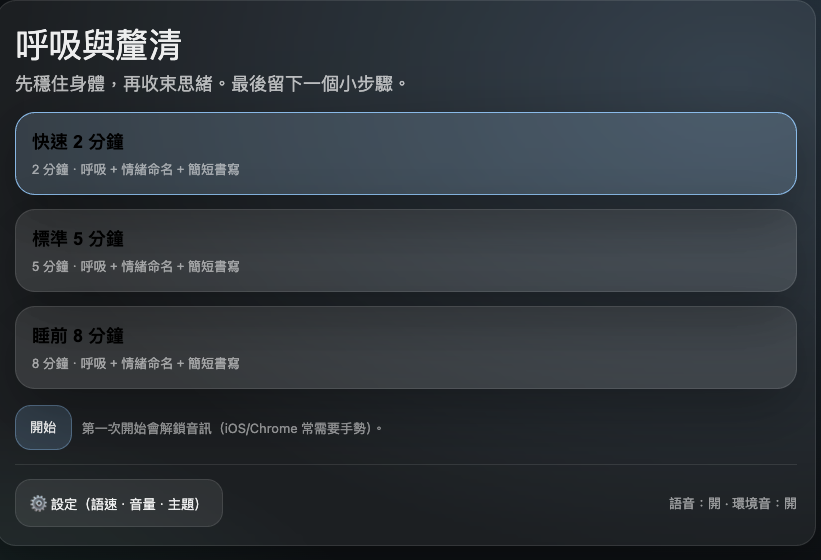
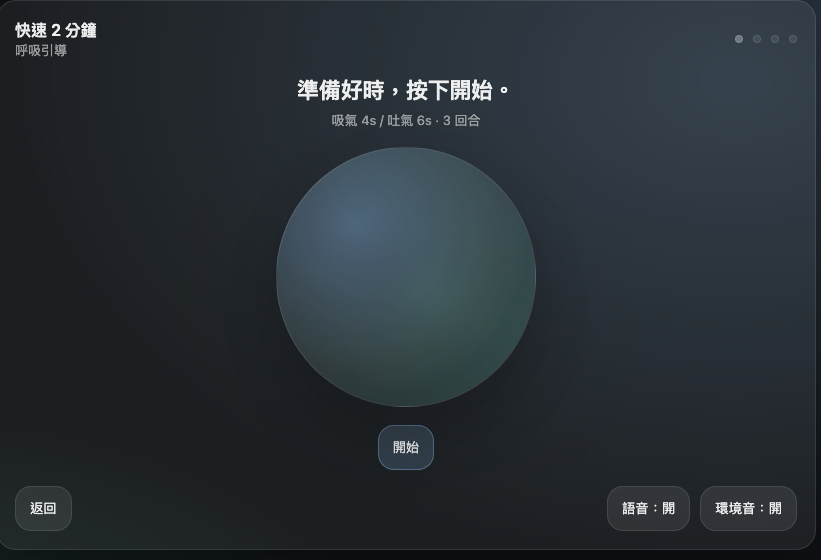
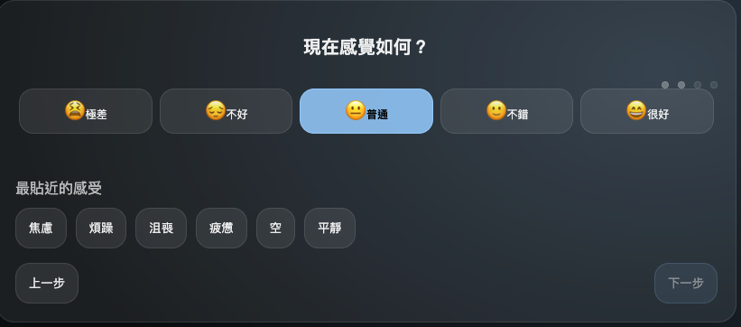

網站：https://breathe-journal.vercel.app/
介紹：
在資訊爆炸的時代，我們的腦袋常常像開了太多分頁： 越滑越累、越看越焦慮，卻停不下來。呼吸日記是一個很小的機制—— 當你覺得快被淹沒時，點開它，先把身體穩住，再把思緒收回來。你會被引導做一段短短的呼吸練習，結束後，替此刻的情緒命名、寫下幾句話，留下一個你願意走的「小步驟」。 不是要你變得更強，只是陪你回到自己手上。而且你可以放心： 所有紀錄都只存在你的手機裡，不需要帳號、不上傳雲端，隱私完全由你掌握。

## 背景
有時候會遇到很焦慮一次想太多事情的時候，這是可以透過一個機制讓自己不要陷入焦慮情緒
並且可以回顧找出自己在哪個日期區間及每週區間的時區很焦慮

## 如何使用
App幾種模式分別是 2 5 8分鐘的放鬆時間可以供使用者選擇

有個圓圈是呼吸的動畫，也有語音引導使用者

使用者可以輸入現在的心情及最近的感受

