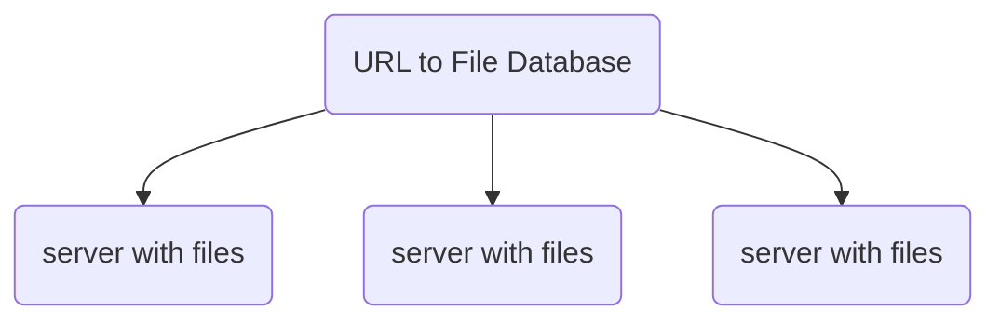

## Question

設計像是『Pastebin』，一個可以讓使用者輸入文字並且取得分享鏈結的系統
## Solutions
### Step 1: Scope the Problem
- 系統不需要有帳戶功能及編輯檔案
- 系統需要追蹤頁面存取次數
- 過舊的檔案要定時刪除
- 使用者不應該很容易猜到網址
- 除了frontend 還有api
- 統計資料會顯示在stats分頁
### Step 2: Make Reasonable Assumptions
- 系統的traffic十分繁重且包含數以百萬的document
- traffic不是平均分散在不同document
### Step 3: Draw the Major Components
- 如何儲存doc? 
	- db
	- file: 因為檔案可能很大，搜尋要比較快的話存檔案比較好
- 簡單設計方式：

- db 用來存file location
- db存traffic anlysis(timestamp, IP, address and location)
### Step 4: Identify the Key Issue
- 有部分資料會被頻繁讀取，若存在檔案系統，存取會較花時間，因此可能需要cache，由於不會有更新doc，所以cache不會有資料不合法問題
- 考慮從URL建立hash map的 database sharding
	- 問題：如果要新增server，如何redistribute doc?
#### Generating URLs
- 鏈結要比較難被猜到
	- 使用GUID，缺點：太長
	- 10碼英數混合，容易有碰撞問題
		- 可以搭配資料庫查詢是否碰撞
#### Analytics
有兩個選擇
- 當每次瀏覽時存取他的rawdata
	- Pros: 資料彈性
	- 例子：使用log file
- 只存瀏覽次數
- 如果log資料太大？
	- 用機率方式儲存log
		- 熱門的url 儲存積蓄小，熱門的url可能10次才存一次log
	- 可以按照月份存取總瀏覽數
### Follow-up Questions
- 如何支援帳戶
- 如何新增一個分析的property? e.g. 推薦來源
- 如果stats要顯示在每個doc，會如何改變設計？