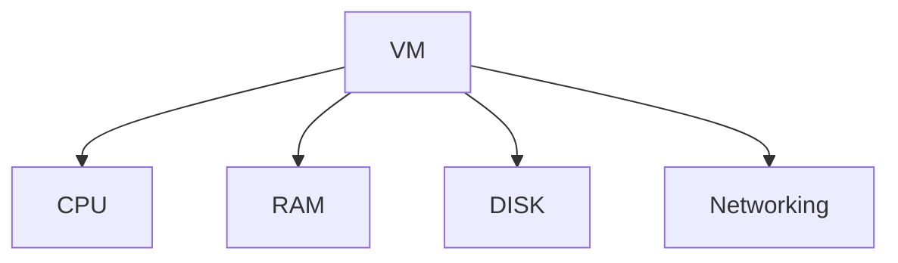

## 概覽公共雲服務

[(11:45)Top 50+ AWS Services Explained in 10 Minutes](https://youtu.be/JIbIYCM48to?si=gE1287cRSlK16a2y)
- Elastic Compute Cloud (EC2) ->
- -> 有 擴展問題 -> LB -> Cloud Watch -> Auto Scaling -> 太麻煩
- -> Elastic Beanstalk (PAAS) -> 其實不用伺服器 -> Lambda (FAAS aka ServerLess)
- OutPosts: 可以跑 AWS 在自己基礎建設
- SNOW: 自架
- docker: 可以跑不同公雲環境
- 需要更多可以擴展 -> EKS -> 可以自動擴展？-> FARGATE
- 既然有 Container，使用App Runner最簡單
- 
- 儲存？ s3: 可以存任何格式 -> 是否有成本低、高延遲的？ -> Glacier ，速度要快？ Block Storage，要更多權限、可控 > Elastic File System 
- 
- Database? Simple DB(NoSQL) > Dynamo DB ：便宜、可以水平擴展、快，不可Join，有限查詢，-> Document DB > SQL solution> > RDS ，比MSQL 快？ Aurora 
- 高度連結資料e.g. social graph > Neptune -> 要快速？ Elastic Cache -> 時序性資料？ Timestream ，不可變的加密交易 Quantum Ledger

- Fulltext search engine: Elastic Search>

- 管理帳單：Budgets

- 分析？Redshift > 
- 科學計算？ SageMaker
- 圖片辨識？ Rekognition
- 對話？Alex
- 學習機器學習？ Deep Racer
- 權限管理？ IAM
- 管理登入？ Cognito
- 

- [(17:16) The only Cloud services you actually need to know](https://youtu.be/gcfB8iIPtbY?si=UdPVa23KC7HDrnYu)
	- 

  

Vendor Lock in

VM / CPU / RAM / Disk

## 比較 Public Cloud vs. Open Source

|       | OpenSource | AWS      |
| ----- | ---------- | -------- |
| NOSQL | MongoDB    | DynamoDB |
| SQL   | Postgresql | RDS      |
|       |            |          |
### SQL
| Feature            | **SQLite**                                   | **PostgreSQL**                                              |
| ------------------ | -------------------------------------------- | ----------------------------------------------------------- |
| **Architecture**   | Serverless, embedded                         | Client-server                                               |
| **Setup**          | ==No setup required==                        | Requires setup and administration                           |
| **Concurrency**    | Limited concurrent writes                    | Excellent concurrency with MVCC                             |
| **Scalability**    | Not designed for high scalability            | ==Highly scalable==                                         |
| **Performance**    | Fast for read-heavy workloads                | High performance for both read and write operations         |
| **Features**       | Basic SQL features                           | Advanced SQL features and extensibility                     |
| **Resource Usage** | ==Minimal==                                  | Higher resource usage                                       |
| **Use Cases**      | Small applications, mobile apps, prototyping | Enterprise applications, web applications, data warehousing |
| **Transactions**   | ACID compliant                               | ACID compliant                                              |
| **Data Integrity** | Basic data integrity checks                  | Advanced data integrity and compliance features             |
|                    |                                              |                                                             |

公雲有哪些？

有哪些可以取代Vercel？

- What is Cloud Computing?什麼是雲端運算？
- Benefits of Cloud Computing (Scalability, Cost-efficiency, Flexibility, etc.)雲端運算的好處（可擴展性、成本效益、靈活性等）
- Types of Cloud Services (IaaS, PaaS, SaaS)雲端服務類型（IaaS、PaaS、SaaS）
## Ref
